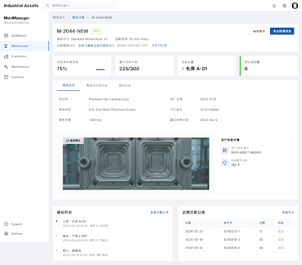
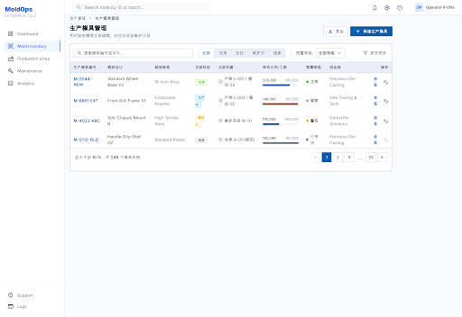
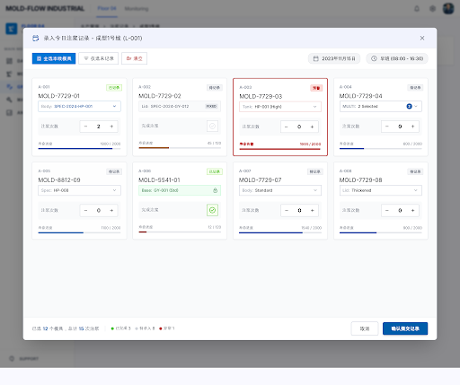

# OES

[](LICENSE)
[](https://github.com/imkgsam/oes/actions/workflows/ci.yml)

OES is a vertical enterprise application system for sanitary ceramic manufacturing. It is designed for manufacturers that need one governed software backbone across customer operations, sales, item master data, molds, production, warehousing, procurement, suppliers, finance, PDA shop-floor execution, tenant identity, permission control, and auditability.

The project is built around a concrete manufacturing domain: bathroom ceramic products, molds, materials, semi-finished goods, finished goods, production execution, warehouse movement, terminal devices, and the enterprise workflows that connect office planning with factory-floor operations.

## Why OES Exists

Sanitary ceramic manufacturing has a different operating shape from generic retail, SaaS, or simple inventory systems. A real factory needs to coordinate product models, mold lifecycle, material preparation, production execution, warehouse scanning, quality-sensitive process records, sales commitments, procurement, supplier collaboration, finance settlement, terminal access, and role-based control.

OES exists to make those workflows work as one system instead of as disconnected spreadsheets, isolated modules, and fragile custom integrations.

It focuses on:

- Sanitary ceramic product and item master management.
- Mold design, mold records, production mold usage, and MES-side manufacturing data.
- Warehouse operations connected to PDA and terminal-device workflows.
- CRM, sales, procurement, supplier, and finance collaboration around manufacturing demand.
- Tenant, organization, employee, account, role, scope, and policy governance.
- Auditable business execution across backend services and frontend workspaces.
- Clear service boundaries so the system can grow without turning into a single ungoverned application.

## Manufacturing Workflow Coverage

OES is organized around the end-to-end operating chain of a sanitary ceramic manufacturer:

```text
Customer / CRM
  -> Sales quotation and order collaboration
  -> Item master, product models, categories, attributes, packaging
  -> Mold design, mold records, and production mold management
  -> MES production execution and shop-floor records
  -> WMS inventory movement, PDA scanning, and terminal operations
  -> Procurement and supplier collaboration
  -> Finance settlement and operating visibility
```

This makes the project closer to a focused industry system than a generic ERP shell. The architecture is intentionally broad enough to cover enterprise operations, but the product narrative is grounded in manufacturing workflows that sanitary ceramic factories actually need.

## What Makes OES Different

- It treats manufacturing data as governed business truth, not just table CRUD.
- It connects office workflows with PDA and terminal-driven shop-floor operations.
- It separates system capabilities such as identity, permission, tenant organization, and audit from business capabilities such as CRM, MES, WMS, procurement, and finance.
- It uses explicit contracts between services instead of hidden database coupling.
- It keeps frontend workspaces, BFF APIs, service contracts, and domain logic aligned through architecture documents and service truth sources.
- It is designed for long-lived enterprise evolution, where permissions, audit trails, and cross-service boundaries matter as much as feature screens.

## AI-assisted Manufacturing Direction

OES is designed with AI-assisted operations in mind, but AI is treated as a governed assistant rather than the source of business truth. In a sanitary ceramic factory, useful AI should work with mold records, production events, warehouse movement, PDA logs, permissions, and audit trails through controlled application services.

The project direction includes:

- Mold lifecycle intelligence: summarize mold usage history, surface high-risk molds, explain abnormal repair frequency, and help planners understand when a mold may affect production reliability.
- Slip-casting and production anomaly review: turn daily shop-floor records into concise exception summaries for supervisors, including missing records, unusual output, delayed operations, and repeated process deviations.
- PDA shop-floor assistant: help operators choose the correct work action, interpret scan results, and reduce input errors without allowing AI to bypass terminal access policy or employee identity checks.
- Sales-to-production traceability: connect customer demand, item master data, mold readiness, MES execution, WMS inventory movement, procurement status, and finance signals into a readable operational narrative.
- Manufacturing knowledge retrieval: help users search product models, mold standards, packaging rules, process notes, and historical issue records without spreading domain knowledge across informal chat logs.
- Audit-friendly recommendations: every AI-assisted suggestion that affects business execution should be traceable to source data, operator context, permissions, and a human-confirmed workflow.

This makes AI a practical layer on top of governed manufacturing workflows, not a shortcut around MES, WMS, permission, or audit systems.

## Current Status

OES is under active solo development. The repository already contains the core monorepo structure, backend services, BFF/API gateway modules, tenant web workspace, PDA web and Android surfaces, gRPC contracts, architecture documents, and product direction screens for mold-management workflows.

The project is not presented as a finished commercial suite. It is a working vertical system foundation that is being expanded toward a complete sanitary ceramic manufacturing operating platform.

Current development is focused on:

- Tenant, identity, permission, and account security foundations.
- Item master, product model, category, attribute, and packaging workflows.
- MES mold design, mold detail, production mold, and slip-casting records.
- PDA-oriented shop-floor login, scanning, device restriction, and workbench flows.
- Tenant web administration, security center, and manufacturing management pages.
- Contract consistency across backend services and BFF surfaces.

See [ROADMAP.md](ROADMAP.md) for the product direction.

## Representative Modules

| Area                | Module                                              | Purpose                                                                                      |
| ------------------- | --------------------------------------------------- | -------------------------------------------------------------------------------------------- |
| Entry point         | `api-gateway`                                       | External HTTP/BFF entry for tenant web, PDA, auth, terminal, HR, item, and MES workflows.    |
| Identity foundation | `auth-service`                                      | Authentication, sessions, login methods, terminal PIN flows, and audit-oriented auth events. |
| Identity foundation | `identity-service`                                  | Account identity, employee binding, and identity lookup surfaces.                            |
| Governance          | `permission-service`                                | Role, permission catalog, policy seed, and authorization foundation.                         |
| Organization        | `tenant-org-service`                                | Tenant, organization, and onboarding boundaries.                                             |
| People              | `hr-service`                                        | Employee records, employee-code format, HR query, and onboarding collaboration.              |
| Product data        | `item-master-service`                               | Item models, categories, attributes, packaging, and product master data.                     |
| Manufacturing       | `mes-service`                                       | Mold records, production mold management, MES surfaces, and manufacturing execution data.    |
| Customer operations | `crm-service`                                       | Customer master and customer query/management contracts.                                     |
| Supply chain        | `srm-service`, `procurement-service`, `wms-service` | Supplier, procurement, warehouse, and inventory-oriented business contexts.                  |
| Finance             | `finance-service`                                   | Finance context foundation for settlement and operating visibility.                          |
| Frontend            | `app/web`                                           | Tenant web administration and manufacturing management workspace.                            |
| Shop floor          | `app/pda`                                           | PDA web/Android surfaces for device-aware operational workflows.                             |

## Product Screens

The mold-management experience is a central part of OES for sanitary ceramic manufacturing. These screens show the product direction for managing mold assets, mold-design relationships, production mold usage, and daily slip-casting records.

### Mold Management Overview


### Mold Detail With Design Linkage



### Production Mold Management



### Daily Slip-casting Entry



## Repository Layout

```text
app/
  pda/                         PDA web and Android client surfaces.
  web/                         Tenant web frontend workspace.
docs/
  architecture/                Stable architecture truth sources.
  adr/                         Architecture decision records.
  contracts/                   Black-box service and BFF contracts.
  governance/                  Collaboration and change discipline.
  plans/                       Feature plans, design workspaces, and roadmap notes.
src/
  common/                      Shared infrastructure, contracts, transport, auth helpers.
  services/
    api-gateway/               External HTTP/BFF entry point.
    business/                  Business contexts such as CRM, SRM, MES, WMS, finance.
    system/                    Identity, permission, auth, tenant, HR, party, asset services.
```

## Architecture Principles

OES follows a boundary-first architecture:

- External clients enter through the API Gateway / BFF.
- Strong internal service contracts use gRPC.
- Cross-context facts should flow through explicit integration mechanisms.
- Services must not share databases.
- Domain rules belong in domain/application layers, not controllers, DTOs, gateways, or Prisma schemas.
- Shared libraries carry infrastructure capabilities, not cross-domain business ownership.
- AI may assist business workflows but must not own core business truth or bypass authorization and audit.

For the full project baseline, start with [AGENTS.md](AGENTS.md) and [docs/index.md](docs/index.md).

## Main Capabilities

- Manufacturing business foundation: CRM, sales, item master, MES, WMS, SRM, procurement, and finance services.
- Mold and production operations: mold design/detail surfaces, production mold management, MES mold records, and manufacturing workflow contracts.
- Shop-floor execution: PDA web/Android surfaces, scanning diagnostics, terminal access policies, and device-aware login flows.
- Enterprise system foundation: auth, identity, permission, tenant organization, HR, party, asset, terminal device, and audit-oriented service design.
- Frontend surfaces: tenant web administration/workbench and PDA-oriented operational flows.
- Contracts and architecture: proto contracts, BFF contracts, service truth-source docs, ADRs, and cross-service collaboration rules.

## Getting Started

OES is a large monorepo. The commands below are the local baseline for running the system foundation and tenant web workspace.

The accepted runtime target is [Local Development And Test Runtime V2](docs/architecture/platforms/local-development-and-test-runtime.md).
Until its atomic implementation cutover merges, the commands below remain the only current
executable setup path; there is no separately supported V2 mode. The cutover delivery will replace
this section together with all pnpm/CI entry points and runtime runbooks.

### Prerequisites

- Node.js 22 or newer.
- pnpm 10.x.
- Docker Desktop or compatible Docker runtime.

### Prepare A Clean Worktree

```bash
pnpm install --frozen-lockfile
pnpm env:bootstrap
pnpm env:check
```

`env:bootstrap` renders ignored, worktree-owned local files from the sanitized
`.env.example`. It preserves any user-managed `.env`; use `-- --force` only to
refresh files previously generated by this command.

### Generate And Build The Repository

```bash
pnpm generated:all
pnpm build
```

### Start Infrastructure

```bash
pnpm docker:infra:up
```

### Generate And Validate Contracts

```bash
pnpm proto:lint
pnpm common:build
```

### Sync System Databases And Foundation Data

```bash
pnpm backend:system:db:sync
pnpm backend:foundation:sync
```

### Run System Services

```bash
pnpm dev:system
```

### Run Tenant Web

```bash
pnpm web
```

## Documentation Map

- [Architecture index](docs/architecture/index.md)
- [ADR index](docs/adr/index.md)
- [Contracts index](docs/contracts/index.md)
- [Governance index](docs/governance/index.md)
- [Plans index](docs/plans/index.md)

## Contributing

OES welcomes contributors who care about manufacturing software, long-lived enterprise architecture, and clear service boundaries. Please read [CONTRIBUTING.md](CONTRIBUTING.md) before opening a pull request.

The short version:

- Keep each change scoped to one service, one contract, one frontend surface, or one governance topic.
- Update the relevant architecture truth source before changing stable boundaries.
- Keep cross-service contracts explicit.
- Add tests or verification evidence that matches the risk of the change.
- Do not put core business rules in controllers, DTOs, gateways, or persistence schemas.

## Security

Security issues should not be reported in public issues. See [SECURITY.md](SECURITY.md) for the responsible disclosure process.

## License

OES is released under the [Apache License 2.0](LICENSE).
