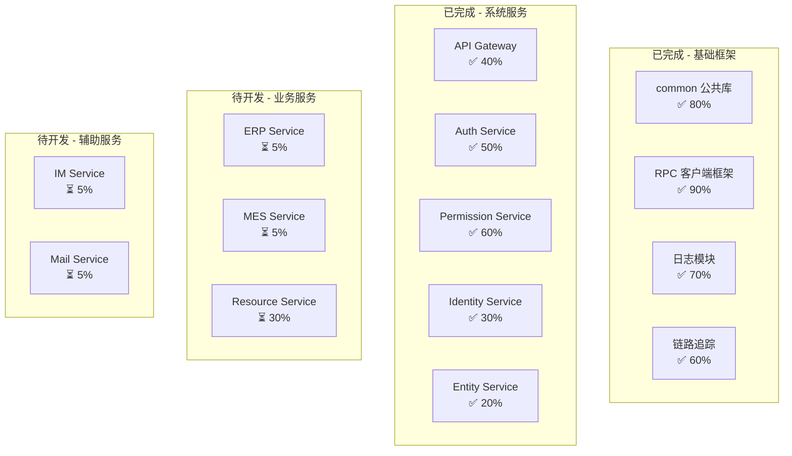
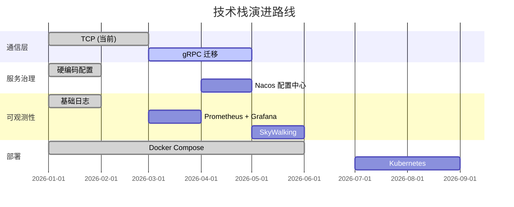
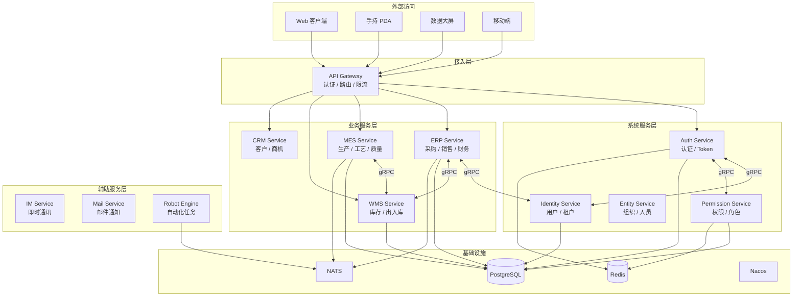
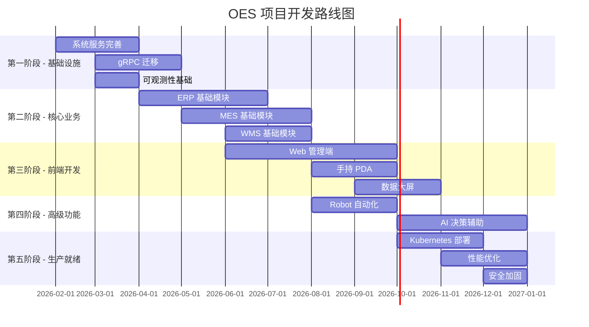

# OES 项目开发计划书

> **文档版本**: v1.0  
> **创建日期**: 2026-02-01  
> **最后更新**: 2026-02-01

---

## 目录

1. [项目概述](#1-项目概述)
2. [当前进度分析](#2-当前进度分析)
3. [技术栈选择](#3-技术栈选择)
4. [系统架构设计](#4-系统架构设计)
5. [详细开发计划](#5-详细开发计划)
6. [资源需求](#6-资源需求)
7. [风险评估与应对](#7-风险评估与应对)
8. [附录](#8-附录)

---

## 1. 项目概述

### 1.1 项目定位

OES（Open Enterprise System）是一个面向**制造业**的**多租户 SaaS 企业管理平台**，融合以下子系统：

| 模块 | 全称                             | 说明           |
| ---- | -------------------------------- | -------------- |
| ERP  | Enterprise Resource Planning     | 企业资源计划   |
| MES  | Manufacturing Execution System   | 制造执行系统   |
| WMS  | Warehouse Management System      | 仓库管理系统   |
| CRM  | Customer Relationship Management | 客户关系管理   |
| SRM  | Supplier Relationship Management | 供应商关系管理 |
| CMS  | Content Management System        | 内容管理系统   |
| BI   | Business Intelligence            | 商业智能       |
| APS  | Advanced Planning & Scheduling   | 高级计划排程   |
| Ecom | E-commerce                       | 电子商务       |

### 1.2 核心特性

- **多租户架构**：支持 SaaS 模式，租户数据隔离
- **微服务架构**：基于 NestJS + DDD 设计
- **多端支持**：Web、手持 PDA、数据大屏、移动端（后期）
- **国际化**：支持多语言
- **AI 能力**：智能决策辅助（规划中）
- **自动化**：Robot 机器人服务

### 1.3 目标用户

- **主要行业**：制造业（卫浴、家具、电子等）
- **企业规模**：中小型制造企业
- **用户角色**：管理层、生产人员、仓库人员、销售人员

---

## 2. 当前进度分析

### 2.1 已完成模块



### 2.2 各模块详细状态

#### 2.2.1 公共库 (common)

| 子模块      | 状态 | 完成度 | 说明                           |
| ----------- | ---- | ------ | ------------------------------ |
| 异常处理    | ✅   | 90%    | 统一异常体系已建立             |
| RPC 客户端  | ✅   | 85%    | TCP 客户端工厂、连接管理       |
| 日志模块    | ✅   | 70%    | Pino + OpenTelemetry           |
| 链路追踪    | ⚠️   | 60%    | OTEL SDK 已集成，需完善        |
| HTTP 客户端 | ✅   | 80%    | Axios 封装                     |
| DTO 定义    | ⚠️   | 40%    | 部分服务 DTO 已定义            |
| gRPC 生成   | ⚠️   | 30%    | Proto 文件已有，生成代码待完善 |

#### 2.2.2 系统服务

| 服务               | 状态 | 完成度 | 已实现功能                 | 待实现功能               |
| ------------------ | ---- | ------ | -------------------------- | ------------------------ |
| api-gateway        | ⚠️   | 40%    | JWT 验证、路由转发         | 限流、熔断、API 文档     |
| auth-service       | ⚠️   | 50%    | 邮箱密码登录、Session 管理 | MFA、OAuth2、Token 刷新  |
| permission-service | ⚠️   | 60%    | RBAC 模型、权限检查        | Scope 校验、缓存优化     |
| identity-service   | ⚠️   | 30%    | 账户基础 CRUD              | 租户管理、ServiceAccount |
| entity-service     | ⚠️   | 20%    | 实体基础模型               | 组织架构、人员档案       |

#### 2.2.3 业务服务

| 服务             | 状态 | 完成度 | 说明           |
| ---------------- | ---- | ------ | -------------- |
| resource-service | ⚠️   | 30%    | 域名管理已实现 |
| erp-service      | ⏳   | 5%     | 仅有框架       |
| mes-service      | ⏳   | 5%     | 仅有框架       |
| asset-service    | ⏳   | 5%     | 仅有框架       |

### 2.3 技术债务

| 问题          | 优先级 | 影响                   | 建议                |
| ------------- | ------ | ---------------------- | ------------------- |
| TCP 直连模式  | 🔴 高  | 连接数爆炸、无负载均衡 | 迁移到 gRPC         |
| 配置硬编码    | 🟡 中  | 部署不灵活             | 引入配置中心        |
| 缺少单元测试  | 🟡 中  | 代码质量风险           | 补充测试            |
| 缺少 API 文档 | 🟡 中  | 前后端协作困难         | 集成 Swagger        |
| 无 CI/CD      | 🟡 中  | 部署效率低             | 配置 GitHub Actions |

---

## 3. 技术栈选择

### 3.1 后端技术栈

#### 3.1.1 核心框架

| 技术   | 当前选择       | 替代方案         | 选择理由              |
| ------ | -------------- | ---------------- | --------------------- |
| 运行时 | Node.js 20+    | Go, Java         | 开发效率高，生态丰富  |
| 框架   | NestJS 11      | Fastify, Express | 企业级架构，DI 支持好 |
| 语言   | TypeScript 5.8 | -                | 类型安全，重构友好    |
| ORM    | Prisma 6       | TypeORM, Drizzle | 类型安全，迁移方便    |
| 数据库 | PostgreSQL 16  | MySQL 8          | JSON 支持好，扩展性强 |

#### 3.1.2 服务通信

| 技术     | 当前选择     | 目标选择                 | 迁移优先级 |
| -------- | ------------ | ------------------------ | ---------- |
| 同步通信 | TCP (NestJS) | **gRPC**                 | 🔴 高      |
| 异步通信 | -            | **NATS / Redis Streams** | 🟡 中      |
| API 网关 | 自建         | **APISIX** (后期)        | 🟢 低      |

**gRPC vs TCP 对比**：

| 维度     | TCP (当前)    | gRPC (目标)   |
| -------- | ------------- | ------------- |
| 性能     | ⭐⭐⭐        | ⭐⭐⭐⭐⭐    |
| 类型安全 | ❌            | ✅ Proto 定义 |
| 多路复用 | ❌            | ✅ HTTP/2     |
| 负载均衡 | ❌ 需自行实现 | ✅ 客户端 LB  |
| 流式传输 | ❌            | ✅ 双向流     |
| 跨语言   | ⚠️ 有限       | ✅ 多语言支持 |

#### 3.1.3 基础设施

| 组件     | 当前选择       | 目标选择              | 说明           |
| -------- | -------------- | --------------------- | -------------- |
| 缓存     | Redis 7        | Redis 7               | 保持不变       |
| 消息队列 | -              | NATS                  | 轻量级，高性能 |
| 配置中心 | 环境变量       | **Nacos**             | 动态配置       |
| 服务发现 | 硬编码         | **Nacos**             | 动态发现       |
| 容器编排 | Docker Compose | **Kubernetes** (后期) | 生产级部署     |

### 3.2 可观测性技术栈

| 组件 | 选择                 | 替代方案 | 说明                |
| ---- | -------------------- | -------- | ------------------- |
| 指标 | Prometheus + Grafana | -        | 业界标准            |
| 追踪 | Jaeger / SkyWalking  | Zipkin   | SkyWalking 功能更全 |
| 日志 | Loki + Grafana       | ELK      | Loki 更轻量         |
| APM  | SkyWalking           | Datadog  | 开源免费            |

### 3.3 前端技术栈（建议）

| 端         | 推荐技术                  | 替代方案             | 说明       |
| ---------- | ------------------------- | -------------------- | ---------- |
| Web 管理端 | React 18 + Ant Design Pro | Vue 3 + Element Plus | 生态成熟   |
| 数据大屏   | React + ECharts / DataV   | Vue + ECharts        | 可视化丰富 |
| 手持 PDA   | React Native / uni-app    | Flutter              | 跨平台     |
| 移动端     | React Native              | Flutter, uni-app     | 代码复用   |
| 小程序     | Taro / uni-app            | 原生                 | 多端统一   |

### 3.4 技术栈演进路线



---

## 4. 系统架构设计

### 4.1 整体架构图



### 4.2 服务划分

#### 4.2.1 系统服务（System Services）

| 服务               | 职责                       | 依赖                                 |
| ------------------ | -------------------------- | ------------------------------------ |
| api-gateway        | 统一入口、认证、路由       | auth-service                         |
| auth-service       | 登录、Token、Session       | identity-service, permission-service |
| identity-service   | 用户、租户、ServiceAccount | -                                    |
| permission-service | 角色、权限、Scope          | -                                    |
| entity-service     | 组织、人员、档案           | identity-service                     |

#### 4.2.2 业务服务（Business Services）

| 服务        | 职责               | 核心实体                |
| ----------- | ------------------ | ----------------------- |
| erp-service | 采购、销售、财务   | Order, Invoice, Payment |
| mes-service | 生产、工艺、质量   | WorkOrder, Process, QC  |
| wms-service | 库存、出入库       | Inventory, StockIn/Out  |
| crm-service | 客户、商机、合同   | Customer, Opportunity   |
| srm-service | 供应商、询价、采购 | Supplier, RFQ           |

#### 4.2.3 辅助服务（Auxiliary Services）

| 服务          | 职责       | 说明      |
| ------------- | ---------- | --------- |
| im-service    | 即时通讯   | WebSocket |
| mail-service  | 邮件发送   | SMTP      |
| robot-service | Robot 管理 | 控制面    |
| robot-engine  | Robot 执行 | 运行面    |

### 4.3 数据库设计原则

#### 4.3.1 多租户策略

采用 **Schema 隔离** 模式：

```
PostgreSQL
├── public (系统表)
│   ├── tenants
│   └── system_configs
├── tenant_001 (租户 A)
│   ├── users
│   ├── orders
│   └── ...
├── tenant_002 (租户 B)
│   ├── users
│   ├── orders
│   └── ...
```

**优点**：

- 数据完全隔离
- 便于备份/恢复单个租户
- 性能隔离

**缺点**：

- Schema 数量有上限（约 10,000）
- 跨租户查询复杂

#### 4.3.2 数据库分配

| 服务               | 数据库         | Schema 策略           |
| ------------------ | -------------- | --------------------- |
| identity-service   | oes_identity   | 单 Schema（系统级）   |
| auth-service       | oes_auth       | 单 Schema（系统级）   |
| permission-service | oes_permission | 单 Schema（系统级）   |
| erp-service        | oes_erp        | 多 Schema（租户隔离） |
| mes-service        | oes_mes        | 多 Schema（租户隔离） |
| wms-service        | oes_wms        | 多 Schema（租户隔离） |

---

## 5. 详细开发计划

### 5.1 阶段划分



### 5.2 第一阶段：基础设施完善（2026-02 ~ 2026-04）

#### 5.2.1 里程碑

| 里程碑 | 目标日期   | 交付物        |
| ------ | ---------- | ------------- |
| M1.1   | 2026-02-28 | 系统服务 MVP  |
| M1.2   | 2026-03-31 | gRPC 迁移完成 |
| M1.3   | 2026-04-15 | 可观测性基础  |

#### 5.2.2 详细任务

**Sprint 1 (2026-02-01 ~ 2026-02-14): Auth Service 完善**

| 任务             | 优先级 | 预估工时 | 说明               |
| ---------------- | ------ | -------- | ------------------ |
| 完善邮箱密码登录 | P0     | 8h       | 补充验证逻辑       |
| 实现 Token 刷新  | P0     | 8h       | Refresh Token 机制 |
| 实现登出功能     | P0     | 4h       | Token 撤销         |
| 添加手机号登录   | P1     | 8h       | SMS 验证码         |
| 添加 MFA 支持    | P2     | 16h      | TOTP 双因素        |

**Sprint 2 (2026-02-15 ~ 2026-02-28): Identity & Permission 完善**

| 任务                | 优先级 | 预估工时 | 说明           |
| ------------------- | ------ | -------- | -------------- |
| 租户管理 CRUD       | P0     | 16h      | 租户创建、配置 |
| ServiceAccount 管理 | P0     | 12h      | API Key 生成   |
| 权限缓存优化        | P1     | 8h       | Redis 缓存     |
| Scope 校验实现      | P1     | 12h      | 资源级权限     |

**Sprint 3 (2026-03-01 ~ 2026-03-14): gRPC 迁移准备**

| 任务             | 优先级 | 预估工时 | 说明           |
| ---------------- | ------ | -------- | -------------- |
| Proto 文件定义   | P0     | 16h      | 所有服务接口   |
| 代码生成配置     | P0     | 8h       | buf + ts-proto |
| gRPC Server 改造 | P0     | 16h      | NestJS gRPC    |
| gRPC Client 改造 | P0     | 16h      | 客户端迁移     |

**Sprint 4 (2026-03-15 ~ 2026-03-31): gRPC 迁移执行**

| 任务                    | 优先级 | 预估工时 | 说明       |
| ----------------------- | ------ | -------- | ---------- |
| auth-service 迁移       | P0     | 12h      | TCP → gRPC |
| permission-service 迁移 | P0     | 12h      | TCP → gRPC |
| identity-service 迁移   | P0     | 12h      | TCP → gRPC |
| 集成测试                | P0     | 16h      | 端到端测试 |

**Sprint 5 (2026-04-01 ~ 2026-04-15): 可观测性**

| 任务            | 优先级 | 预估工时 | 说明       |
| --------------- | ------ | -------- | ---------- |
| Prometheus 集成 | P0     | 8h       | 指标暴露   |
| Grafana 面板    | P1     | 8h       | 监控大盘   |
| Jaeger 集成     | P1     | 8h       | 链路追踪   |
| 日志规范化      | P1     | 8h       | 结构化日志 |

### 5.3 第二阶段：核心业务开发（2026-04 ~ 2026-08）

#### 5.3.1 ERP Service（2026-04 ~ 2026-06）

**核心模块**：

| 模块     | 功能                     | 优先级 |
| -------- | ------------------------ | ------ |
| 基础数据 | 物料、BOM、供应商、客户  | P0     |
| 采购管理 | 采购申请、采购订单、入库 | P0     |
| 销售管理 | 销售订单、发货、退货     | P0     |
| 库存管理 | 库存查询、调拨、盘点     | P1     |
| 财务管理 | 应收、应付、成本         | P2     |

**数据模型**：

```prisma
// 物料主数据
model Material {
  id          String   @id @default(uuid())
  code        String   @unique
  name        String
  spec        String?
  unit        String
  category    String
  tenantId    String
  createdAt   DateTime @default(now())
  updatedAt   DateTime @updatedAt
}

// 采购订单
model PurchaseOrder {
  id          String   @id @default(uuid())
  code        String   @unique
  supplierId  String
  status      String
  totalAmount Decimal
  tenantId    String
  items       PurchaseOrderItem[]
  createdAt   DateTime @default(now())
}
```

#### 5.3.2 MES Service（2026-05 ~ 2026-08）

**核心模块**：

| 模块     | 功能                 | 优先级 |
| -------- | -------------------- | ------ |
| 工单管理 | 生产工单、派工、报工 | P0     |
| 工艺管理 | 工艺路线、工序、工时 | P0     |
| 质量管理 | 检验标准、质检记录   | P1     |
| 设备管理 | 设备台账、保养、维修 | P2     |
| 看板管理 | 生产进度、异常看板   | P1     |

#### 5.3.3 WMS Service（2026-06 ~ 2026-08）

**核心模块**：

| 模块     | 功能                 | 优先级 |
| -------- | -------------------- | ------ |
| 仓库管理 | 仓库、库区、库位     | P0     |
| 入库管理 | 采购入库、生产入库   | P0     |
| 出库管理 | 销售出库、生产领料   | P0     |
| 库存管理 | 库存查询、预警、盘点 | P0     |
| 条码管理 | 条码生成、扫码操作   | P1     |

### 5.4 第三阶段：前端开发（2026-06 ~ 2026-10）

#### 5.4.1 Web 管理端

**技术选型**：React 18 + Ant Design Pro 6 + UmiJS 4

**模块划分**：

| 模块     | 页面数 | 预估工时 |
| -------- | ------ | -------- |
| 系统管理 | 15     | 40h      |
| ERP 模块 | 30     | 80h      |
| MES 模块 | 25     | 60h      |
| WMS 模块 | 20     | 50h      |
| 报表中心 | 10     | 30h      |

#### 5.4.2 手持 PDA

**技术选型**：React Native + Expo

**核心功能**：

- 扫码入库/出库
- 生产报工
- 库存盘点
- 质检录入

#### 5.4.3 数据大屏

**技术选型**：React + ECharts + DataV

**核心看板**：

- 生产进度看板
- 库存预警看板
- 销售数据看板
- 设备状态看板

### 5.5 第四阶段：高级功能（2026-08 ~ 2026-12）

#### 5.5.1 Robot 自动化

参考已有设计文档 `OES Robot 设计方案书.md`

**核心任务**：

| 任务               | 预估工时 | 说明         |
| ------------------ | -------- | ------------ |
| robot-service 开发 | 40h      | 控制面       |
| robot-engine 开发  | 60h      | 运行面       |
| 预置 Robot         | 20h      | 系统级自动化 |

#### 5.5.2 AI 决策辅助

参考已有设计文档 `AI能力拓展方案.md`

**核心任务**：

| 任务              | 预估工时 | 说明         |
| ----------------- | -------- | ------------ |
| DecisionType 框架 | 24h      | 决策类型定义 |
| ContextBuilder    | 32h      | 上下文构建   |
| AI Engine 集成    | 40h      | LLM 对接     |
| 库存决策 Skill    | 16h      | 首个 Skill   |

### 5.6 第五阶段：生产就绪（2026-10 ~ 2026-12）

#### 5.6.1 Kubernetes 部署

| 任务             | 预估工时 | 说明       |
| ---------------- | -------- | ---------- |
| Helm Charts 编写 | 24h      | 所有服务   |
| Ingress 配置     | 8h       | 流量入口   |
| HPA 配置         | 8h       | 自动扩缩容 |
| PV/PVC 配置      | 8h       | 持久化存储 |

#### 5.6.2 性能优化

| 任务           | 预估工时 | 说明          |
| -------------- | -------- | ------------- |
| 数据库索引优化 | 16h      | 慢查询分析    |
| 缓存策略优化   | 16h      | Redis 缓存    |
| gRPC 连接池    | 8h       | 连接复用      |
| 批量操作优化   | 16h      | 减少 RPC 调用 |

#### 5.6.3 安全加固

| 任务      | 预估工时 | 说明       |
| --------- | -------- | ---------- |
| mTLS 配置 | 16h      | 服务间加密 |
| 密钥管理  | 16h      | Vault 集成 |
| 安全审计  | 16h      | 日志审计   |
| 渗透测试  | 24h      | 安全测试   |

---

## 6. 资源需求

### 6.1 开发环境

| 资源     | 最低配置                   | 推荐配置   |
| -------- | -------------------------- | ---------- |
| CPU      | 4 核                       | 8 核       |
| 内存     | 16 GB                      | 32 GB      |
| 存储     | 256 GB SSD                 | 512 GB SSD |
| 操作系统 | Windows 10 / macOS / Linux | -          |

### 6.2 开发工具

| 工具               | 用途       | 费用 |
| ------------------ | ---------- | ---- |
| VS Code            | 代码编辑   | 免费 |
| Docker Desktop     | 容器运行   | 免费 |
| Postman / Insomnia | API 测试   | 免费 |
| DBeaver            | 数据库管理 | 免费 |
| Obsidian           | 文档管理   | 免费 |

### 6.3 云服务（开发/测试）

| 服务       | 规格  | 月费用（估算）  |
| ---------- | ----- | --------------- |
| 云服务器   | 4C8G  | ¥200-400        |
| PostgreSQL | 2C4G  | ¥100-200        |
| Redis      | 1G    | ¥50-100         |
| 对象存储   | 100GB | ¥20-50          |
| **合计**   | -     | **¥370-750/月** |

### 6.4 云服务（生产环境）

| 服务            | 规格        | 月费用（估算）    |
| --------------- | ----------- | ----------------- |
| Kubernetes 集群 | 3 节点 4C8G | ¥1500-2500        |
| PostgreSQL      | 4C8G 高可用 | ¥500-800          |
| Redis           | 4G 集群     | ¥300-500          |
| 对象存储        | 1TB         | ¥100-200          |
| CDN             | 100GB/月    | ¥50-100           |
| 负载均衡        | -           | ¥100-200          |
| **合计**        | -           | **¥2550-4300/月** |

### 6.5 第三方服务

| 服务     | 用途     | 费用     |
| -------- | -------- | -------- |
| 短信服务 | 验证码   | 按量付费 |
| 邮件服务 | 通知邮件 | 按量付费 |
| AI API   | 决策辅助 | 按量付费 |

---

## 7. 风险评估与应对

### 7.1 技术风险

| 风险                  | 概率 | 影响 | 应对措施                   |
| --------------------- | ---- | ---- | -------------------------- |
| gRPC 迁移复杂度超预期 | 中   | 高   | 分阶段迁移，保留 TCP 回退  |
| 多租户性能问题        | 中   | 高   | 早期压测，优化 Schema 策略 |
| 前端开发进度滞后      | 高   | 中   | 优先核心功能，迭代开发     |
| 第三方服务依赖        | 低   | 中   | 抽象接口，支持多供应商     |

### 7.2 业务风险

| 风险             | 概率 | 影响 | 应对措施             |
| ---------------- | ---- | ---- | -------------------- |
| 需求变更频繁     | 高   | 中   | 模块化设计，敏捷迭代 |
| 行业特性理解不足 | 中   | 高   | 深入调研，MVP 验证   |
| 竞品压力         | 中   | 中   | 差异化功能，AI 能力  |

### 7.3 资源风险

| 风险             | 概率 | 影响 | 应对措施               |
| ---------------- | ---- | ---- | ---------------------- |
| 独立开发精力有限 | 高   | 高   | 优先核心功能，合理规划 |
| 云服务成本超支   | 中   | 中   | 按需扩容，成本监控     |
| 技术债务累积     | 高   | 中   | 定期重构，代码审查     |

---

## 8. 附录

### 8.1 参考文档

| 文档          | 路径                                                             | 说明     |
| ------------- | ---------------------------------------------------------------- | -------- |
| 项目介绍      | `doc/oes-dos/OES项目/项目细节/项目介绍.md`                       | 项目概述 |
| mTLS 升级方案 | `doc/oes-dos/OES项目/待实现功能/mTLS支持以及gRPC升级.md`         | 通信升级 |
| 权限优化方案  | `doc/oes-dos/OES项目/待实现功能/OES 高安全微服务权限优化方案.md` | 权限设计 |
| Robot 设计    | `doc/oes-dos/OES项目/待实现功能/OES Robot 设计方案书.md`         | 自动化   |
| AI 能力方案   | `doc/oes-dos/OES项目/待实现功能/AI能力拓展方案.md`               | AI 集成  |

### 8.2 技术参考

| 资源            | 链接                       | 说明     |
| --------------- | -------------------------- | -------- |
| NestJS 文档     | https://docs.nestjs.com    | 框架文档 |
| Prisma 文档     | https://www.prisma.io/docs | ORM 文档 |
| gRPC 文档       | https://grpc.io/docs       | 通信协议 |
| Kubernetes 文档 | https://kubernetes.io/docs | 容器编排 |

### 8.3 检查清单

#### 8.3.1 第一阶段完成检查

- [ ] Auth Service 支持完整登录流程
- [ ] Token 刷新和撤销功能正常
- [ ] 租户管理功能可用
- [ ] gRPC 通信正常
- [ ] Prometheus 指标可采集
- [ ] Grafana 面板可查看

#### 8.3.2 第二阶段完成检查

- [ ] ERP 基础数据管理可用
- [ ] 采购流程完整
- [ ] 销售流程完整
- [ ] MES 工单管理可用
- [ ] WMS 出入库可用

#### 8.3.3 第三阶段完成检查

- [ ] Web 管理端核心功能可用
- [ ] 手持 PDA 扫码功能正常
- [ ] 数据大屏展示正常

---

## 更新日志

| 版本 | 日期       | 更新内容 | 作者 |
| ---- | ---------- | -------- | ---- |
| v1.0 | 2026-02-01 | 初始版本 | -    |

---

> **下一步行动**：
>
> 1. 确认开发计划是否符合预期
> 2. 开始 Sprint 1：Auth Service 完善
> 3. 建立每周进度跟踪机制
