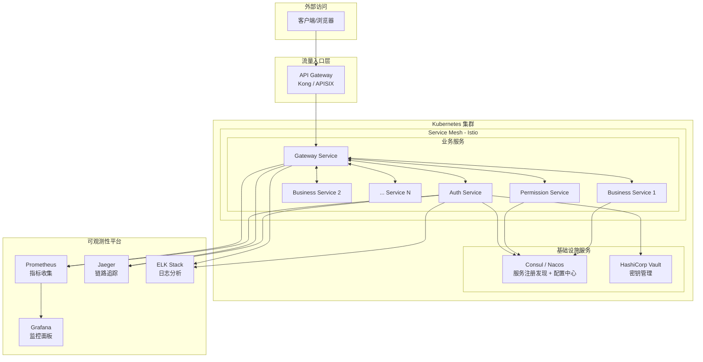
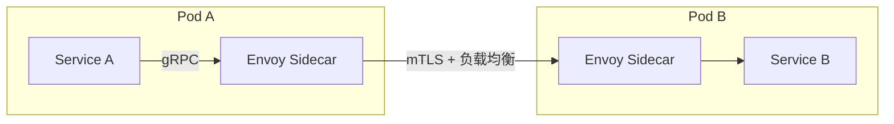
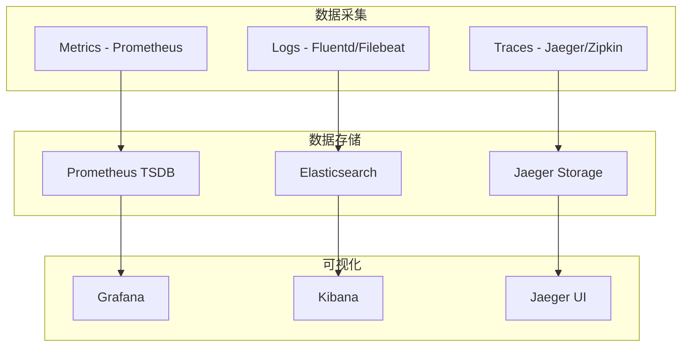
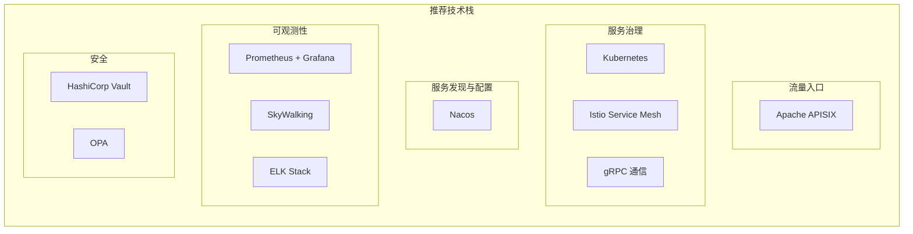
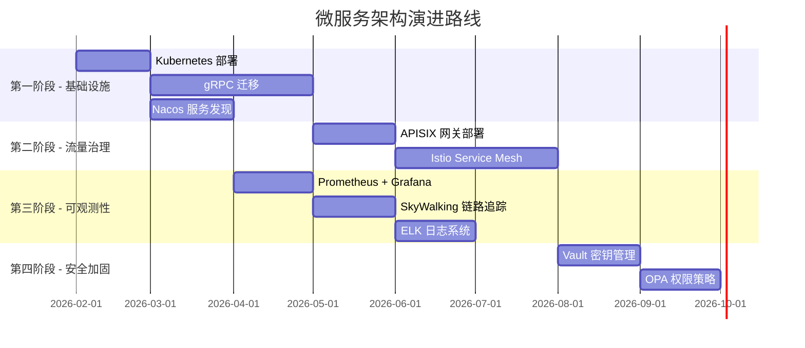

## 企业级微服务架构方案

根据你的需求（50+ 服务、统一管理、动态发现、可观测性），我推荐采用 **Kubernetes + Service Mesh + 云原生组件** 的完整解决方案。

---

### 整体架构图

---

### 各层组件选型

#### 1. 服务通信层

| 需求 | 推荐方案 | 说明 |
|------|----------|------|
| 服务间通信 | **gRPC** | 高性能、类型安全、HTTP/2 多路复用 |
| 流量管理 | **Istio** | 负载均衡、熔断、重试、mTLS |
| 服务发现 | **Kubernetes Service** + **Istio** | 原生支持，无需额外组件 |

#### 2. API 网关层

| 需求 | 推荐方案 | 说明 |
|------|----------|------|
| 统一入口 | **Kong** 或 **Apache APISIX** | 企业级 API 网关 |
| 动态路由 | Kong Routes / APISIX Routes | 基于路径、Header 路由 |
| 限流熔断 | Kong Rate Limiting / APISIX Limit | 插件化配置 |
| 认证授权 | Kong JWT / OAuth2 插件 | 统一鉴权 |
| API 管理 | Kong Manager / APISIX Dashboard | 可视化管理 |

**Kong vs APISIX 对比**：

| 维度 | Kong | APISIX |
|------|------|--------|
| 性能 | ⭐⭐⭐ | ⭐⭐⭐⭐⭐ (基于 OpenResty) |
| 生态 | ⭐⭐⭐⭐⭐ | ⭐⭐⭐⭐ |
| 中国社区 | ⭐⭐⭐ | ⭐⭐⭐⭐⭐ |
| 学习曲线 | 中 | 中 |

**推荐**：国内项目选 **APISIX**，国际项目选 **Kong**

#### 3. 服务注册发现 + 配置中心

| 需求 | 推荐方案 | 说明 |
|------|----------|------|
| 服务注册发现 | **Nacos** 或 **Consul** | 动态服务列表 |
| 配置中心 | **Nacos** 或 **Consul KV** | 动态配置下发 |
| 配置热更新 | Nacos Config / Consul Watch | 无需重启服务 |

**Nacos vs Consul 对比**：

| 维度 | Nacos | Consul |
|------|-------|--------|
| 服务发现 | ✅ | ✅ |
| 配置中心 | ✅ 内置 | ⚠️ 需 Consul KV |
| 中国社区 | ⭐⭐⭐⭐⭐ | ⭐⭐⭐ |
| 多数据中心 | ⚠️ 需额外配置 | ✅ 原生支持 |

**推荐**：国内项目选 **Nacos**（阿里开源，中文文档完善）

#### 4. 可观测性平台

| 需求 | 推荐方案 | 说明 |
|------|----------|------|
| 指标监控 | **Prometheus** + **Grafana** | 业界标准 |
| 链路追踪 | **Jaeger** 或 **SkyWalking** | 分布式追踪 |
| 日志收集 | **ELK** (Elasticsearch + Logstash + Kibana) | 日志分析 |
| 统一面板 | **Grafana** | 整合 Metrics + Logs + Traces |

**SkyWalking vs Jaeger**：

| 维度 | SkyWalking | Jaeger |
|------|------------|--------|
| 功能 | 追踪 + APM + 告警 | 纯追踪 |
| 性能 | ⭐⭐⭐⭐ | ⭐⭐⭐⭐⭐ |
| 中国社区 | ⭐⭐⭐⭐⭐ | ⭐⭐⭐ |

**推荐**：需要 APM 选 **SkyWalking**，纯追踪选 **Jaeger**

#### 5. 安全层

| 需求 | 推荐方案 | 说明 |
|------|----------|------|
| 密钥管理 | **HashiCorp Vault** | 动态密钥、证书管理 |
| 服务间 mTLS | **Istio** | 自动证书轮换 |
| API 认证 | **Kong/APISIX** + **OAuth2/JWT** | 统一鉴权 |
| RBAC | **OPA (Open Policy Agent)** | 细粒度权限控制 |

---

### 推荐技术栈总结

| 层级 | 组件 | 作用 |
|------|------|------|
| API 网关 | **Apache APISIX** | 统一入口、路由、限流、认证 |
| 服务通信 | **gRPC** | 高性能服务间调用 |
| 服务网格 | **Istio** | 负载均衡、熔断、mTLS |
| 容器编排 | **Kubernetes** | 服务部署、扩缩容 |
| 服务发现 | **Nacos** | 动态服务注册、配置中心 |
| 监控 | **Prometheus + Grafana** | 指标收集与可视化 |
| 追踪 | **SkyWalking** | 分布式链路追踪 + APM |
| 日志 | **ELK Stack** | 日志收集与分析 |
| 密钥管理 | **HashiCorp Vault** | 密钥、证书管理 |
| 权限控制 | **OPA** | 细粒度策略引擎 |

---

### 实施路线图

---

### 对当前项目的改进建议

#### 短期（1-2 个月）
1. **gRPC 迁移**：将 TCP 通信改为 gRPC
2. **配置外部化**：使用 Nacos 管理服务配置
3. **添加 Prometheus 指标**：为每个服务暴露 `/metrics`

#### 中期（3-4 个月）
4. **部署 APISIX**：替代当前 Gateway 的路由功能
5. **引入 SkyWalking**：实现链路追踪
6. **部署 ELK**：统一日志收集

#### 长期（5-6 个月）
7. **Kubernetes 迁移**：容器化部署
8. **Istio 部署**：服务网格治理
9. **Vault 集成**：密钥安全管理

---

### 总结

你的需求是构建一个**企业级微服务平台**，需要的不是单一技术，而是一套**完整的云原生技术栈**。核心组件：

| 需求 | 解决方案 |
|------|----------|
| 统一入口 + API 管理 | **APISIX** |
| 服务通信 | **gRPC** |
| 服务治理 | **Istio** |
| 服务发现 + 配置中心 | **Nacos** |
| 监控 | **Prometheus + Grafana** |
| 追踪 | **SkyWalking** |
| 日志 | **ELK** |
| 安全 | **Vault + OPA** |

这套架构可以支撑 **100+ 服务**的规模，是目前业界主流的微服务架构方案。