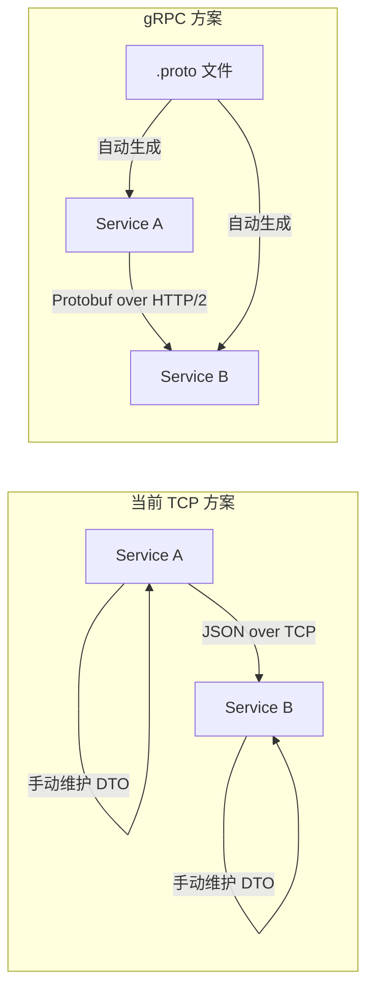
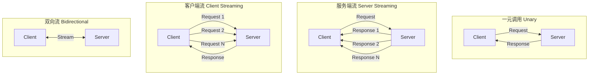
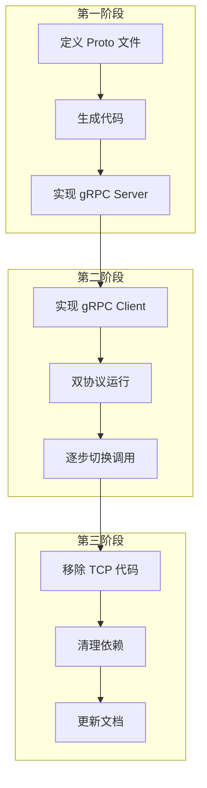

# gRPC 迁移指南

> **目标**：将当前 TCP 通信迁移到 gRPC，实现高性能、类型安全的服务间通信

---

## 目录

1. [为什么选择 gRPC](#1-为什么选择-grpc)
2. [gRPC 核心概念](#2-grpc-核心概念)
3. [项目配置](#3-项目配置)
4. [Proto 文件定义](#4-proto-文件定义)
5. [服务端实现](#5-服务端实现)
6. [客户端实现](#6-客户端实现)
7. [迁移步骤](#7-迁移步骤)
8. [最佳实践](#8-最佳实践)

---

## 1. 为什么选择 gRPC

### 1.1 TCP vs gRPC 对比

| 维度         | TCP (当前)      | gRPC                      |
| ------------ | --------------- | ------------------------- |
| **协议**     | 自定义 JSON     | HTTP/2 + Protobuf         |
| **性能**     | ⭐⭐⭐          | ⭐⭐⭐⭐⭐ (二进制序列化) |
| **类型安全** | ❌ 运行时检查   | ✅ 编译时检查             |
| **多路复用** | ❌ 单连接单请求 | ✅ 单连接多请求           |
| **流式传输** | ❌              | ✅ 双向流                 |
| **负载均衡** | ❌ 需自行实现   | ✅ 客户端 LB              |
| **跨语言**   | ⚠️ 有限         | ✅ 多语言支持             |
| **代码生成** | ❌ 手动维护 DTO | ✅ 自动生成               |

### 1.2 gRPC 的优势



**核心优势**：

1. **单一数据源**：Proto 文件定义接口，自动生成客户端和服务端代码
2. **HTTP/2 多路复用**：单连接支持多个并发请求，解决连接数爆炸问题
3. **二进制序列化**：Protobuf 比 JSON 更小更快
4. **流式支持**：支持服务端流、客户端流、双向流

---

## 2. gRPC 核心概念

### 2.1 四种通信模式



### 2.2 Proto 文件结构

```protobuf
// 语法版本
syntax = "proto3";

// 包名（命名空间）
package oes.auth.v1;

// 服务定义
service AuthService {
  // 一元调用
  rpc Login(LoginRequest) returns (LoginResponse);

  // 服务端流
  rpc WatchSessions(WatchRequest) returns (stream SessionEvent);
}

// 消息定义
message LoginRequest {
  string email = 1;
  string password = 2;
}

message LoginResponse {
  string access_token = 1;
  string refresh_token = 2;
  int64 expires_in = 3;
}
```

---

## 3. 项目配置

### 3.1 安装依赖

```bash
# 根目录安装
pnpm add @grpc/grpc-js @grpc/proto-loader

# 开发依赖（代码生成）
pnpm add -D grpc-tools ts-proto protobufjs
```

### 3.2 目录结构

```
src/
├── common/
│   └── src/
│       └── contracts/           # Proto 文件目录
│           ├── buf.yaml         # Buf 配置
│           ├── buf.gen.yaml     # 代码生成配置
│           └── oes/
│               ├── auth/
│               │   └── v1/
│               │       └── auth.proto
│               ├── permission/
│               │   └── v1/
│               │       └── permission.proto
│               └── identity/
│                   └── v1/
│                       └── identity.proto
├── generated/                   # 生成的代码
│   └── oes/
│       ├── auth/
│       │   └── v1/
│       │       ├── auth.ts      # 类型定义
│       │       └── auth.client.ts
│       └── ...
```

### 3.3 Buf 配置

**buf.yaml**（Proto 管理工具配置）：

```yaml
# buf.yaml
version: v1
name: buf.build/oes/contracts
deps: []
lint:
  use:
    - DEFAULT
  except:
    - PACKAGE_VERSION_SUFFIX
breaking:
  use:
    - FILE
```

**buf.gen.yaml**（代码生成配置）：

```yaml
# buf.gen.yaml
version: v1
managed:
  enabled: true
plugins:
  # 生成 TypeScript 类型和客户端
  - plugin: ts-proto
    out: ../../generated
    opt:
      - esModuleInterop=true
      - outputServices=nice-grpc
      - outputClientImpl=true
      - useExactTypes=false
      - env=node
      - stringEnums=true
      - nestJs=true
```

### 3.4 package.json 脚本

```json
{
  "scripts": {
    "proto:gen": "buf generate --template src/common/src/contracts/buf.gen.yaml src/common/src/contracts",
    "proto:lint": "buf lint src/common/src/contracts",
    "proto:breaking": "buf breaking src/common/src/contracts --against .git#subdir=src/common/src/contracts",
    "proto:format": "buf format -w src/common/src/contracts"
  }
}
```

---

## 4. Proto 文件定义

### 4.1 Auth Service Proto

```protobuf
// src/common/src/contracts/oes/auth/v1/auth.proto
syntax = "proto3";

package oes.auth.v1;

option go_package = "github.com/oes/contracts/auth/v1;authv1";

import "google/protobuf/timestamp.proto";
import "google/protobuf/empty.proto";

// ============ 服务定义 ============

service AuthService {
  // 用户登录
  rpc LoginWithEmailPassword(EmailPasswordLoginRequest) returns (LoginResponse);
  rpc LoginWithPhoneOtp(PhoneOtpLoginRequest) returns (LoginResponse);

  // Token 管理
  rpc RefreshToken(RefreshTokenRequest) returns (LoginResponse);
  rpc RevokeToken(RevokeTokenRequest) returns (google.protobuf.Empty);

  // Session 管理
  rpc GetActiveSessions(GetSessionsRequest) returns (GetSessionsResponse);
  rpc TerminateSession(TerminateSessionRequest) returns (google.protobuf.Empty);

  // 内部调用（服务间）
  rpc ValidateToken(ValidateTokenRequest) returns (ValidateTokenResponse);
}

// ============ 请求/响应消息 ============

message EmailPasswordLoginRequest {
  string email = 1;
  string password = 2;
  string device_id = 3;
  string device_name = 4;
  string ip_address = 5;
}

message PhoneOtpLoginRequest {
  string phone = 1;
  string otp_code = 2;
  string device_id = 3;
  string device_name = 4;
}

message LoginResponse {
  string access_token = 1;
  string refresh_token = 2;
  int64 expires_in = 3;  // 秒
  string token_type = 4; // "Bearer"
  UserInfo user = 5;
}

message RefreshTokenRequest {
  string refresh_token = 1;
}

message RevokeTokenRequest {
  string token = 1;
  TokenType token_type = 2;
}

message ValidateTokenRequest {
  string token = 1;
}

message ValidateTokenResponse {
  bool valid = 1;
  TokenClaims claims = 2;
}

message TokenClaims {
  string sub = 1;           // 用户 ID
  string tenant_id = 2;
  string account_type = 3;  // USER / SERVICE / ROBOT
  repeated string roles = 4;
  int64 exp = 5;
  int64 iat = 6;
}

message GetSessionsRequest {
  string user_id = 1;
}

message GetSessionsResponse {
  repeated Session sessions = 1;
}

message Session {
  string id = 1;
  string device_id = 2;
  string device_name = 3;
  string ip_address = 4;
  google.protobuf.Timestamp created_at = 5;
  google.protobuf.Timestamp last_active_at = 6;
  bool is_current = 7;
}

message TerminateSessionRequest {
  string session_id = 1;
}

// ============ 枚举 ============

enum TokenType {
  TOKEN_TYPE_UNSPECIFIED = 0;
  TOKEN_TYPE_ACCESS = 1;
  TOKEN_TYPE_REFRESH = 2;
}

// ============ 通用消息 ============

message UserInfo {
  string id = 1;
  string email = 2;
  string phone = 3;
  string display_name = 4;
  string avatar_url = 5;
  string tenant_id = 6;
}
```

### 4.2 Permission Service Proto

```protobuf
// src/common/src/contracts/oes/permission/v1/permission.proto
syntax = "proto3";

package oes.permission.v1;

import "google/protobuf/empty.proto";

service PermissionService {
  // 权限检查
  rpc CheckPermission(CheckPermissionRequest) returns (CheckPermissionResponse);
  rpc BatchCheckPermissions(BatchCheckPermissionsRequest) returns (BatchCheckPermissionsResponse);

  // 角色管理
  rpc GetUserRoles(GetUserRolesRequest) returns (GetUserRolesResponse);
  rpc AssignRole(AssignRoleRequest) returns (google.protobuf.Empty);
  rpc RevokeRole(RevokeRoleRequest) returns (google.protobuf.Empty);

  // 权限管理
  rpc GetRolePermissions(GetRolePermissionsRequest) returns (GetRolePermissionsResponse);
  rpc GetUserPermissions(GetUserPermissionsRequest) returns (GetUserPermissionsResponse);
}

message CheckPermissionRequest {
  string account_id = 1;
  string account_type = 2;  // USER / SERVICE / ROBOT
  string tenant_id = 3;
  string permission_code = 4;
  string resource_type = 5;  // 可选，用于 Scope 检查
  string resource_id = 6;    // 可选，用于 Scope 检查
}

message CheckPermissionResponse {
  bool allowed = 1;
  string reason = 2;  // 拒绝原因
}

message BatchCheckPermissionsRequest {
  string account_id = 1;
  string account_type = 2;
  string tenant_id = 3;
  repeated string permission_codes = 4;
}

message BatchCheckPermissionsResponse {
  map<string, bool> results = 1;  // permission_code -> allowed
}

message GetUserRolesRequest {
  string user_id = 1;
  string tenant_id = 2;
}

message GetUserRolesResponse {
  repeated Role roles = 1;
}

message Role {
  string id = 1;
  string code = 2;
  string name = 3;
  string description = 4;
  bool is_system = 5;
}

message Permission {
  string id = 1;
  string code = 2;
  string name = 3;
  string module = 4;
  string action = 5;
}

message AssignRoleRequest {
  string user_id = 1;
  string role_id = 2;
  string tenant_id = 3;
}

message RevokeRoleRequest {
  string user_id = 1;
  string role_id = 2;
  string tenant_id = 3;
}

message GetRolePermissionsRequest {
  string role_id = 1;
}

message GetRolePermissionsResponse {
  repeated Permission permissions = 1;
}

message GetUserPermissionsRequest {
  string user_id = 1;
  string tenant_id = 2;
}

message GetUserPermissionsResponse {
  repeated Permission permissions = 1;
}
```

### 4.3 Identity Service Proto

```protobuf
// src/common/src/contracts/oes/identity/v1/identity.proto
syntax = "proto3";

package oes.identity.v1;

import "google/protobuf/timestamp.proto";
import "google/protobuf/empty.proto";

service IdentityService {
  // 用户账户
  rpc GetUserAccount(GetUserAccountRequest) returns (UserAccount);
  rpc GetUserAccountByEmail(GetUserAccountByEmailRequest) returns (UserAccount);
  rpc CreateUserAccount(CreateUserAccountRequest) returns (UserAccount);
  rpc UpdateUserAccount(UpdateUserAccountRequest) returns (UserAccount);

  // 租户管理
  rpc GetTenant(GetTenantRequest) returns (Tenant);
  rpc CreateTenant(CreateTenantRequest) returns (Tenant);
  rpc ListTenants(ListTenantsRequest) returns (ListTenantsResponse);

  // ServiceAccount 管理
  rpc GetServiceAccount(GetServiceAccountRequest) returns (ServiceAccount);
  rpc CreateServiceAccount(CreateServiceAccountRequest) returns (ServiceAccountWithSecret);
  rpc RegenerateSecret(RegenerateSecretRequest) returns (ServiceAccountWithSecret);
}

// ============ 用户账户 ============

message GetUserAccountRequest {
  string id = 1;
}

message GetUserAccountByEmailRequest {
  string email = 1;
}

message UserAccount {
  string id = 1;
  string email = 2;
  string phone = 3;
  string display_name = 4;
  string avatar_url = 5;
  string tenant_id = 6;
  AccountStatus status = 7;
  google.protobuf.Timestamp created_at = 8;
  google.protobuf.Timestamp updated_at = 9;
}

message CreateUserAccountRequest {
  string email = 1;
  string phone = 2;
  string display_name = 3;
  string tenant_id = 4;
  string password_hash = 5;  // 由 auth-service 传入
}

message UpdateUserAccountRequest {
  string id = 1;
  optional string display_name = 2;
  optional string avatar_url = 3;
  optional string phone = 4;
}

// ============ 租户 ============

message GetTenantRequest {
  string id = 1;
}

message Tenant {
  string id = 1;
  string name = 2;
  string code = 3;
  TenantStatus status = 4;
  TenantPlan plan = 5;
  google.protobuf.Timestamp created_at = 6;
}

message CreateTenantRequest {
  string name = 1;
  string code = 2;
  TenantPlan plan = 3;
}

message ListTenantsRequest {
  int32 page = 1;
  int32 page_size = 2;
  optional TenantStatus status = 3;
}

message ListTenantsResponse {
  repeated Tenant tenants = 1;
  int32 total = 2;
}

// ============ ServiceAccount ============

message GetServiceAccountRequest {
  string client_id = 1;
}

message ServiceAccount {
  string id = 1;
  string client_id = 2;
  string name = 3;
  string description = 4;
  ServiceAccountType type = 5;
  string tenant_id = 6;  // 租户级 ServiceAccount
  AccountStatus status = 7;
  google.protobuf.Timestamp created_at = 8;
}

message ServiceAccountWithSecret {
  ServiceAccount account = 1;
  string client_secret = 2;  // 仅创建/重置时返回
}

message CreateServiceAccountRequest {
  string name = 1;
  string description = 2;
  ServiceAccountType type = 3;
  optional string tenant_id = 4;
}

message RegenerateSecretRequest {
  string client_id = 1;
}

// ============ 枚举 ============

enum AccountStatus {
  ACCOUNT_STATUS_UNSPECIFIED = 0;
  ACCOUNT_STATUS_ACTIVE = 1;
  ACCOUNT_STATUS_INACTIVE = 2;
  ACCOUNT_STATUS_SUSPENDED = 3;
}

enum TenantStatus {
  TENANT_STATUS_UNSPECIFIED = 0;
  TENANT_STATUS_ACTIVE = 1;
  TENANT_STATUS_SUSPENDED = 2;
  TENANT_STATUS_DELETED = 3;
}

enum TenantPlan {
  TENANT_PLAN_UNSPECIFIED = 0;
  TENANT_PLAN_FREE = 1;
  TENANT_PLAN_BASIC = 2;
  TENANT_PLAN_PRO = 3;
  TENANT_PLAN_ENTERPRISE = 4;
}

enum ServiceAccountType {
  SERVICE_ACCOUNT_TYPE_UNSPECIFIED = 0;
  SERVICE_ACCOUNT_TYPE_INTERNAL = 1;   // 内部服务
  SERVICE_ACCOUNT_TYPE_EXTERNAL = 2;   // 外部 API 调用
  SERVICE_ACCOUNT_TYPE_ROBOT = 3;      // 机器人服务
}
```

---

## 5. 服务端实现

### 5.1 NestJS gRPC 服务端配置

**main.ts**（Auth Service）：

```typescript
// src/services/system/auth-service/src/main.ts
import { NestFactory } from '@nestjs/core'
import { MicroserviceOptions, Transport } from '@nestjs/microservices'
import { join } from 'path'
import { AppModule } from './app.module'
import { OES_AUTH_V1_PACKAGE_NAME } from '@oes/generated/oes/auth/v1/auth'

async function bootstrap() {
  // 创建 gRPC 微服务
  const app = await NestFactory.createMicroservice<MicroserviceOptions>(AppModule, {
    transport: Transport.GRPC,
    options: {
      package: OES_AUTH_V1_PACKAGE_NAME,
      protoPath: join(__dirname, '../../../common/src/contracts/oes/auth/v1/auth.proto'),
      url: '0.0.0.0:9202',
      loader: {
        keepCase: true,
        longs: String,
        enums: String,
        defaults: true,
        oneofs: true
      }
    }
  })

  await app.listen()
  console.log('Auth Service (gRPC) is listening on port 9202')
}

bootstrap()
```

### 5.2 gRPC Controller 实现

```typescript
// src/services/system/auth-service/src/interfaces/grpc/auth.grpc.controller.ts
import { Controller } from '@nestjs/common'
import { GrpcMethod, RpcException } from '@nestjs/microservices'
import { status } from '@grpc/grpc-js'
import {
  AuthServiceController,
  AuthServiceControllerMethods,
  EmailPasswordLoginRequest,
  LoginResponse,
  RefreshTokenRequest,
  ValidateTokenRequest,
  ValidateTokenResponse
} from '@oes/generated/oes/auth/v1/auth'
import { AuthService } from '../../application/services/auth.service'

@Controller()
@AuthServiceControllerMethods() // 自动实现所有方法签名
export class AuthGrpcController implements AuthServiceController {
  constructor(private readonly authService: AuthService) {}

  @GrpcMethod('AuthService', 'LoginWithEmailPassword')
  async loginWithEmailPassword(request: EmailPasswordLoginRequest): Promise<LoginResponse> {
    try {
      const result = await this.authService.loginWithEmailPassword({
        email: request.email,
        password: request.password,
        deviceId: request.deviceId,
        deviceName: request.deviceName,
        ipAddress: request.ipAddress
      })

      return {
        accessToken: result.accessToken,
        refreshToken: result.refreshToken,
        expiresIn: result.expiresIn,
        tokenType: 'Bearer',
        user: {
          id: result.user.id,
          email: result.user.email,
          phone: result.user.phone || '',
          displayName: result.user.displayName,
          avatarUrl: result.user.avatarUrl || '',
          tenantId: result.user.tenantId
        }
      }
    } catch (error) {
      // 转换为 gRPC 错误
      throw new RpcException({
        code: status.UNAUTHENTICATED,
        message: error.message
      })
    }
  }

  @GrpcMethod('AuthService', 'RefreshToken')
  async refreshToken(request: RefreshTokenRequest): Promise<LoginResponse> {
    try {
      const result = await this.authService.refreshToken(request.refreshToken)
      return {
        accessToken: result.accessToken,
        refreshToken: result.refreshToken,
        expiresIn: result.expiresIn,
        tokenType: 'Bearer',
        user: undefined // 刷新时不返回用户信息
      }
    } catch (error) {
      throw new RpcException({
        code: status.UNAUTHENTICATED,
        message: 'Invalid refresh token'
      })
    }
  }

  @GrpcMethod('AuthService', 'ValidateToken')
  async validateToken(request: ValidateTokenRequest): Promise<ValidateTokenResponse> {
    try {
      const claims = await this.authService.validateToken(request.token)
      return {
        valid: true,
        claims: {
          sub: claims.sub,
          tenantId: claims.tenantId,
          accountType: claims.accountType,
          roles: claims.roles,
          exp: claims.exp,
          iat: claims.iat
        }
      }
    } catch (error) {
      return {
        valid: false,
        claims: undefined
      }
    }
  }
}
```

### 5.3 错误处理

```typescript
// src/common/src/rpc/interceptors/grpc-exception.interceptor.ts
import { Injectable, NestInterceptor, ExecutionContext, CallHandler } from '@nestjs/common'
import { Observable, throwError } from 'rxjs'
import { catchError } from 'rxjs/operators'
import { RpcException } from '@nestjs/microservices'
import { status } from '@grpc/grpc-js'
import { OesException } from '@oes/common/core/exceptions'

@Injectable()
export class GrpcExceptionInterceptor implements NestInterceptor {
  intercept(context: ExecutionContext, next: CallHandler): Observable<any> {
    return next.handle().pipe(
      catchError((error) => {
        // 已经是 RpcException，直接抛出
        if (error instanceof RpcException) {
          return throwError(() => error)
        }

        // 转换 OesException 为 gRPC 错误
        if (error instanceof OesException) {
          const grpcStatus = this.mapToGrpcStatus(error.code)
          return throwError(
            () =>
              new RpcException({
                code: grpcStatus,
                message: error.message,
                details: JSON.stringify({
                  errorCode: error.code,
                  errorType: error.type,
                  context: error.context
                })
              })
          )
        }

        // 未知错误
        return throwError(
          () =>
            new RpcException({
              code: status.INTERNAL,
              message: error.message || 'Internal server error'
            })
        )
      })
    )
  }

  private mapToGrpcStatus(errorCode: string): number {
    const mapping: Record<string, number> = {
      UNAUTHORIZED: status.UNAUTHENTICATED,
      FORBIDDEN: status.PERMISSION_DENIED,
      NOT_FOUND: status.NOT_FOUND,
      CONFLICT: status.ALREADY_EXISTS,
      VALIDATION_ERROR: status.INVALID_ARGUMENT,
      RATE_LIMITED: status.RESOURCE_EXHAUSTED
    }
    return mapping[errorCode] || status.INTERNAL
  }
}
```

---

## 6. 客户端实现

### 6.1 gRPC 客户端模块

```typescript
// src/common/src/rpc/grpc/grpc-client.module.ts
import { DynamicModule, Module, Provider } from '@nestjs/common'
import { ClientsModule, Transport, ClientGrpc } from '@nestjs/microservices'
import { join } from 'path'

export interface GrpcClientConfig {
  name: string
  package: string
  protoPath: string
  url: string
}

@Module({})
export class GrpcClientModule {
  static register(configs: GrpcClientConfig[]): DynamicModule {
    const clientsConfig = configs.map((config) => ({
      name: config.name,
      transport: Transport.GRPC as const,
      options: {
        package: config.package,
        protoPath: config.protoPath,
        url: config.url,
        loader: {
          keepCase: true,
          longs: String,
          enums: String,
          defaults: true,
          oneofs: true
        }
      }
    }))

    return {
      module: GrpcClientModule,
      imports: [ClientsModule.register(clientsConfig)],
      exports: [ClientsModule]
    }
  }

  static registerAsync(configs: GrpcClientConfig[]): DynamicModule {
    // 支持从配置中心动态获取 URL
    const clientsConfig = configs.map((config) => ({
      name: config.name,
      transport: Transport.GRPC as const,
      useFactory: (configService: any) => ({
        package: config.package,
        protoPath: config.protoPath,
        url: configService.get(`GRPC_${config.name}_URL`) || config.url,
        loader: {
          keepCase: true,
          longs: String,
          enums: String,
          defaults: true,
          oneofs: true
        }
      }),
      inject: ['ConfigService']
    }))

    return {
      module: GrpcClientModule,
      imports: [ClientsModule.registerAsync(clientsConfig)],
      exports: [ClientsModule]
    }
  }
}
```

### 6.2 服务配置

```typescript
// src/common/src/rpc/grpc/grpc-services.config.ts
import { join } from 'path'
import { GrpcClientConfig } from './grpc-client.module'

const PROTO_BASE_PATH = join(__dirname, '../../contracts')

export const GRPC_SERVICES: Record<string, GrpcClientConfig> = {
  AUTH: {
    name: 'AUTH_GRPC_CLIENT',
    package: 'oes.auth.v1',
    protoPath: join(PROTO_BASE_PATH, 'oes/auth/v1/auth.proto'),
    url: process.env.AUTH_SERVICE_GRPC_URL || 'localhost:9202'
  },
  PERMISSION: {
    name: 'PERMISSION_GRPC_CLIENT',
    package: 'oes.permission.v1',
    protoPath: join(PROTO_BASE_PATH, 'oes/permission/v1/permission.proto'),
    url: process.env.PERMISSION_SERVICE_GRPC_URL || 'localhost:9302'
  },
  IDENTITY: {
    name: 'IDENTITY_GRPC_CLIENT',
    package: 'oes.identity.v1',
    protoPath: join(PROTO_BASE_PATH, 'oes/identity/v1/identity.proto'),
    url: process.env.IDENTITY_SERVICE_GRPC_URL || 'localhost:9402'
  }
}

export const GrpcServiceKeys = {
  AUTH: 'AUTH_GRPC_CLIENT',
  PERMISSION: 'PERMISSION_GRPC_CLIENT',
  IDENTITY: 'IDENTITY_GRPC_CLIENT'
} as const
```

### 6.3 客户端使用示例

```typescript
// src/services/system/api-gateway/src/modules/auth-service/auth-service.module.ts
import { Module } from '@nestjs/common'
import { GrpcClientModule } from '@oes/common/rpc/grpc/grpc-client.module'
import { GRPC_SERVICES } from '@oes/common/rpc/grpc/grpc-services.config'
import { AuthController } from './controllers/auth.controller'
import { AuthGrpcService } from './services/auth-grpc.service'

@Module({
  imports: [GrpcClientModule.register([GRPC_SERVICES.AUTH])],
  controllers: [AuthController],
  providers: [AuthGrpcService]
})
export class AuthServiceModule {}
```

```typescript
// src/services/system/api-gateway/src/modules/auth-service/services/auth-grpc.service.ts
import { Injectable, OnModuleInit, Inject } from '@nestjs/common'
import { ClientGrpc } from '@nestjs/microservices'
import { firstValueFrom } from 'rxjs'
import {
  AuthServiceClient,
  AUTH_SERVICE_NAME,
  EmailPasswordLoginRequest,
  LoginResponse
} from '@oes/generated/oes/auth/v1/auth'
import { GrpcServiceKeys } from '@oes/common/rpc/grpc/grpc-services.config'

@Injectable()
export class AuthGrpcService implements OnModuleInit {
  private authService: AuthServiceClient

  constructor(
    @Inject(GrpcServiceKeys.AUTH)
    private readonly client: ClientGrpc
  ) {}

  onModuleInit() {
    // 获取服务客户端
    this.authService = this.client.getService<AuthServiceClient>(AUTH_SERVICE_NAME)
  }

  async loginWithEmailPassword(request: EmailPasswordLoginRequest): Promise<LoginResponse> {
    // 调用 gRPC 服务
    return firstValueFrom(this.authService.loginWithEmailPassword(request))
  }

  async validateToken(token: string) {
    return firstValueFrom(this.authService.validateToken({ token }))
  }
}
```

### 6.4 Controller 使用

```typescript
// src/services/system/api-gateway/src/modules/auth-service/controllers/auth.controller.ts
import { Body, Controller, Post, HttpCode, HttpStatus } from '@nestjs/common'
import { ApiTags, ApiOperation, ApiResponse } from '@nestjs/swagger'
import { Public } from '@oes/common/auth/decorators/is-public.decorator'
import { AuthGrpcService } from '../services/auth-grpc.service'
import { EmailPasswordLoginDto, LoginResponseDto } from '../dto/auth.dto'

@ApiTags('认证')
@Controller('auth')
export class AuthController {
  constructor(private readonly authService: AuthGrpcService) {}

  @Public()
  @Post('login/email-password')
  @HttpCode(HttpStatus.OK)
  @ApiOperation({ summary: '邮箱密码登录' })
  @ApiResponse({ status: 200, type: LoginResponseDto })
  async loginWithEmailPassword(@Body() dto: EmailPasswordLoginDto): Promise<LoginResponseDto> {
    const result = await this.authService.loginWithEmailPassword({
      email: dto.email,
      password: dto.password,
      deviceId: dto.deviceId || '',
      deviceName: dto.deviceName || '',
      ipAddress: '' // 从请求中获取
    })

    return {
      accessToken: result.accessToken,
      refreshToken: result.refreshToken,
      expiresIn: Number(result.expiresIn),
      tokenType: result.tokenType
    }
  }
}
```

---

## 7. 迁移步骤

### 7.1 迁移顺序



### 7.2 详细步骤

**Step 1: 定义 Proto 文件**

```bash
# 创建目录结构
mkdir -p src/common/src/contracts/oes/{auth,permission,identity}/v1

# 编写 proto 文件
# 参考上面的 Proto 文件定义
```

**Step 2: 生成代码**

```bash
# 安装 buf
npm install -g @bufbuild/buf

# 生成代码
pnpm run proto:gen
```

**Step 3: 实现 gRPC Server**

```typescript
// 修改 main.ts，添加 gRPC 传输
// 参考上面的服务端实现
```

**Step 4: 双协议运行（过渡期）**

```typescript
// main.ts - 同时支持 TCP 和 gRPC
async function bootstrap() {
  const app = await NestFactory.create(AppModule)

  // TCP 微服务（保持兼容）
  app.connectMicroservice<MicroserviceOptions>({
    transport: Transport.TCP,
    options: { host: '0.0.0.0', port: 9201 }
  })

  // gRPC 微服务（新增）
  app.connectMicroservice<MicroserviceOptions>({
    transport: Transport.GRPC,
    options: {
      package: 'oes.auth.v1',
      protoPath: join(__dirname, '../proto/auth.proto'),
      url: '0.0.0.0:9202'
    }
  })

  await app.startAllMicroservices()
}
```

**Step 5: 逐步切换调用方**

```typescript
// 先切换一个调用方，验证正常后再切换其他
// 例如：先切换 api-gateway 对 auth-service 的调用
```

**Step 6: 移除 TCP 代码**

```bash
# 确认所有调用方都已切换到 gRPC 后
# 移除 TCP 相关代码和配置
```

---

## 8. 最佳实践

### 8.1 Proto 文件版本管理

```protobuf
// 使用版本号命名空间
package oes.auth.v1;  // v1 版本
package oes.auth.v2;  // v2 版本（不兼容变更时）

// 字段编号规则
message User {
  string id = 1;        // 永不复用已删除字段的编号
  string email = 2;
  // reserved 3;        // 标记已删除的字段
  string name = 4;
}
```

### 8.2 错误处理规范

```typescript
// 使用标准 gRPC 状态码
import { status } from '@grpc/grpc-js'

// 状态码映射
const STATUS_MAPPING = {
  // 客户端错误
  INVALID_ARGUMENT: status.INVALID_ARGUMENT, // 参数错误
  NOT_FOUND: status.NOT_FOUND, // 资源不存在
  ALREADY_EXISTS: status.ALREADY_EXISTS, // 资源已存在
  PERMISSION_DENIED: status.PERMISSION_DENIED, // 权限不足
  UNAUTHENTICATED: status.UNAUTHENTICATED, // 未认证

  // 服务端错误
  INTERNAL: status.INTERNAL, // 内部错误
  UNAVAILABLE: status.UNAVAILABLE, // 服务不可用
  DEADLINE_EXCEEDED: status.DEADLINE_EXCEEDED // 超时
}
```

### 8.3 超时和重试配置

```typescript
// 客户端配置
const clientOptions = {
  transport: Transport.GRPC,
  options: {
    package: 'oes.auth.v1',
    protoPath: '...',
    url: 'localhost:9202',
    channelOptions: {
      'grpc.keepalive_time_ms': 10000, // 心跳间隔
      'grpc.keepalive_timeout_ms': 5000, // 心跳超时
      'grpc.max_receive_message_length': 4 * 1024 * 1024, // 最大消息大小
      'grpc.max_send_message_length': 4 * 1024 * 1024
    }
  }
}
```

### 8.4 健康检查

```protobuf
// 使用标准健康检查协议
syntax = "proto3";

package grpc.health.v1;

service Health {
  rpc Check(HealthCheckRequest) returns (HealthCheckResponse);
  rpc Watch(HealthCheckRequest) returns (stream HealthCheckResponse);
}

message HealthCheckRequest {
  string service = 1;
}

message HealthCheckResponse {
  enum ServingStatus {
    UNKNOWN = 0;
    SERVING = 1;
    NOT_SERVING = 2;
  }
  ServingStatus status = 1;
}
```

---

## 下一步

完成 gRPC 迁移后，建议继续：

1. [Nacos 配置中心集成](02-Nacos配置中心集成指南.md)
2. [可观测性组件集成](03-可观测性组件集成指南.md)
3. [API 网关集成](04-API网关集成指南.md)
