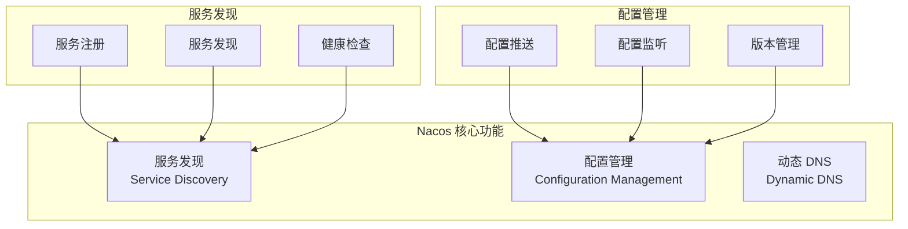

# Nacos 配置中心集成指南

> **目标**：使用 Nacos 实现服务注册发现和动态配置管理，替代硬编码配置

---

## 目录

1. [Nacos 简介](#1-nacos-简介)
2. [Nacos 部署](#2-nacos-部署)
3. [NestJS 集成](#3-nestjs-集成)
4. [配置管理](#4-配置管理)
5. [服务发现](#5-服务发现)
6. [最佳实践](#6-最佳实践)

---

## 1. Nacos 简介

### 1.1 什么是 Nacos

Nacos（Dynamic Naming and Configuration Service）是阿里巴巴开源的服务发现和配置管理平台。



### 1.2 为什么选择 Nacos

| 功能     | 环境变量      | Nacos        | 说明               |
| -------- | ------------- | ------------ | ------------------ |
| 配置存储 | 文件/环境变量 | 集中存储     | Nacos 统一管理     |
| 动态更新 | ❌ 需重启     | ✅ 热更新    | 无需重启服务       |
| 版本管理 | ❌            | ✅           | 配置历史可追溯     |
| 多环境   | 手动切换      | 命名空间隔离 | dev/test/prod      |
| 服务发现 | ❌ 硬编码     | ✅ 动态发现  | 自动感知服务上下线 |
| 健康检查 | ❌            | ✅           | 自动剔除不健康实例 |

### 1.3 Nacos vs 其他方案

| 维度       | Nacos      | Consul     | etcd          | Apollo   |
| ---------- | ---------- | ---------- | ------------- | -------- |
| 服务发现   | ✅         | ✅         | ⚠️ 需额外组件 | ❌       |
| 配置中心   | ✅         | ⚠️ KV 存储 | ⚠️ KV 存储    | ✅       |
| 中文文档   | ⭐⭐⭐⭐⭐ | ⭐⭐⭐     | ⭐⭐          | ⭐⭐⭐⭐ |
| 学习曲线   | 低         | 中         | 高            | 中       |
| 部署复杂度 | 低         | 中         | 高            | 高       |
| 社区活跃度 | 高         | 高         | 高            | 中       |

**推荐 Nacos 的原因**：

- 一站式解决服务发现 + 配置管理
- 中文文档完善，社区活跃
- 阿里巴巴大规模生产验证
- 与 Spring Cloud / Dubbo 生态集成好

---

## 2. Nacos 部署

### 2.1 Docker Compose 部署（开发环境）

```yaml
# docker-compose.yml
version: '3.8'

services:
  nacos:
    image: nacos/nacos-server:v2.3.0
    container_name: nacos
    environment:
      - MODE=standalone
      - PREFER_HOST_MODE=hostname
      - SPRING_DATASOURCE_PLATFORM=mysql
      - MYSQL_SERVICE_HOST=mysql
      - MYSQL_SERVICE_PORT=3306
      - MYSQL_SERVICE_DB_NAME=nacos
      - MYSQL_SERVICE_USER=nacos
      - MYSQL_SERVICE_PASSWORD=nacos
      - NACOS_AUTH_ENABLE=true
      - NACOS_AUTH_TOKEN=SecretKey012345678901234567890123456789012345678901234567890123456789
      - NACOS_AUTH_IDENTITY_KEY=serverIdentity
      - NACOS_AUTH_IDENTITY_VALUE=security
    ports:
      - '8848:8848'
      - '9848:9848'
      - '9849:9849'
    depends_on:
      - mysql
    volumes:
      - ./nacos/logs:/home/nacos/logs
    networks:
      - oes-network

  mysql:
    image: mysql:8.0
    container_name: nacos-mysql
    environment:
      - MYSQL_ROOT_PASSWORD=root
      - MYSQL_DATABASE=nacos
      - MYSQL_USER=nacos
      - MYSQL_PASSWORD=nacos
    ports:
      - '3307:3306'
    volumes:
      - ./nacos/mysql:/var/lib/mysql
      - ./nacos/init.sql:/docker-entrypoint-initdb.d/init.sql
    networks:
      - oes-network

networks:
  oes-network:
    driver: bridge
```

### 2.2 初始化 SQL

```sql
-- nacos/init.sql
-- Nacos 数据库初始化脚本
-- 从 https://github.com/alibaba/nacos/blob/master/distribution/conf/mysql-schema.sql 获取

CREATE TABLE `config_info` (
  `id` bigint(20) NOT NULL AUTO_INCREMENT,
  `data_id` varchar(255) NOT NULL,
  `group_id` varchar(128) DEFAULT NULL,
  `content` longtext NOT NULL,
  `md5` varchar(32) DEFAULT NULL,
  `gmt_create` datetime NOT NULL DEFAULT CURRENT_TIMESTAMP,
  `gmt_modified` datetime NOT NULL DEFAULT CURRENT_TIMESTAMP,
  `src_user` text,
  `src_ip` varchar(50) DEFAULT NULL,
  `app_name` varchar(128) DEFAULT NULL,
  `tenant_id` varchar(128) DEFAULT '',
  `c_desc` varchar(256) DEFAULT NULL,
  `c_use` varchar(64) DEFAULT NULL,
  `effect` varchar(64) DEFAULT NULL,
  `type` varchar(64) DEFAULT NULL,
  `c_schema` text,
  `encrypted_data_key` text,
  PRIMARY KEY (`id`),
  UNIQUE KEY `uk_configinfo_datagrouptenant` (`data_id`,`group_id`,`tenant_id`)
) ENGINE=InnoDB DEFAULT CHARSET=utf8 COLLATE=utf8_bin;

-- 更多表结构请参考官方文档
```

### 2.3 启动 Nacos

```bash
# 启动
docker-compose up -d nacos

# 查看日志
docker-compose logs -f nacos

# 访问控制台
# http://localhost:8848/nacos
# 默认账号：nacos / nacos
```

### 2.4 Nacos 控制台

访问 `http://localhost:8848/nacos` 后：

1. **配置管理** → 创建配置
2. **服务管理** → 查看注册的服务
3. **命名空间** → 创建环境隔离

---

## 3. NestJS 集成

### 3.1 安装依赖

```bash
pnpm add nacos-config nacos-naming
```

### 3.2 Nacos 配置模块

```typescript
// src/common/src/config/nacos/nacos.module.ts
import { DynamicModule, Global, Module, OnModuleInit, Logger } from '@nestjs/common'
import { NacosConfigClient } from 'nacos-config'
import { NacosNamingClient } from 'nacos-naming'

export interface NacosModuleOptions {
  serverAddr: string
  namespace?: string
  username?: string
  password?: string
  serviceName: string
  servicePort: number
  serviceIp?: string
}

export const NACOS_CONFIG_CLIENT = 'NACOS_CONFIG_CLIENT'
export const NACOS_NAMING_CLIENT = 'NACOS_NAMING_CLIENT'
export const NACOS_OPTIONS = 'NACOS_OPTIONS'

@Global()
@Module({})
export class NacosModule implements OnModuleInit {
  private static logger = new Logger('NacosModule')
  private static configClient: NacosConfigClient
  private static namingClient: NacosNamingClient
  private static options: NacosModuleOptions

  static forRoot(options: NacosModuleOptions): DynamicModule {
    this.options = options

    const configClientProvider = {
      provide: NACOS_CONFIG_CLIENT,
      useFactory: async () => {
        const client = new NacosConfigClient({
          serverAddr: options.serverAddr,
          namespace: options.namespace,
          username: options.username,
          password: options.password
        })
        await client.ready()
        this.configClient = client
        this.logger.log('Nacos Config Client connected')
        return client
      }
    }

    const namingClientProvider = {
      provide: NACOS_NAMING_CLIENT,
      useFactory: async () => {
        const client = new NacosNamingClient({
          serverList: options.serverAddr,
          namespace: options.namespace,
          username: options.username,
          password: options.password,
          logger: console
        })
        await client.ready()
        this.namingClient = client
        this.logger.log('Nacos Naming Client connected')
        return client
      }
    }

    const optionsProvider = {
      provide: NACOS_OPTIONS,
      useValue: options
    }

    return {
      module: NacosModule,
      providers: [configClientProvider, namingClientProvider, optionsProvider],
      exports: [NACOS_CONFIG_CLIENT, NACOS_NAMING_CLIENT, NACOS_OPTIONS]
    }
  }

  async onModuleInit() {
    // 注册服务
    if (NacosModule.namingClient && NacosModule.options) {
      const { serviceName, servicePort, serviceIp } = NacosModule.options
      const ip = serviceIp || this.getLocalIp()

      await NacosModule.namingClient.registerInstance(serviceName, {
        ip,
        port: servicePort,
        healthy: true,
        enabled: true,
        weight: 1,
        metadata: {
          version: process.env.npm_package_version || '1.0.0'
        }
      })

      NacosModule.logger.log(`Service registered: ${serviceName} at ${ip}:${servicePort}`)
    }
  }

  private getLocalIp(): string {
    const os = require('os')
    const interfaces = os.networkInterfaces()
    for (const name of Object.keys(interfaces)) {
      for (const iface of interfaces[name]) {
        if (iface.family === 'IPv4' && !iface.internal) {
          return iface.address
        }
      }
    }
    return '127.0.0.1'
  }
}
```

### 3.3 配置服务

```typescript
// src/common/src/config/nacos/nacos-config.service.ts
import { Injectable, Inject, Logger, OnModuleInit } from '@nestjs/common'
import { NacosConfigClient } from 'nacos-config'
import { NACOS_CONFIG_CLIENT } from './nacos.module'

export interface ConfigSubscription {
  dataId: string
  group: string
  callback: (config: string) => void
}

@Injectable()
export class NacosConfigService implements OnModuleInit {
  private readonly logger = new Logger(NacosConfigService.name)
  private configCache = new Map<string, any>()
  private subscriptions: ConfigSubscription[] = []

  constructor(
    @Inject(NACOS_CONFIG_CLIENT)
    private readonly configClient: NacosConfigClient
  ) {}

  async onModuleInit() {
    // 初始化时加载所有订阅的配置
    for (const sub of this.subscriptions) {
      await this.loadAndSubscribe(sub)
    }
  }

  /**
   * 获取配置（JSON 格式）
   */
  async getConfig<T = any>(dataId: string, group = 'DEFAULT_GROUP'): Promise<T> {
    const cacheKey = `${group}:${dataId}`

    if (this.configCache.has(cacheKey)) {
      return this.configCache.get(cacheKey)
    }

    const content = await this.configClient.getConfig(dataId, group)
    if (!content) {
      throw new Error(`Config not found: ${dataId}`)
    }

    const parsed = JSON.parse(content)
    this.configCache.set(cacheKey, parsed)
    return parsed
  }

  /**
   * 订阅配置变更
   */
  subscribe(dataId: string, group: string, callback: (config: any) => void): void {
    this.subscriptions.push({ dataId, group, callback })
  }

  private async loadAndSubscribe(sub: ConfigSubscription): Promise<void> {
    const { dataId, group, callback } = sub
    const cacheKey = `${group}:${dataId}`

    // 加载初始配置
    try {
      const content = await this.configClient.getConfig(dataId, group)
      if (content) {
        const parsed = JSON.parse(content)
        this.configCache.set(cacheKey, parsed)
        callback(parsed)
        this.logger.log(`Config loaded: ${dataId}`)
      }
    } catch (error) {
      this.logger.error(`Failed to load config: ${dataId}`, error)
    }

    // 订阅变更
    this.configClient.subscribe({ dataId, group }, (content: string) => {
      try {
        const parsed = JSON.parse(content)
        this.configCache.set(cacheKey, parsed)
        callback(parsed)
        this.logger.log(`Config updated: ${dataId}`)
      } catch (error) {
        this.logger.error(`Failed to parse config: ${dataId}`, error)
      }
    })
  }

  /**
   * 发布配置
   */
  async publishConfig(dataId: string, group: string, content: any): Promise<boolean> {
    const contentStr = typeof content === 'string' ? content : JSON.stringify(content, null, 2)

    return this.configClient.publishSingle(dataId, group, contentStr)
  }
}
```

### 3.4 服务发现服务

```typescript
// src/common/src/config/nacos/nacos-naming.service.ts
import { Injectable, Inject, Logger } from '@nestjs/common'
import { NacosNamingClient, Instance } from 'nacos-naming'
import { NACOS_NAMING_CLIENT } from './nacos.module'

@Injectable()
export class NacosNamingService {
  private readonly logger = new Logger(NacosNamingService.name)
  private instanceCache = new Map<string, Instance[]>()

  constructor(
    @Inject(NACOS_NAMING_CLIENT)
    private readonly namingClient: NacosNamingClient
  ) {}

  /**
   * 获取服务实例列表
   */
  async getInstances(serviceName: string, group = 'DEFAULT_GROUP'): Promise<Instance[]> {
    const instances = await this.namingClient.getAllInstances(serviceName, group, 'DEFAULT', false)
    return instances.filter((i) => i.healthy && i.enabled)
  }

  /**
   * 获取一个健康实例（简单轮询）
   */
  async selectOneInstance(serviceName: string): Promise<Instance | null> {
    const instances = await this.getInstances(serviceName)
    if (instances.length === 0) {
      this.logger.warn(`No healthy instance found for: ${serviceName}`)
      return null
    }

    // 简单轮询
    const index = Math.floor(Math.random() * instances.length)
    return instances[index]
  }

  /**
   * 获取服务地址
   */
  async getServiceUrl(serviceName: string): Promise<string | null> {
    const instance = await this.selectOneInstance(serviceName)
    if (!instance) {
      return null
    }
    return `${instance.ip}:${instance.port}`
  }

  /**
   * 订阅服务变更
   */
  subscribe(serviceName: string, callback: (instances: Instance[]) => void): void {
    this.namingClient.subscribe(serviceName, (instances: Instance[]) => {
      const healthy = instances.filter((i) => i.healthy && i.enabled)
      this.instanceCache.set(serviceName, healthy)
      callback(healthy)
      this.logger.log(`Service instances updated: ${serviceName}, count: ${healthy.length}`)
    })
  }
}
```

### 3.5 在服务中使用

```typescript
// src/services/system/auth-service/src/app.module.ts
import { Module } from '@nestjs/common'
import { NacosModule } from '@oes/common/config/nacos/nacos.module'
import { NacosConfigService } from '@oes/common/config/nacos/nacos-config.service'
import { NacosNamingService } from '@oes/common/config/nacos/nacos-naming.service'

@Module({
  imports: [
    NacosModule.forRoot({
      serverAddr: process.env.NACOS_SERVER_ADDR || 'localhost:8848',
      namespace: process.env.NACOS_NAMESPACE || 'public',
      username: process.env.NACOS_USERNAME || 'nacos',
      password: process.env.NACOS_PASSWORD || 'nacos',
      serviceName: 'auth-service',
      servicePort: 9202
    })
  ],
  providers: [NacosConfigService, NacosNamingService],
  exports: [NacosConfigService, NacosNamingService]
})
export class AppModule {}
```

---

## 4. 配置管理

### 4.1 配置文件结构

在 Nacos 控制台创建以下配置：

**Data ID**: `auth-service.json`  
**Group**: `DEFAULT_GROUP`  
**配置格式**: JSON

```json
{
  "server": {
    "port": 9202,
    "grpcPort": 9203
  },
  "database": {
    "host": "localhost",
    "port": 5432,
    "database": "oes_auth",
    "username": "postgres",
    "password": "postgres"
  },
  "redis": {
    "host": "localhost",
    "port": 6379,
    "password": ""
  },
  "jwt": {
    "secret": "your-jwt-secret-key",
    "accessTokenExpiry": "15m",
    "refreshTokenExpiry": "7d"
  },
  "rateLimit": {
    "login": {
      "maxAttempts": 5,
      "windowMs": 900000
    }
  }
}
```

### 4.2 动态配置加载

```typescript
// src/services/system/auth-service/src/config/app-config.service.ts
import { Injectable, OnModuleInit, Logger } from '@nestjs/common'
import { NacosConfigService } from '@oes/common/config/nacos/nacos-config.service'

export interface AuthServiceConfig {
  server: {
    port: number
    grpcPort: number
  }
  database: {
    host: string
    port: number
    database: string
    username: string
    password: string
  }
  redis: {
    host: string
    port: number
    password: string
  }
  jwt: {
    secret: string
    accessTokenExpiry: string
    refreshTokenExpiry: string
  }
  rateLimit: {
    login: {
      maxAttempts: number
      windowMs: number
    }
  }
}

@Injectable()
export class AppConfigService implements OnModuleInit {
  private readonly logger = new Logger(AppConfigService.name)
  private config: AuthServiceConfig

  constructor(private readonly nacosConfig: NacosConfigService) {}

  async onModuleInit() {
    // 加载初始配置
    this.config = await this.nacosConfig.getConfig<AuthServiceConfig>(
      'auth-service.json',
      'DEFAULT_GROUP'
    )

    // 订阅配置变更
    this.nacosConfig.subscribe(
      'auth-service.json',
      'DEFAULT_GROUP',
      (newConfig: AuthServiceConfig) => {
        this.config = newConfig
        this.logger.log('Configuration updated')
        this.onConfigChange(newConfig)
      }
    )
  }

  get<K extends keyof AuthServiceConfig>(key: K): AuthServiceConfig[K] {
    return this.config[key]
  }

  getAll(): AuthServiceConfig {
    return this.config
  }

  private onConfigChange(config: AuthServiceConfig) {
    // 处理配置变更
    // 例如：更新连接池、刷新缓存等
  }
}
```

### 4.3 共享配置

创建共享配置供多个服务使用：

**Data ID**: `common.json`  
**Group**: `DEFAULT_GROUP`

```json
{
  "logging": {
    "level": "info",
    "format": "json"
  },
  "tracing": {
    "enabled": true,
    "endpoint": "http://jaeger:14268/api/traces"
  },
  "services": {
    "auth": {
      "name": "auth-service",
      "grpcPort": 9202
    },
    "permission": {
      "name": "permission-service",
      "grpcPort": 9302
    },
    "identity": {
      "name": "identity-service",
      "grpcPort": 9402
    }
  }
}
```

```typescript
// 加载共享配置
const commonConfig = await nacosConfig.getConfig('common.json')
const authServiceUrl = `${commonConfig.services.auth.name}:${commonConfig.services.auth.grpcPort}`
```

### 4.4 环境隔离

使用命名空间隔离不同环境：

```typescript
// 开发环境
NacosModule.forRoot({
  serverAddr: 'localhost:8848',
  namespace: 'dev' // 开发环境命名空间 ID
  // ...
})

// 测试环境
NacosModule.forRoot({
  serverAddr: 'nacos.test.internal:8848',
  namespace: 'test' // 测试环境命名空间 ID
  // ...
})

// 生产环境
NacosModule.forRoot({
  serverAddr: 'nacos.prod.internal:8848',
  namespace: 'prod' // 生产环境命名空间 ID
  // ...
})
```

---

## 5. 服务发现

### 5.1 动态获取服务地址

```typescript
// src/common/src/rpc/grpc/dynamic-grpc-client.service.ts
import { Injectable, Logger } from '@nestjs/common'
import { ClientGrpc, ClientProxyFactory, Transport } from '@nestjs/microservices'
import { NacosNamingService } from '@oes/common/config/nacos/nacos-naming.service'
import { join } from 'path'

@Injectable()
export class DynamicGrpcClientService {
  private readonly logger = new Logger(DynamicGrpcClientService.name)
  private clients = new Map<string, ClientGrpc>()

  constructor(private readonly namingService: NacosNamingService) {}

  async getClient(
    serviceName: string,
    packageName: string,
    protoPath: string
  ): Promise<ClientGrpc> {
    // 从 Nacos 获取服务地址
    const url = await this.namingService.getServiceUrl(serviceName)
    if (!url) {
      throw new Error(`Service not found: ${serviceName}`)
    }

    const cacheKey = `${serviceName}:${url}`

    // 检查缓存
    if (this.clients.has(cacheKey)) {
      return this.clients.get(cacheKey)!
    }

    // 创建新客户端
    const client = ClientProxyFactory.create({
      transport: Transport.GRPC,
      options: {
        package: packageName,
        protoPath,
        url
      }
    }) as unknown as ClientGrpc

    this.clients.set(cacheKey, client)
    this.logger.log(`Created gRPC client for ${serviceName} at ${url}`)

    return client
  }

  /**
   * 订阅服务变更，自动更新客户端
   */
  subscribeServiceChanges(serviceName: string): void {
    this.namingService.subscribe(serviceName, (instances) => {
      // 清除旧的客户端缓存
      for (const key of this.clients.keys()) {
        if (key.startsWith(`${serviceName}:`)) {
          this.clients.delete(key)
        }
      }
      this.logger.log(`Cleared client cache for ${serviceName}`)
    })
  }
}
```

### 5.2 负载均衡策略

```typescript
// src/common/src/config/nacos/load-balancer.ts
import { Instance } from 'nacos-naming'

export interface LoadBalancer {
  select(instances: Instance[]): Instance | null
}

/**
 * 轮询负载均衡
 */
export class RoundRobinLoadBalancer implements LoadBalancer {
  private index = 0

  select(instances: Instance[]): Instance | null {
    if (instances.length === 0) return null
    const instance = instances[this.index % instances.length]
    this.index++
    return instance
  }
}

/**
 * 加权随机负载均衡
 */
export class WeightedRandomLoadBalancer implements LoadBalancer {
  select(instances: Instance[]): Instance | null {
    if (instances.length === 0) return null

    const totalWeight = instances.reduce((sum, i) => sum + (i.weight || 1), 0)
    let random = Math.random() * totalWeight

    for (const instance of instances) {
      random -= instance.weight || 1
      if (random <= 0) {
        return instance
      }
    }

    return instances[0]
  }
}

/**
 * 最少连接负载均衡（需要额外的连接计数）
 */
export class LeastConnectionsLoadBalancer implements LoadBalancer {
  private connections = new Map<string, number>()

  select(instances: Instance[]): Instance | null {
    if (instances.length === 0) return null

    let minConnections = Infinity
    let selected: Instance | null = null

    for (const instance of instances) {
      const key = `${instance.ip}:${instance.port}`
      const count = this.connections.get(key) || 0
      if (count < minConnections) {
        minConnections = count
        selected = instance
      }
    }

    return selected
  }

  incrementConnection(instance: Instance): void {
    const key = `${instance.ip}:${instance.port}`
    this.connections.set(key, (this.connections.get(key) || 0) + 1)
  }

  decrementConnection(instance: Instance): void {
    const key = `${instance.ip}:${instance.port}`
    const count = this.connections.get(key) || 0
    this.connections.set(key, Math.max(0, count - 1))
  }
}
```

### 5.3 健康检查

```typescript
// src/common/src/config/nacos/health-check.service.ts
import { Injectable, OnModuleInit, OnModuleDestroy, Logger } from '@nestjs/common'
import { NacosNamingClient } from 'nacos-naming'
import { Inject } from '@nestjs/common'
import { NACOS_NAMING_CLIENT, NACOS_OPTIONS, NacosModuleOptions } from './nacos.module'

@Injectable()
export class HealthCheckService implements OnModuleInit, OnModuleDestroy {
  private readonly logger = new Logger(HealthCheckService.name)
  private heartbeatInterval: NodeJS.Timeout

  constructor(
    @Inject(NACOS_NAMING_CLIENT)
    private readonly namingClient: NacosNamingClient,
    @Inject(NACOS_OPTIONS)
    private readonly options: NacosModuleOptions
  ) {}

  onModuleInit() {
    // 启动心跳
    this.heartbeatInterval = setInterval(() => {
      this.sendHeartbeat()
    }, 5000) // 每 5 秒发送一次心跳
  }

  onModuleDestroy() {
    // 停止心跳
    if (this.heartbeatInterval) {
      clearInterval(this.heartbeatInterval)
    }

    // 注销服务
    this.deregisterService()
  }

  private async sendHeartbeat() {
    try {
      await this.namingClient.sendHeartbeat(this.options.serviceName, {
        ip: this.options.serviceIp || this.getLocalIp(),
        port: this.options.servicePort
      })
    } catch (error) {
      this.logger.error('Failed to send heartbeat', error)
    }
  }

  private async deregisterService() {
    try {
      await this.namingClient.deregisterInstance(this.options.serviceName, {
        ip: this.options.serviceIp || this.getLocalIp(),
        port: this.options.servicePort
      })
      this.logger.log('Service deregistered')
    } catch (error) {
      this.logger.error('Failed to deregister service', error)
    }
  }

  private getLocalIp(): string {
    const os = require('os')
    const interfaces = os.networkInterfaces()
    for (const name of Object.keys(interfaces)) {
      for (const iface of interfaces[name]) {
        if (iface.family === 'IPv4' && !iface.internal) {
          return iface.address
        }
      }
    }
    return '127.0.0.1'
  }
}
```

---

## 6. 最佳实践

### 6.1 配置分层

```
配置层级：
├── common.json          # 全局共享配置
├── auth-service.json    # 服务专属配置
└── auth-service-{env}.json  # 环境特定配置（可选）
```

### 6.2 敏感配置处理

```typescript
// 敏感配置使用环境变量覆盖
const config = await nacosConfig.getConfig('auth-service.json')

// 数据库密码优先使用环境变量
const dbPassword = process.env.DB_PASSWORD || config.database.password

// 或者使用 Vault 管理敏感配置
```

### 6.3 配置变更通知

```typescript
// 配置变更时发送通知
nacosConfig.subscribe('auth-service.json', 'DEFAULT_GROUP', (config) => {
  // 发送告警
  alertService.send({
    level: 'info',
    message: 'Configuration updated',
    service: 'auth-service',
    timestamp: new Date()
  })

  // 记录审计日志
  auditLogger.log({
    action: 'CONFIG_UPDATE',
    service: 'auth-service',
    config: config
  })
})
```

### 6.4 灰度发布配置

```json
// 使用 Beta 配置进行灰度
{
  "dataId": "auth-service.json",
  "group": "DEFAULT_GROUP",
  "betaIps": "192.168.1.100,192.168.1.101",
  "content": "{ ... 新配置 ... }"
}
```

### 6.5 配置回滚

```typescript
// Nacos 支持配置历史版本
// 可以在控制台查看历史版本并回滚

// 或者通过 API 回滚
async function rollbackConfig(dataId: string, group: string, historyId: string) {
  // 获取历史版本
  const history = await nacosClient.getConfigHistory(dataId, group, historyId)

  // 发布历史版本
  await nacosClient.publishConfig(dataId, group, history.content)
}
```

---

## 下一步

完成 Nacos 集成后，建议继续：

1. [可观测性组件集成](03-可观测性组件集成指南.md)
2. [API 网关集成](04-API网关集成指南.md)
