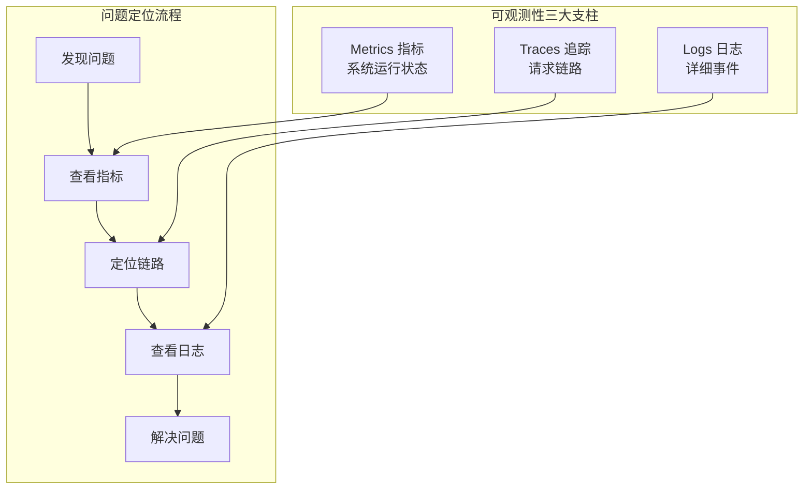
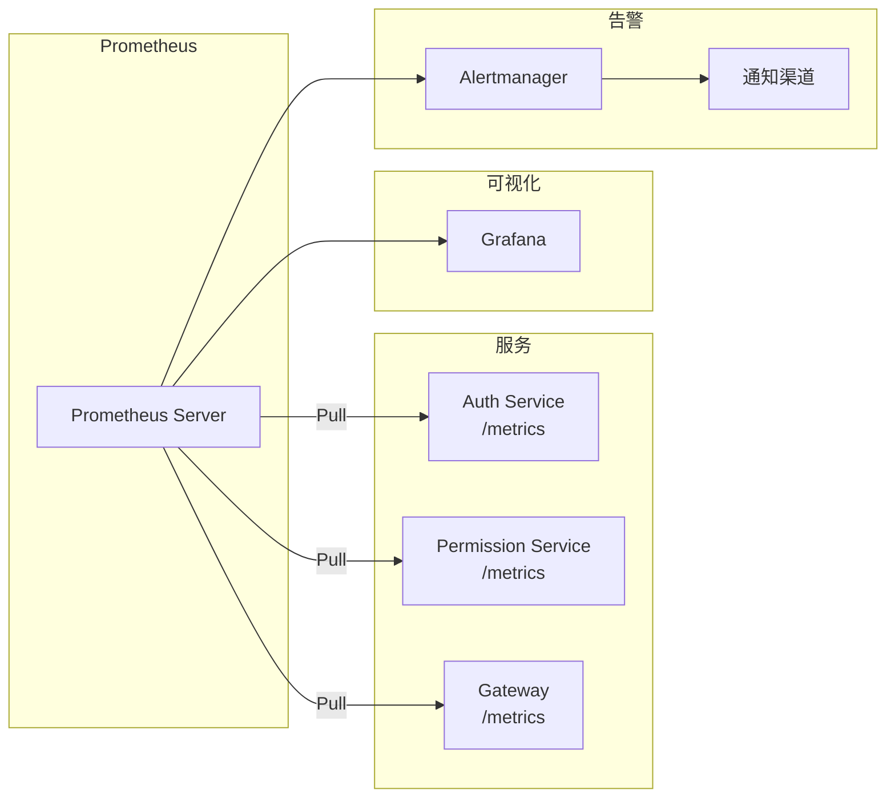
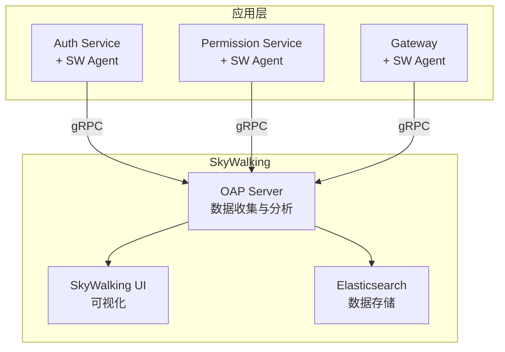
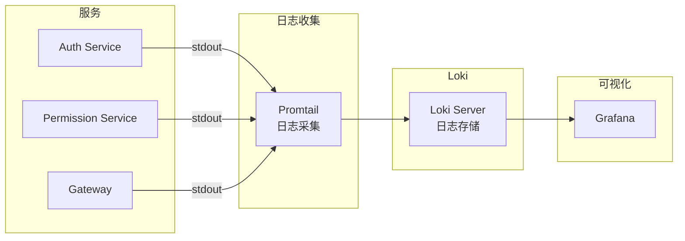

# 可观测性组件集成指南

> **目标**：构建完整的可观测性体系，包括指标监控、链路追踪、日志收集

---

## 目录

1. [可观测性概述](#1-可观测性概述)
2. [Prometheus + Grafana 指标监控](#2-prometheus--grafana-指标监控)
3. [SkyWalking 链路追踪](#3-skywalking-链路追踪)
4. [日志收集方案](#4-日志收集方案)
5. [统一可观测性平台](#5-统一可观测性平台)
6. [告警配置](#6-告警配置)

---

## 1. 可观测性概述

### 1.1 可观测性三大支柱



### 1.2 各组件职责

| 组件        | 职责         | 回答的问题                   |
| ----------- | ------------ | ---------------------------- |
| **Metrics** | 系统运行指标 | 系统是否健康？性能如何？     |
| **Traces**  | 请求链路追踪 | 请求经过了哪些服务？哪里慢？ |
| **Logs**    | 详细事件日志 | 具体发生了什么？错误详情？   |

### 1.3 技术选型

| 维度 | 选择                 | 替代方案           | 选择理由                  |
| ---- | -------------------- | ------------------ | ------------------------- |
| 指标 | Prometheus + Grafana | InfluxDB + Grafana | 业界标准，生态丰富        |
| 追踪 | SkyWalking           | Jaeger, Zipkin     | APM 功能全面，中文社区好  |
| 日志 | Loki + Grafana       | ELK Stack          | 轻量级，与 Grafana 集成好 |

---

## 2. Prometheus + Grafana 指标监控

### 2.1 架构图



### 2.2 Docker Compose 部署

```yaml
# docker-compose.observability.yml
version: '3.8'

services:
  prometheus:
    image: prom/prometheus:v2.48.0
    container_name: prometheus
    ports:
      - '9090:9090'
    volumes:
      - ./prometheus/prometheus.yml:/etc/prometheus/prometheus.yml
      - ./prometheus/rules:/etc/prometheus/rules
      - prometheus_data:/prometheus
    command:
      - '--config.file=/etc/prometheus/prometheus.yml'
      - '--storage.tsdb.path=/prometheus'
      - '--web.enable-lifecycle'
    networks:
      - oes-network

  grafana:
    image: grafana/grafana:10.2.0
    container_name: grafana
    ports:
      - '3000:3000'
    environment:
      - GF_SECURITY_ADMIN_USER=admin
      - GF_SECURITY_ADMIN_PASSWORD=admin
      - GF_USERS_ALLOW_SIGN_UP=false
    volumes:
      - grafana_data:/var/lib/grafana
      - ./grafana/provisioning:/etc/grafana/provisioning
    depends_on:
      - prometheus
    networks:
      - oes-network

  alertmanager:
    image: prom/alertmanager:v0.26.0
    container_name: alertmanager
    ports:
      - '9093:9093'
    volumes:
      - ./alertmanager/alertmanager.yml:/etc/alertmanager/alertmanager.yml
    networks:
      - oes-network

volumes:
  prometheus_data:
  grafana_data:

networks:
  oes-network:
    external: true
```

### 2.3 Prometheus 配置

```yaml
# prometheus/prometheus.yml
global:
  scrape_interval: 15s
  evaluation_interval: 15s

alerting:
  alertmanagers:
    - static_configs:
        - targets:
            - alertmanager:9093

rule_files:
  - /etc/prometheus/rules/*.yml

scrape_configs:
  # Prometheus 自身
  - job_name: 'prometheus'
    static_configs:
      - targets: ['localhost:9090']

  # OES 服务
  - job_name: 'oes-services'
    static_configs:
      - targets:
          - 'api-gateway:3000'
          - 'auth-service:9201'
          - 'permission-service:9301'
          - 'identity-service:9401'
    metrics_path: /metrics
    scrape_interval: 10s

  # 使用服务发现（Nacos）
  - job_name: 'oes-services-nacos'
    nacos_sd_configs:
      - server: 'nacos:8848'
        namespace_id: 'public'
    relabel_configs:
      - source_labels: [__meta_nacos_service]
        target_label: service
      - source_labels: [__meta_nacos_instance_ip, __meta_nacos_instance_port]
        separator: ':'
        target_label: __address__
```

### 2.4 NestJS 集成 Prometheus

**安装依赖**：

```bash
pnpm add @willsoto/nestjs-prometheus prom-client
```

**配置模块**：

```typescript
// src/common/src/metrics/metrics.module.ts
import { Module } from '@nestjs/common'
import {
  PrometheusModule,
  makeCounterProvider,
  makeHistogramProvider,
  makeGaugeProvider
} from '@willsoto/nestjs-prometheus'

@Module({
  imports: [
    PrometheusModule.register({
      path: '/metrics',
      defaultMetrics: {
        enabled: true,
        config: {
          prefix: 'oes_'
        }
      }
    })
  ],
  providers: [
    // HTTP 请求计数器
    makeCounterProvider({
      name: 'http_requests_total',
      help: 'Total number of HTTP requests',
      labelNames: ['method', 'path', 'status']
    }),
    // HTTP 请求延迟直方图
    makeHistogramProvider({
      name: 'http_request_duration_seconds',
      help: 'HTTP request duration in seconds',
      labelNames: ['method', 'path', 'status'],
      buckets: [0.01, 0.05, 0.1, 0.5, 1, 2, 5]
    }),
    // gRPC 请求计数器
    makeCounterProvider({
      name: 'grpc_requests_total',
      help: 'Total number of gRPC requests',
      labelNames: ['service', 'method', 'status']
    }),
    // gRPC 请求延迟
    makeHistogramProvider({
      name: 'grpc_request_duration_seconds',
      help: 'gRPC request duration in seconds',
      labelNames: ['service', 'method'],
      buckets: [0.001, 0.005, 0.01, 0.05, 0.1, 0.5, 1]
    }),
    // 活跃连接数
    makeGaugeProvider({
      name: 'active_connections',
      help: 'Number of active connections',
      labelNames: ['type']
    })
  ],
  exports: [PrometheusModule]
})
export class MetricsModule {}
```

**指标拦截器**：

```typescript
// src/common/src/metrics/metrics.interceptor.ts
import { Injectable, NestInterceptor, ExecutionContext, CallHandler } from '@nestjs/common'
import { Observable } from 'rxjs'
import { tap } from 'rxjs/operators'
import { InjectMetric } from '@willsoto/nestjs-prometheus'
import { Counter, Histogram } from 'prom-client'

@Injectable()
export class MetricsInterceptor implements NestInterceptor {
  constructor(
    @InjectMetric('http_requests_total')
    private readonly requestCounter: Counter<string>,
    @InjectMetric('http_request_duration_seconds')
    private readonly requestDuration: Histogram<string>
  ) {}

  intercept(context: ExecutionContext, next: CallHandler): Observable<any> {
    const request = context.switchToHttp().getRequest()
    const { method, path } = request
    const startTime = Date.now()

    return next.handle().pipe(
      tap({
        next: () => {
          const duration = (Date.now() - startTime) / 1000
          const status = context.switchToHttp().getResponse().statusCode

          this.requestCounter.inc({ method, path, status: String(status) })
          this.requestDuration.observe({ method, path, status: String(status) }, duration)
        },
        error: (error) => {
          const duration = (Date.now() - startTime) / 1000
          const status = error.status || 500

          this.requestCounter.inc({ method, path, status: String(status) })
          this.requestDuration.observe({ method, path, status: String(status) }, duration)
        }
      })
    )
  }
}
```

**自定义业务指标**：

```typescript
// src/services/system/auth-service/src/metrics/auth-metrics.service.ts
import { Injectable } from '@nestjs/common'
import { InjectMetric } from '@willsoto/nestjs-prometheus'
import { Counter, Gauge, Histogram } from 'prom-client'

@Injectable()
export class AuthMetricsService {
  constructor(
    @InjectMetric('auth_login_total')
    private readonly loginCounter: Counter<string>,
    @InjectMetric('auth_login_failures_total')
    private readonly loginFailureCounter: Counter<string>,
    @InjectMetric('auth_active_sessions')
    private readonly activeSessionsGauge: Gauge<string>,
    @InjectMetric('auth_token_generation_duration_seconds')
    private readonly tokenGenerationDuration: Histogram<string>
  ) {}

  recordLogin(method: string, success: boolean) {
    if (success) {
      this.loginCounter.inc({ method })
    } else {
      this.loginFailureCounter.inc({ method })
    }
  }

  setActiveSessions(tenantId: string, count: number) {
    this.activeSessionsGauge.set({ tenant_id: tenantId }, count)
  }

  recordTokenGeneration(duration: number) {
    this.tokenGenerationDuration.observe(duration)
  }
}
```

### 2.5 Grafana 仪表板

**预置仪表板配置**：

```yaml
# grafana/provisioning/dashboards/dashboards.yml
apiVersion: 1

providers:
  - name: 'OES Dashboards'
    orgId: 1
    folder: 'OES'
    type: file
    disableDeletion: false
    editable: true
    options:
      path: /etc/grafana/provisioning/dashboards/json
```

**服务概览仪表板 JSON**：

```json
{
  "title": "OES 服务概览",
  "panels": [
    {
      "title": "请求速率",
      "type": "graph",
      "targets": [
        {
          "expr": "sum(rate(http_requests_total[5m])) by (service)",
          "legendFormat": "{{service}}"
        }
      ]
    },
    {
      "title": "请求延迟 P99",
      "type": "graph",
      "targets": [
        {
          "expr": "histogram_quantile(0.99, sum(rate(http_request_duration_seconds_bucket[5m])) by (le, service))",
          "legendFormat": "{{service}}"
        }
      ]
    },
    {
      "title": "错误率",
      "type": "graph",
      "targets": [
        {
          "expr": "sum(rate(http_requests_total{status=~\"5..\"}[5m])) by (service) / sum(rate(http_requests_total[5m])) by (service) * 100",
          "legendFormat": "{{service}}"
        }
      ]
    },
    {
      "title": "活跃会话数",
      "type": "stat",
      "targets": [
        {
          "expr": "sum(auth_active_sessions)"
        }
      ]
    }
  ]
}
```

---

## 3. SkyWalking 链路追踪

### 3.1 SkyWalking 架构



### 3.2 Docker Compose 部署

```yaml
# docker-compose.skywalking.yml
version: '3.8'

services:
  elasticsearch:
    image: elasticsearch:7.17.15
    container_name: skywalking-es
    environment:
      - discovery.type=single-node
      - 'ES_JAVA_OPTS=-Xms512m -Xmx512m'
    ports:
      - '9200:9200'
    volumes:
      - es_data:/usr/share/elasticsearch/data
    networks:
      - oes-network

  skywalking-oap:
    image: apache/skywalking-oap-server:9.6.0
    container_name: skywalking-oap
    environment:
      - SW_STORAGE=elasticsearch
      - SW_STORAGE_ES_CLUSTER_NODES=elasticsearch:9200
      - SW_HEALTH_CHECKER=default
      - SW_TELEMETRY=prometheus
    ports:
      - '11800:11800' # gRPC
      - '12800:12800' # HTTP
    depends_on:
      - elasticsearch
    networks:
      - oes-network

  skywalking-ui:
    image: apache/skywalking-ui:9.6.0
    container_name: skywalking-ui
    environment:
      - SW_OAP_ADDRESS=http://skywalking-oap:12800
    ports:
      - '8080:8080'
    depends_on:
      - skywalking-oap
    networks:
      - oes-network

volumes:
  es_data:

networks:
  oes-network:
    external: true
```

### 3.3 NestJS 集成 SkyWalking

**安装依赖**：

```bash
pnpm add skywalking-backend-js
```

**初始化 Agent**：

```typescript
// src/common/src/tracing/skywalking.ts
import agent from 'skywalking-backend-js'

export function initSkyWalking(serviceName: string) {
  agent.start({
    serviceName,
    serviceInstance: `${serviceName}-${process.env.HOSTNAME || 'local'}`,
    collectorAddress: process.env.SW_AGENT_COLLECTOR_BACKEND_SERVICES || 'localhost:11800',
    // 采样率
    sampleRate: 1,
    // 忽略的路径
    ignoreSuffix: '.jpg,.jpeg,.js,.css,.png,.bmp,.gif,.ico,.mp3,.mp4,.html,.svg',
    // 追踪 HTTP
    httpIgnorePath: '/health,/metrics',
    // 追踪 gRPC
    grpc: true,
    // 追踪数据库
    mysql: true,
    pg: true,
    redis: true
  })
}
```

**在 main.ts 中初始化**：

```typescript
// src/services/system/auth-service/src/main.ts
import { initSkyWalking } from '@oes/common/tracing/skywalking'

// 必须在其他 import 之前初始化
initSkyWalking('auth-service')

import { NestFactory } from '@nestjs/core'
import { AppModule } from './app.module'

async function bootstrap() {
  const app = await NestFactory.create(AppModule)
  // ...
}

bootstrap()
```

### 3.4 手动追踪

```typescript
// src/common/src/tracing/tracing.service.ts
import { Injectable } from '@nestjs/common'
import { ContextManager, Span, SpanLayer, Tag } from 'skywalking-backend-js'

@Injectable()
export class TracingService {
  /**
   * 创建自定义 Span
   */
  createSpan(operationName: string): Span {
    const span = ContextManager.current.newLocalSpan(operationName)
    span.start()
    return span
  }

  /**
   * 包装异步操作
   */
  async traceAsync<T>(
    operationName: string,
    operation: () => Promise<T>,
    tags?: Record<string, string>
  ): Promise<T> {
    const span = this.createSpan(operationName)

    if (tags) {
      Object.entries(tags).forEach(([key, value]) => {
        span.tag(new Tag(key, value))
      })
    }

    try {
      const result = await operation()
      span.stop()
      return result
    } catch (error) {
      span.error(error)
      span.stop()
      throw error
    }
  }

  /**
   * 添加标签到当前 Span
   */
  addTag(key: string, value: string): void {
    const span = ContextManager.current.activeSpan()
    if (span) {
      span.tag(new Tag(key, value))
    }
  }

  /**
   * 记录日志到当前 Span
   */
  log(message: string): void {
    const span = ContextManager.current.activeSpan()
    if (span) {
      span.log(message)
    }
  }

  /**
   * 获取当前 TraceId
   */
  getTraceId(): string | undefined {
    const span = ContextManager.current.activeSpan()
    return span?.context?.traceId
  }
}
```

**使用示例**：

```typescript
// src/services/system/auth-service/src/application/services/auth.service.ts
import { Injectable } from '@nestjs/common'
import { TracingService } from '@oes/common/tracing/tracing.service'

@Injectable()
export class AuthService {
  constructor(private readonly tracing: TracingService) {}

  async loginWithEmailPassword(dto: LoginDto) {
    return this.tracing.traceAsync(
      'AuthService.loginWithEmailPassword',
      async () => {
        // 添加业务标签
        this.tracing.addTag('user.email', dto.email)

        // 验证密码
        const user = await this.tracing.traceAsync('validateCredentials', () =>
          this.validateCredentials(dto.email, dto.password)
        )

        // 生成 Token
        const token = await this.tracing.traceAsync('generateToken', () => this.generateToken(user))

        return { user, token }
      },
      { 'login.method': 'email_password' }
    )
  }
}
```

### 3.5 跨服务追踪

gRPC 调用自动传播追踪上下文，无需额外配置。

对于 HTTP 调用，需要传递追踪头：

```typescript
// src/common/src/http/traced-http.service.ts
import { Injectable } from '@nestjs/common'
import { HttpService } from '@nestjs/axios'
import { ContextManager } from 'skywalking-backend-js'
import { firstValueFrom } from 'rxjs'

@Injectable()
export class TracedHttpService {
  constructor(private readonly http: HttpService) {}

  async get<T>(url: string, config?: any): Promise<T> {
    const headers = this.injectTraceHeaders(config?.headers || {})
    const response = await firstValueFrom(this.http.get<T>(url, { ...config, headers }))
    return response.data
  }

  async post<T>(url: string, data: any, config?: any): Promise<T> {
    const headers = this.injectTraceHeaders(config?.headers || {})
    const response = await firstValueFrom(this.http.post<T>(url, data, { ...config, headers }))
    return response.data
  }

  private injectTraceHeaders(headers: Record<string, string>): Record<string, string> {
    const span = ContextManager.current.activeSpan()
    if (span) {
      // SkyWalking 追踪头
      headers['sw8'] = span.context?.serialize() || ''
    }
    return headers
  }
}
```

---

## 4. 日志收集方案

### 4.1 Loki + Grafana 架构



### 4.2 Docker Compose 部署

```yaml
# docker-compose.logging.yml
version: '3.8'

services:
  loki:
    image: grafana/loki:2.9.2
    container_name: loki
    ports:
      - '3100:3100'
    volumes:
      - ./loki/loki-config.yml:/etc/loki/local-config.yaml
      - loki_data:/loki
    command: -config.file=/etc/loki/local-config.yaml
    networks:
      - oes-network

  promtail:
    image: grafana/promtail:2.9.2
    container_name: promtail
    volumes:
      - ./promtail/promtail-config.yml:/etc/promtail/config.yml
      - /var/log:/var/log
      - /var/lib/docker/containers:/var/lib/docker/containers:ro
    command: -config.file=/etc/promtail/config.yml
    networks:
      - oes-network

volumes:
  loki_data:

networks:
  oes-network:
    external: true
```

### 4.3 Loki 配置

```yaml
# loki/loki-config.yml
auth_enabled: false

server:
  http_listen_port: 3100

ingester:
  lifecycler:
    address: 127.0.0.1
    ring:
      kvstore:
        store: inmemory
      replication_factor: 1
    final_sleep: 0s
  chunk_idle_period: 5m
  chunk_retain_period: 30s

schema_config:
  configs:
    - from: 2020-05-15
      store: boltdb
      object_store: filesystem
      schema: v11
      index:
        prefix: index_
        period: 168h

storage_config:
  boltdb:
    directory: /loki/index
  filesystem:
    directory: /loki/chunks

limits_config:
  enforce_metric_name: false
  reject_old_samples: true
  reject_old_samples_max_age: 168h
```

### 4.4 Promtail 配置

```yaml
# promtail/promtail-config.yml
server:
  http_listen_port: 9080
  grpc_listen_port: 0

positions:
  filename: /tmp/positions.yaml

clients:
  - url: http://loki:3100/loki/api/v1/push

scrape_configs:
  # Docker 容器日志
  - job_name: docker
    static_configs:
      - targets:
          - localhost
        labels:
          job: docker
          __path__: /var/lib/docker/containers/*/*-json.log
    pipeline_stages:
      - json:
          expressions:
            log: log
            stream: stream
            time: time
      - labels:
          stream:
      - timestamp:
          source: time
          format: RFC3339Nano
      - output:
          source: log

  # OES 服务日志
  - job_name: oes-services
    docker_sd_configs:
      - host: unix:///var/run/docker.sock
        refresh_interval: 5s
    relabel_configs:
      - source_labels: ['__meta_docker_container_name']
        regex: '/(.*)'
        target_label: 'container'
      - source_labels: ['__meta_docker_container_label_com_docker_compose_service']
        target_label: 'service'
```

### 4.5 NestJS 结构化日志

```typescript
// src/common/src/logging/structured-logger.service.ts
import { Injectable, LoggerService, Scope } from '@nestjs/common'
import { TracingService } from '../tracing/tracing.service'

export interface LogContext {
  traceId?: string
  spanId?: string
  service?: string
  [key: string]: any
}

@Injectable({ scope: Scope.TRANSIENT })
export class StructuredLoggerService implements LoggerService {
  private context: string = 'Application'
  private serviceName: string

  constructor(private readonly tracing: TracingService) {
    this.serviceName = process.env.SERVICE_NAME || 'unknown'
  }

  setContext(context: string) {
    this.context = context
  }

  log(message: any, context?: string) {
    this.writeLog('info', message, context)
  }

  error(message: any, trace?: string, context?: string) {
    this.writeLog('error', message, context, { trace })
  }

  warn(message: any, context?: string) {
    this.writeLog('warn', message, context)
  }

  debug(message: any, context?: string) {
    this.writeLog('debug', message, context)
  }

  verbose(message: any, context?: string) {
    this.writeLog('verbose', message, context)
  }

  private writeLog(level: string, message: any, context?: string, extra?: Record<string, any>) {
    const logEntry = {
      timestamp: new Date().toISOString(),
      level,
      service: this.serviceName,
      context: context || this.context,
      traceId: this.tracing.getTraceId(),
      message: typeof message === 'object' ? JSON.stringify(message) : message,
      ...extra
    }

    // 输出 JSON 格式日志
    console.log(JSON.stringify(logEntry))
  }
}
```

**日志模块**：

```typescript
// src/common/src/logging/logging.module.ts
import { Global, Module } from '@nestjs/common'
import { StructuredLoggerService } from './structured-logger.service'
import { TracingService } from '../tracing/tracing.service'

@Global()
@Module({
  providers: [StructuredLoggerService, TracingService],
  exports: [StructuredLoggerService]
})
export class LoggingModule {}
```

**使用示例**：

```typescript
// 在服务中使用
@Injectable()
export class AuthService {
  constructor(private readonly logger: StructuredLoggerService) {
    this.logger.setContext('AuthService')
  }

  async login(dto: LoginDto) {
    this.logger.log(`Login attempt for email: ${dto.email}`)

    try {
      const result = await this.doLogin(dto)
      this.logger.log(`Login successful for user: ${result.userId}`)
      return result
    } catch (error) {
      this.logger.error(`Login failed: ${error.message}`, error.stack)
      throw error
    }
  }
}
```

---

## 5. 统一可观测性平台

### 5.1 Grafana 数据源配置

```yaml
# grafana/provisioning/datasources/datasources.yml
apiVersion: 1

datasources:
  # Prometheus - 指标
  - name: Prometheus
    type: prometheus
    access: proxy
    url: http://prometheus:9090
    isDefault: true

  # Loki - 日志
  - name: Loki
    type: loki
    access: proxy
    url: http://loki:3100

  # Jaeger/SkyWalking - 追踪
  - name: Jaeger
    type: jaeger
    access: proxy
    url: http://jaeger:16686
```

### 5.2 关联 Metrics、Traces、Logs

```typescript
// 在日志中包含 TraceId
{
  "timestamp": "2026-02-01T10:00:00.000Z",
  "level": "info",
  "service": "auth-service",
  "traceId": "abc123def456",  // 关联追踪
  "message": "Login successful"
}

// 在指标中包含 TraceId（通过 exemplar）
http_request_duration_seconds_bucket{...} 0.5 # {traceID="abc123def456"}
```

### 5.3 Grafana 仪表板示例

```json
{
  "title": "OES 统一监控",
  "panels": [
    {
      "title": "服务拓扑",
      "type": "nodeGraph",
      "datasource": "Prometheus"
    },
    {
      "title": "请求延迟",
      "type": "timeseries",
      "datasource": "Prometheus",
      "targets": [
        {
          "expr": "histogram_quantile(0.95, sum(rate(http_request_duration_seconds_bucket[5m])) by (le, service))"
        }
      ]
    },
    {
      "title": "错误日志",
      "type": "logs",
      "datasource": "Loki",
      "targets": [
        {
          "expr": "{service=~\".+\"} |= \"error\""
        }
      ]
    },
    {
      "title": "追踪链路",
      "type": "traces",
      "datasource": "Jaeger"
    }
  ]
}
```

---

## 6. 告警配置

### 6.1 Alertmanager 配置

```yaml
# alertmanager/alertmanager.yml
global:
  resolve_timeout: 5m
  smtp_smarthost: 'smtp.example.com:587'
  smtp_from: 'alertmanager@example.com'
  smtp_auth_username: 'alertmanager@example.com'
  smtp_auth_password: 'password'

route:
  group_by: ['alertname', 'service']
  group_wait: 30s
  group_interval: 5m
  repeat_interval: 4h
  receiver: 'default'
  routes:
    - match:
        severity: critical
      receiver: 'critical'
    - match:
        severity: warning
      receiver: 'warning'

receivers:
  - name: 'default'
    email_configs:
      - to: 'ops@example.com'

  - name: 'critical'
    email_configs:
      - to: 'oncall@example.com'
    webhook_configs:
      - url: 'http://your-webhook/alert'

  - name: 'warning'
    email_configs:
      - to: 'dev@example.com'
```

### 6.2 告警规则

```yaml
# prometheus/rules/oes-alerts.yml
groups:
  - name: oes-service-alerts
    rules:
      # 服务不可用
      - alert: ServiceDown
        expr: up == 0
        for: 1m
        labels:
          severity: critical
        annotations:
          summary: '服务 {{ $labels.job }} 不可用'
          description: '服务 {{ $labels.instance }} 已经 down 超过 1 分钟'

      # 高错误率
      - alert: HighErrorRate
        expr: |
          sum(rate(http_requests_total{status=~"5.."}[5m])) by (service)
          / sum(rate(http_requests_total[5m])) by (service) > 0.05
        for: 5m
        labels:
          severity: warning
        annotations:
          summary: '服务 {{ $labels.service }} 错误率过高'
          description: '错误率: {{ $value | humanizePercentage }}'

      # 高延迟
      - alert: HighLatency
        expr: |
          histogram_quantile(0.95, sum(rate(http_request_duration_seconds_bucket[5m])) by (le, service)) > 1
        for: 5m
        labels:
          severity: warning
        annotations:
          summary: '服务 {{ $labels.service }} 延迟过高'
          description: 'P95 延迟: {{ $value | humanizeDuration }}'

      # 登录失败过多
      - alert: TooManyLoginFailures
        expr: |
          sum(rate(auth_login_failures_total[5m])) > 10
        for: 5m
        labels:
          severity: warning
        annotations:
          summary: '登录失败次数过多'
          description: '过去 5 分钟登录失败 {{ $value }} 次'
```

---

## 下一步

完成可观测性集成后，建议继续：

1. [API 网关集成](04-API网关集成指南.md)
