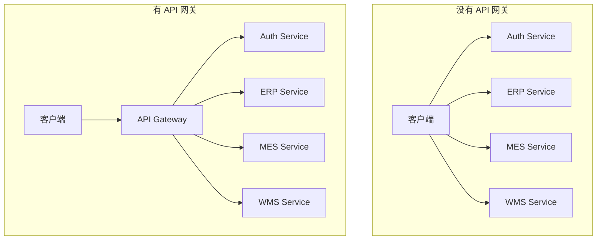
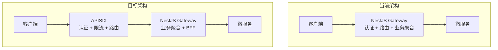
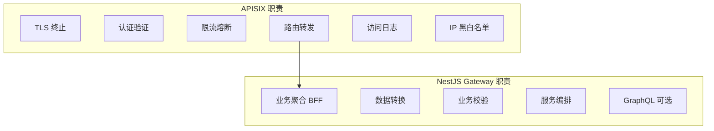

# API 网关集成指南

> **目标**：使用 Apache APISIX 构建企业级 API 网关，实现统一入口、路由、限流、认证

---

## 目录

1. [API 网关概述](#1-api-网关概述)
2. [APISIX 部署](#2-apisix-部署)
3. [路由配置](#3-路由配置)
4. [认证授权](#4-认证授权)
5. [限流熔断](#5-限流熔断)
6. [与 NestJS Gateway 的关系](#6-与-nestjs-gateway-的关系)
7. [最佳实践](#7-最佳实践)

---

## 1. API 网关概述

### 1.1 为什么需要 API 网关



**API 网关的核心价值**：

| 功能         | 说明                           |
| ------------ | ------------------------------ |
| **统一入口** | 客户端只需知道一个地址         |
| **路由转发** | 根据路径/Header 转发到不同服务 |
| **认证授权** | 统一的身份验证                 |
| **限流熔断** | 保护后端服务                   |
| **协议转换** | HTTP → gRPC                    |
| **日志审计** | 统一的访问日志                 |
| **API 管理** | 版本控制、文档                 |

### 1.2 APISIX vs Kong vs 自建

| 维度         | APISIX     | Kong       | NestJS 自建 |
| ------------ | ---------- | ---------- | ----------- |
| **性能**     | ⭐⭐⭐⭐⭐ | ⭐⭐⭐     | ⭐⭐⭐      |
| **功能**     | ⭐⭐⭐⭐⭐ | ⭐⭐⭐⭐⭐ | ⭐⭐⭐      |
| **学习成本** | 中         | 中         | 低          |
| **运维成本** | 中         | 中         | 低          |
| **扩展性**   | ⭐⭐⭐⭐⭐ | ⭐⭐⭐⭐   | ⭐⭐⭐⭐⭐  |
| **中文社区** | ⭐⭐⭐⭐⭐ | ⭐⭐⭐     | ⭐⭐⭐⭐    |

**推荐策略**：

- **初期**：使用 NestJS 自建 Gateway（当前方案）
- **中期**：引入 APISIX 处理流量入口
- **后期**：NestJS Gateway 专注业务聚合，APISIX 处理基础设施

### 1.3 架构演进



---

## 2. APISIX 部署

### 2.1 Docker Compose 部署

```yaml
# docker-compose.apisix.yml
version: '3.8'

services:
  apisix:
    image: apache/apisix:3.7.0-debian
    container_name: apisix
    restart: always
    volumes:
      - ./apisix/config.yaml:/usr/local/apisix/conf/config.yaml:ro
      - ./apisix/apisix.yaml:/usr/local/apisix/conf/apisix.yaml:ro
    ports:
      - '9080:9080' # HTTP
      - '9443:9443' # HTTPS
      - '9180:9180' # Admin API
      - '9091:9091' # Prometheus metrics
    depends_on:
      - etcd
    networks:
      - oes-network

  etcd:
    image: bitnami/etcd:3.5
    container_name: apisix-etcd
    restart: always
    environment:
      - ALLOW_NONE_AUTHENTICATION=yes
      - ETCD_ADVERTISE_CLIENT_URLS=http://etcd:2379
    volumes:
      - etcd_data:/bitnami/etcd
    networks:
      - oes-network

  apisix-dashboard:
    image: apache/apisix-dashboard:3.0.1-alpine
    container_name: apisix-dashboard
    restart: always
    volumes:
      - ./apisix/dashboard-config.yaml:/usr/local/apisix-dashboard/conf/conf.yaml:ro
    ports:
      - '9000:9000'
    depends_on:
      - apisix
    networks:
      - oes-network

volumes:
  etcd_data:

networks:
  oes-network:
    external: true
```

### 2.2 APISIX 配置

```yaml
# apisix/config.yaml
apisix:
  node_listen: 9080
  enable_ipv6: false
  enable_admin: true
  admin_key:
    - name: admin
      key: edd1c9f034335f136f87ad84b625c8f1
      role: admin

etcd:
  host:
    - 'http://etcd:2379'
  prefix: '/apisix'
  timeout: 30

plugin_attr:
  prometheus:
    export_addr:
      ip: '0.0.0.0'
      port: 9091

plugins:
  - jwt-auth
  - key-auth
  - limit-req
  - limit-count
  - limit-conn
  - prometheus
  - proxy-rewrite
  - response-rewrite
  - cors
  - ip-restriction
  - request-id
  - real-ip
  - grpc-transcode
  - grpc-web
```

### 2.3 Dashboard 配置

```yaml
# apisix/dashboard-config.yaml
conf:
  listen:
    host: 0.0.0.0
    port: 9000
  etcd:
    endpoints:
      - 'http://etcd:2379'
  log:
    error_log:
      level: warn
      file_path: /dev/stderr
    access_log:
      file_path: /dev/stdout

authentication:
  secret: secret
  expire_time: 3600
  users:
    - username: admin
      password: admin
```

### 2.4 启动 APISIX

```bash
# 启动
docker-compose -f docker-compose.apisix.yml up -d

# 验证
curl http://localhost:9080/apisix/admin/routes -H 'X-API-KEY: edd1c9f034335f136f87ad84b625c8f1'

# 访问 Dashboard
# http://localhost:9000
# 账号：admin / admin
```

---

## 3. 路由配置

### 3.1 基础路由

```bash
# 创建上游（后端服务）
curl http://localhost:9180/apisix/admin/upstreams/1 -H 'X-API-KEY: edd1c9f034335f136f87ad84b625c8f1' -X PUT -d '
{
  "type": "roundrobin",
  "nodes": {
    "nestjs-gateway:3000": 1
  },
  "checks": {
    "active": {
      "timeout": 5,
      "http_path": "/health",
      "healthy": {
        "interval": 2,
        "successes": 1
      },
      "unhealthy": {
        "interval": 1,
        "http_failures": 2
      }
    }
  }
}'

# 创建路由
curl http://localhost:9180/apisix/admin/routes/1 -H 'X-API-KEY: edd1c9f034335f136f87ad84b625c8f1' -X PUT -d '
{
  "uri": "/api/*",
  "upstream_id": 1,
  "plugins": {
    "proxy-rewrite": {
      "regex_uri": ["^/api/(.*)", "/$1"]
    }
  }
}'
```

### 3.2 声明式配置

```yaml
# apisix/apisix.yaml
upstreams:
  - id: nestjs-gateway
    type: roundrobin
    nodes:
      - host: nestjs-gateway
        port: 3000
        weight: 1
    checks:
      active:
        timeout: 5
        http_path: /health
        healthy:
          interval: 2
          successes: 1
        unhealthy:
          interval: 1
          http_failures: 2

  - id: auth-service
    type: roundrobin
    nodes:
      - host: auth-service
        port: 9201
        weight: 1

routes:
  # API 路由 - 转发到 NestJS Gateway
  - id: api-routes
    uri: /api/*
    upstream_id: nestjs-gateway
    plugins:
      proxy-rewrite:
        regex_uri:
          - '^/api/(.*)'
          - '/$1'
      request-id:
        header_name: X-Request-ID
        include_in_response: true

  # 认证路由 - 公开接口
  - id: auth-public
    uri: /api/auth/*
    upstream_id: nestjs-gateway
    plugins:
      proxy-rewrite:
        regex_uri:
          - '^/api/(.*)'
          - '/$1'

  # 健康检查
  - id: health
    uri: /health
    upstream_id: nestjs-gateway
    plugins:
      proxy-rewrite:
        uri: /health
```

### 3.3 服务发现集成（Nacos）

```yaml
# apisix/config.yaml
discovery:
  nacos:
    host:
      - 'http://nacos:8848'
    prefix: '/nacos/v1/'
    fetch_interval: 30
    weight: 100
    timeout:
      connect: 2000
      send: 2000
      read: 5000
```

```yaml
# 使用 Nacos 服务发现的路由
routes:
  - id: auth-service-nacos
    uri: /api/auth/*
    upstream:
      service_name: auth-service
      discovery_type: nacos
      type: roundrobin
```

---

## 4. 认证授权

### 4.1 JWT 认证

```bash
# 创建 Consumer
curl http://localhost:9180/apisix/admin/consumers -H 'X-API-KEY: edd1c9f034335f136f87ad84b625c8f1' -X PUT -d '
{
  "username": "oes-user",
  "plugins": {
    "jwt-auth": {
      "key": "oes-jwt-key",
      "secret": "your-jwt-secret-key",
      "algorithm": "HS256"
    }
  }
}'

# 在路由上启用 JWT 认证
curl http://localhost:9180/apisix/admin/routes/1 -H 'X-API-KEY: edd1c9f034335f136f87ad84b625c8f1' -X PATCH -d '
{
  "plugins": {
    "jwt-auth": {}
  }
}'
```

### 4.2 自定义认证插件

```lua
-- apisix/plugins/oes-auth.lua
local core = require("apisix.core")
local http = require("resty.http")

local plugin_name = "oes-auth"

local schema = {
    type = "object",
    properties = {
        auth_service_url = { type = "string" },
        header_name = { type = "string", default = "Authorization" }
    },
    required = { "auth_service_url" }
}

local _M = {
    version = 0.1,
    priority = 2500,
    name = plugin_name,
    schema = schema
}

function _M.check_schema(conf)
    return core.schema.check(schema, conf)
end

function _M.rewrite(conf, ctx)
    local token = core.request.header(ctx, conf.header_name)
    if not token then
        return 401, { message = "Missing authorization header" }
    end

    -- 调用 auth-service 验证 token
    local httpc = http.new()
    local res, err = httpc:request_uri(conf.auth_service_url .. "/validate", {
        method = "POST",
        body = core.json.encode({ token = token }),
        headers = {
            ["Content-Type"] = "application/json"
        }
    })

    if not res then
        core.log.error("Failed to validate token: ", err)
        return 500, { message = "Internal server error" }
    end

    if res.status ~= 200 then
        return 401, { message = "Invalid token" }
    end

    -- 解析用户信息并添加到请求头
    local body = core.json.decode(res.body)
    if body and body.claims then
        core.request.set_header(ctx, "X-User-ID", body.claims.sub)
        core.request.set_header(ctx, "X-Tenant-ID", body.claims.tenant_id)
        core.request.set_header(ctx, "X-User-Roles", table.concat(body.claims.roles or {}, ","))
    end
end

return _M
```

### 4.3 公开路由配置

```yaml
# 不需要认证的路由
routes:
  - id: public-routes
    uris:
      - /api/auth/login/*
      - /api/auth/register
      - /api/auth/forgot-password
      - /api/health
      - /api/docs/*
    upstream_id: nestjs-gateway
    plugins:
      proxy-rewrite:
        regex_uri:
          - '^/api/(.*)'
          - '/$1'
      # 不启用 jwt-auth 插件

  # 需要认证的路由
  - id: protected-routes
    uri: /api/*
    upstream_id: nestjs-gateway
    plugins:
      jwt-auth: {}
      proxy-rewrite:
        regex_uri:
          - '^/api/(.*)'
          - '/$1'
```

---

## 5. 限流熔断

### 5.1 请求限流

```yaml
# 基于请求速率限流
routes:
  - id: rate-limited-route
    uri: /api/*
    upstream_id: nestjs-gateway
    plugins:
      limit-req:
        rate: 100 # 每秒 100 个请求
        burst: 50 # 突发 50 个请求
        rejected_code: 429
        key_type: 'var'
        key: 'remote_addr' # 按 IP 限流

      limit-count:
        count: 1000 # 时间窗口内最大请求数
        time_window: 60 # 60 秒时间窗口
        rejected_code: 429
        key_type: 'var'
        key: 'remote_addr'
```

### 5.2 并发限流

```yaml
plugins:
  limit-conn:
    conn: 100 # 最大并发连接数
    burst: 50 # 突发连接数
    default_conn_delay: 0.1
    rejected_code: 503
    key_type: 'var'
    key: 'remote_addr'
```

### 5.3 熔断配置

```yaml
# 使用 api-breaker 插件
plugins:
  api-breaker:
    break_response_code: 502
    max_breaker_sec: 300
    unhealthy:
      http_statuses:
        - 500
        - 502
        - 503
      failures: 3
    healthy:
      http_statuses:
        - 200
      successes: 1
```

### 5.4 按租户限流

```yaml
# 基于租户 ID 限流
plugins:
  limit-count:
    count: 10000
    time_window: 3600
    key_type: 'var'
    key: 'http_x_tenant_id' # 从请求头获取租户 ID
    rejected_code: 429
    rejected_msg: 'Rate limit exceeded for tenant'
```

---

## 6. 与 NestJS Gateway 的关系

### 6.1 职责划分



### 6.2 NestJS Gateway 简化

引入 APISIX 后，NestJS Gateway 可以移除以下功能：

```typescript
// 移除前
@Module({
  imports: [
    CommonJwtModule // ❌ 移除 - APISIX 处理
    // ...
  ],
  providers: [
    {
      provide: APP_GUARD,
      useClass: GatewayJwtAuthGuard // ❌ 移除 - APISIX 处理
    },
    {
      provide: APP_GUARD,
      useClass: RateLimitGuard // ❌ 移除 - APISIX 处理
    }
  ]
})
export class AppModule {}

// 移除后
@Module({
  imports: [
    // 业务模块
    AuthServiceModule,
    PermissionServiceModule,
    ErpServiceModule
  ],
  providers: [
    // 只保留业务相关的 Guard
    {
      provide: APP_GUARD,
      useClass: PermissionGuard // ✅ 保留 - 业务权限
    }
  ]
})
export class AppModule {}
```

### 6.3 从请求头获取用户信息

APISIX 验证 JWT 后，将用户信息放入请求头：

```typescript
// src/common/src/auth/decorators/current-user.decorator.ts
import { createParamDecorator, ExecutionContext } from '@nestjs/common'

export interface CurrentUser {
  id: string
  tenantId: string
  roles: string[]
}

export const CurrentUser = createParamDecorator(
  (data: unknown, ctx: ExecutionContext): CurrentUser => {
    const request = ctx.switchToHttp().getRequest()

    return {
      id: request.headers['x-user-id'],
      tenantId: request.headers['x-tenant-id'],
      roles: (request.headers['x-user-roles'] || '').split(',').filter(Boolean)
    }
  }
)
```

```typescript
// 在 Controller 中使用
@Controller('orders')
export class OrderController {
  @Get()
  async getOrders(@CurrentUser() user: CurrentUser) {
    // user.id, user.tenantId, user.roles 已由 APISIX 验证并注入
    return this.orderService.findByTenant(user.tenantId)
  }
}
```

---

## 7. 最佳实践

### 7.1 灰度发布

```yaml
# 基于请求头的灰度路由
routes:
  - id: canary-route
    uri: /api/v2/*
    plugins:
      traffic-split:
        rules:
          - match:
              - vars:
                  - ['http_x_canary', '==', 'true']
            weighted_upstreams:
              - upstream_id: new-version
                weight: 100
          - weighted_upstreams:
              - upstream_id: stable-version
                weight: 90
              - upstream_id: new-version
                weight: 10
```

### 7.2 API 版本管理

```yaml
# 版本路由
routes:
  - id: api-v1
    uri: /api/v1/*
    upstream_id: gateway-v1
    plugins:
      proxy-rewrite:
        regex_uri:
          - '^/api/v1/(.*)'
          - '/$1'

  - id: api-v2
    uri: /api/v2/*
    upstream_id: gateway-v2
    plugins:
      proxy-rewrite:
        regex_uri:
          - '^/api/v2/(.*)'
          - '/$1'
```

### 7.3 CORS 配置

```yaml
plugins:
  cors:
    allow_origins: 'https://app.example.com'
    allow_methods: 'GET,POST,PUT,DELETE,OPTIONS'
    allow_headers: 'Authorization,Content-Type,X-Tenant-ID'
    expose_headers: 'X-Request-ID'
    max_age: 3600
    allow_credential: true
```

### 7.4 请求/响应转换

```yaml
plugins:
  # 请求转换
  proxy-rewrite:
    uri: '/internal/api'
    headers:
      add:
        X-Forwarded-Proto: 'https'
      remove:
        - 'X-Debug'

  # 响应转换
  response-rewrite:
    headers:
      add:
        X-Server: 'OES-Gateway'
      remove:
        - 'X-Powered-By'
```

### 7.5 监控集成

```yaml
# Prometheus 指标
plugins:
  prometheus:
    prefer_name: true

# 访问日志
plugins:
  http-logger:
    uri: "http://loki:3100/loki/api/v1/push"
    batch_max_size: 1000
    inactive_timeout: 5
    buffer_duration: 60
```

### 7.6 安全加固

```yaml
# IP 白名单
plugins:
  ip-restriction:
    whitelist:
      - "192.168.1.0/24"
      - "10.0.0.0/8"

# 请求体大小限制
plugins:
  client-control:
    max_body_size: 10485760  # 10MB

# 请求头安全
plugins:
  response-rewrite:
    headers:
      add:
        X-Content-Type-Options: "nosniff"
        X-Frame-Options: "DENY"
        X-XSS-Protection: "1; mode=block"
        Strict-Transport-Security: "max-age=31536000; includeSubDomains"
```

---

## 8. 迁移步骤

### 8.1 迁移顺序

```mermaid
flowchart TB
    A[部署 APISIX] --> B[配置基础路由]
    B --> C[迁移认证到 APISIX]
    C --> D[迁移限流到 APISIX]
    D --> E[简化 NestJS Gateway]
    E --> F[测试验证]
    F --> G[切换流量]
```



### 8.2 并行运行期

```yaml
# 初期：APISIX 和 NestJS Gateway 并行
# APISIX 只做路由转发，不做认证

routes:
  - id: passthrough
    uri: /*
    upstream_id: nestjs-gateway
    # 不启用认证插件，由 NestJS 处理
```

### 8.3 逐步迁移

```yaml
# 中期：逐步将认证迁移到 APISIX

# 新接口使用 APISIX 认证
routes:
  - id: new-api
    uri: /api/v2/*
    upstream_id: nestjs-gateway
    plugins:
      jwt-auth: {}

# 旧接口保持 NestJS 认证
routes:
  - id: legacy-api
    uri: /api/v1/*
    upstream_id: nestjs-gateway
    # 不启用 jwt-auth
```

---

## 总结

| 阶段     | APISIX 职责        | NestJS Gateway 职责 |
| -------- | ------------------ | ------------------- |
| **初期** | 路由转发           | 认证 + 限流 + 业务  |
| **中期** | 路由 + 认证 + 限流 | 业务聚合            |
| **后期** | 全部基础设施功能   | 纯业务 BFF          |

**推荐时间线**：

- 第一阶段完成后（gRPC 迁移后）开始引入 APISIX
- 预计 1-2 个月完成迁移
