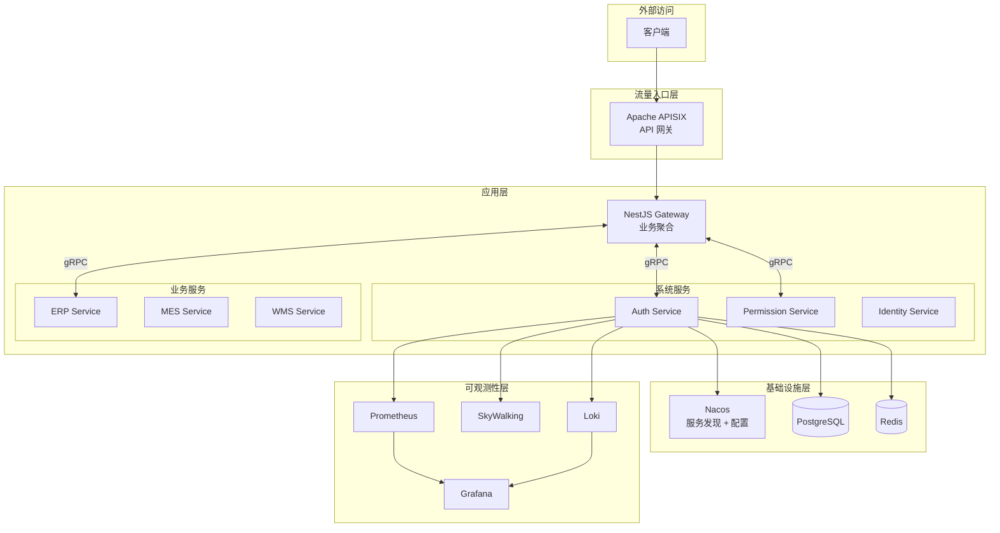
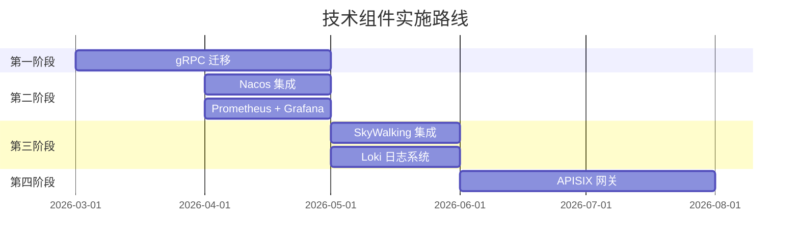

# OES 技术实现指南

> 本目录包含 OES 项目各核心组件的详细实现指南，包括代码示例和最佳实践。

---

## 📚 文档索引

| 序号 | 文档                                                    | 说明                                  | 优先级 |
| ---- | ------------------------------------------------------- | ------------------------------------- | ------ |
| 01   | [gRPC 迁移指南](./01-gRPC迁移指南.md)                   | TCP → gRPC 迁移，Proto 定义，代码生成 | 🔴 高  |
| 02   | [Nacos 配置中心集成指南](./02-Nacos配置中心集成指南.md) | 服务发现，动态配置，健康检查          | 🟡 中  |
| 03   | [可观测性组件集成指南](./03-可观测性组件集成指南.md)    | Prometheus, SkyWalking, Loki          | 🟡 中  |
| 04   | [API 网关集成指南](./04-API网关集成指南.md)             | APISIX 部署，路由，限流，认证         | 🟢 低  |

---

## 🗺️ 技术架构总览



---

## 📋 实施路线图



---

## 🔧 快速开始

### 1. gRPC 迁移（最高优先级）

```bash
# 1. 安装依赖
pnpm add @grpc/grpc-js @grpc/proto-loader
pnpm add -D ts-proto

# 2. 定义 Proto 文件
# 参考 01-gRPC迁移指南.md

# 3. 生成代码
pnpm run proto:gen

# 4. 实现 gRPC Server/Client
# 参考文档中的代码示例
```

### 2. Nacos 配置中心

```bash
# 1. 启动 Nacos
docker-compose -f docker-compose.nacos.yml up -d

# 2. 安装依赖
pnpm add nacos-config nacos-naming

# 3. 集成到 NestJS
# 参考 02-Nacos配置中心集成指南.md
```

### 3. 可观测性

```bash
# 1. 启动 Prometheus + Grafana
docker-compose -f docker-compose.observability.yml up -d

# 2. 安装依赖
pnpm add @willsoto/nestjs-prometheus prom-client

# 3. 集成指标
# 参考 03-可观测性组件集成指南.md
```

### 4. API 网关

```bash
# 1. 启动 APISIX
docker-compose -f docker-compose.apisix.yml up -d

# 2. 配置路由
# 参考 04-API网关集成指南.md
```

---

## 📊 技术选型对比

### 服务通信

| 方案       | 性能       | 类型安全 | 学习成本 | 推荐度  |
| ---------- | ---------- | -------- | -------- | ------- |
| TCP (当前) | ⭐⭐⭐     | ❌       | ⭐       | -       |
| **gRPC**   | ⭐⭐⭐⭐⭐ | ✅       | ⭐⭐⭐   | ✅ 推荐 |
| HTTP/REST  | ⭐⭐       | ❌       | ⭐       | -       |

### 配置中心

| 方案      | 服务发现 | 配置管理 | 中文社区   | 推荐度  |
| --------- | -------- | -------- | ---------- | ------- |
| 环境变量  | ❌       | ⚠️       | -          | -       |
| **Nacos** | ✅       | ✅       | ⭐⭐⭐⭐⭐ | ✅ 推荐 |
| Consul    | ✅       | ⚠️       | ⭐⭐⭐     | -       |
| Apollo    | ❌       | ✅       | ⭐⭐⭐⭐   | -       |

### 可观测性

| 组件           | 用途       | 替代方案 | 推荐度  |
| -------------- | ---------- | -------- | ------- |
| **Prometheus** | 指标       | InfluxDB | ✅ 推荐 |
| **Grafana**    | 可视化     | -        | ✅ 推荐 |
| **SkyWalking** | 追踪 + APM | Jaeger   | ✅ 推荐 |
| **Loki**       | 日志       | ELK      | ✅ 推荐 |

### API 网关

| 方案        | 性能       | 功能       | 中文社区   | 推荐度  |
| ----------- | ---------- | ---------- | ---------- | ------- |
| NestJS 自建 | ⭐⭐⭐     | ⭐⭐⭐     | ⭐⭐⭐⭐   | 初期    |
| **APISIX**  | ⭐⭐⭐⭐⭐ | ⭐⭐⭐⭐⭐ | ⭐⭐⭐⭐⭐ | ✅ 推荐 |
| Kong        | ⭐⭐⭐     | ⭐⭐⭐⭐⭐ | ⭐⭐⭐     | -       |

---

## 📁 相关文档

- [OES 项目开发计划书](../OES项目开发计划书.md)
- [mTLS 支持以及 gRPC 升级](../待实现功能/mTLS支持以及gRPC升级.md)
- [OES 高安全微服务权限优化方案](../待实现功能/OES%20高安全微服务权限优化方案.md)
- [OES Robot 设计方案书](../待实现功能/OES%20Robot%20设计方案书.md)
- [AI 能力拓展方案](../待实现功能/AI能力拓展方案.md)

---

## ❓ 常见问题

### Q1: gRPC 和 TCP 可以并行运行吗？

可以。在迁移期间，可以同时启动 TCP 和 gRPC 端口，逐步切换调用方。参考 [gRPC 迁移指南 - 双协议运行](./01-gRPC迁移指南.md#72-详细步骤)。

### Q2: Nacos 和 Kubernetes 服务发现冲突吗？

不冲突。在 Kubernetes 环境中，可以选择：

1. 只用 Kubernetes Service（推荐）
2. Nacos 作为配置中心，Kubernetes 做服务发现
3. 完全使用 Nacos（非 K8s 环境）

### Q3: APISIX 和 NestJS Gateway 如何分工？

- **APISIX**：基础设施功能（认证、限流、路由）
- **NestJS Gateway**：业务聚合（BFF）

参考 [API 网关集成指南 - 职责划分](./04-API网关集成指南.md#61-职责划分)。

### Q4: 可观测性组件资源消耗大吗？

开发环境推荐配置：

- Prometheus: 1GB 内存
- Grafana: 512MB 内存
- Loki: 1GB 内存
- SkyWalking: 2GB 内存

生产环境需要根据数据量调整。

---

## 📞 获取帮助

如有问题，请参考：

1. 各组件官方文档
2. 项目 Issue 跟踪
3. 技术社区讨论
