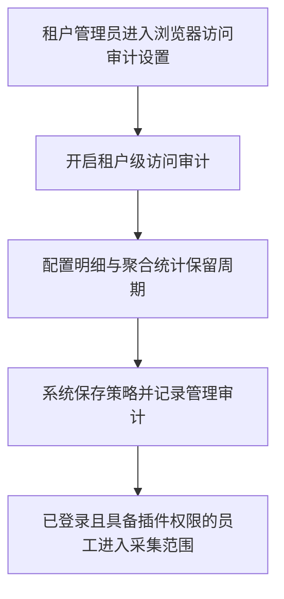
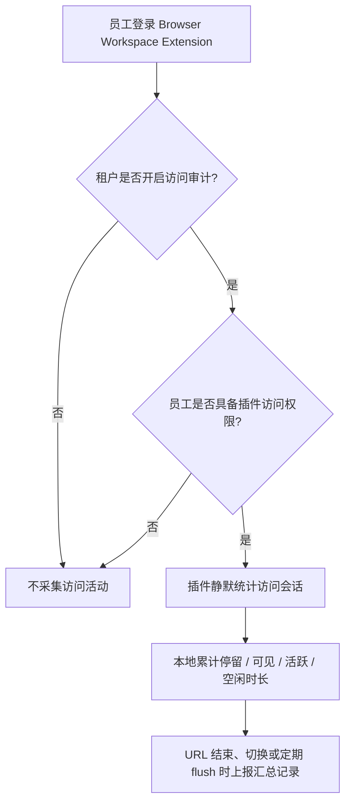
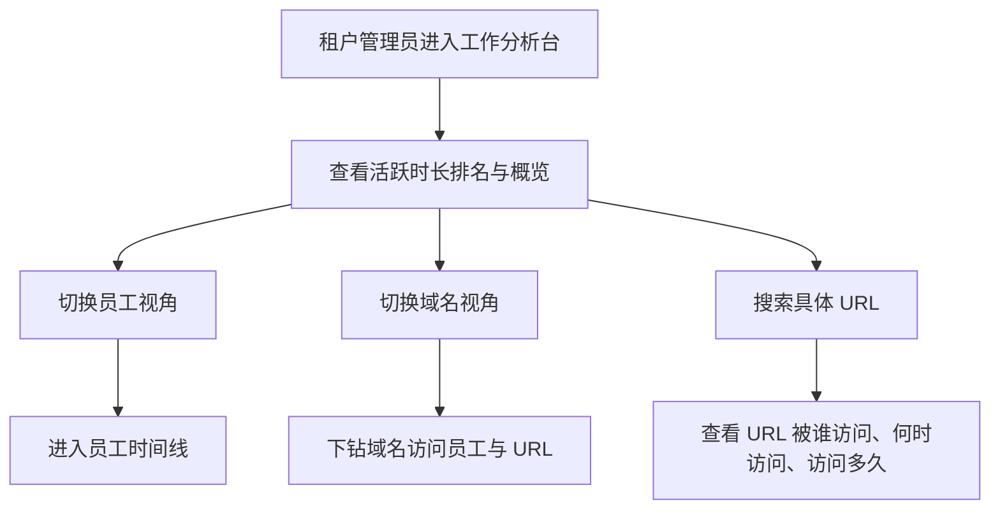

# Browser Activity Audit Workbench Design

## 0. 文档控制

```text
designKey: browser-activity-audit-workbench
designStatus: SUPERSEDED_BY_TRUTH_SOURCE
implementationStatus: P1_IMPLEMENTATION_IN_PROGRESS
lastUpdatedAt: 2026-06-25 18:30:00 Asia/Shanghai
lastUpdatedBy: Codex
supersedes:
  - 本能力不在 docs/plans/ideas.md 或 docs/plans/candidates.md 中维护活跃正文
truthSource:
  - docs/plans/features/browser-activity-audit-workbench-p1.md
  - docs/architecture/services/browser-activity-service.md
  - docs/contracts/browser-activity-service/browser-activity-p1.md
  - docs/contracts/api-gateway/browser-activity-bff.md
doNotUseAsStableSource: true
conflictResolution: 本文仅保留历史设计过程；稳定范围、服务边界、契约和执行范围以 truthSource 列表为准。
```

## 1. 设计定位

Browser Activity Audit Workbench 是面向租户管理员的浏览器访问审计与工作行为分析能力。

它依托 OES Browser Workspace Extension 作为浏览器端采集入口，在租户管理员开启能力后，对本租户内具备 `browser-extension` 访问权限且已登录插件的员工，静默记录浏览器访问事实、在线状态与活跃浏览时长，并提供多视角分析台用于审核、复盘与管理判断。

本能力不直接判定员工是否摸鱼，不做自动绩效评价，也不把 AI 或规则输出作为员工行为结论。系统只提供事实记录、时间口径、聚合视角与可审计查询入口，最终判断由租户管理制度与管理员承担。

## 2. 当前范围

本文负责：

- 冻结 P1 的产品目标、用户范围与操作流程。
- 冻结访问记录、活跃时长、空闲时长等业务口径。
- 冻结租户级开关、保留周期配置与管理员分析台视角。
- 记录未来需要回写的 truth source 目标。

本文不负责：

- 实现代码、DB 表设计、索引设计或字段级契约。
- 冻结正式 API、gRPC、事件或权限码。
- 替代 Browser Workspace Extension 的总体设计。
- 替代 observability / audit 架构的稳定真相源。
- 设计截图、实时屏幕、键盘记录或 AI 判断能力。

## 3. 涉及对象

- frontends:
  - `browser-extension`
  - `tenant-web`
- services / capabilities:
  - `api-gateway`
  - `auth-service`
  - `identity-service`
  - `permission-service`
  - future browser activity audit capability owner
- related truth sources:
  - `docs/plans/designs/browser-workspace-extension-design.md`
  - `docs/architecture/12-observability-and-audit-architecture.md`
  - `docs/architecture/14-grpc-metadata-and-service-trust-architecture.md`
  - `docs/architecture/services/permission-service.md`

## 4. 已冻结决定

| 日期 | 决定 | 影响范围 | 回写目标 |
| --- | --- | --- | --- |
| 2026-06-23 | 采用策略化浏览器访问审计方向，但 P1 只保留租户级总开关，不做复杂策略矩阵。 | 产品范围 / 管理后台 | future feature packet |
| 2026-06-23 | 采集对象限定为本租户内具备 `browser-extension` 访问权限且已登录插件的员工。 | 权限边界 / 采集范围 | permission / extension collaboration |
| 2026-06-23 | 插件前台不新增员工操作，不提供员工侧开关；后台租户管理员控制是否启用。 | 插件 UX / 管理流程 | browser extension design / feature packet |
| 2026-06-23 | P1 不做网站自动分类、风险评分、截图、实时屏幕、键盘记录或自动摸鱼判定。 | 合规边界 / 产品承诺 | feature packet |
| 2026-06-23 | P1 记录 domain、完整 URL、页面标题、访问时间、停留时长、前台可见时长、活跃浏览时长与空闲时长。 | 访问事实模型 | future contract / feature packet |
| 2026-06-23 | 分析台采用员工、域名、URL、时间线、活跃时长排名等事实视角，不以网站分类作为主轴。 | 管理员分析台 | tenant-web feature design |
| 2026-06-23 | 数据量控制采用访问会话汇总记录，不保存每次鼠标、滚动、点击或键盘事件。 | 数据治理 / 采集边界 | future contract / implementation plan |
| 2026-06-23 | 原始明细与聚合统计保留周期应由租户级配置控制；审计记录不跟随普通访问数据清理。 | 数据保留 / 审计治理 | audit / feature packet |

## 5. P1 目标用户与前提

### 5.1 管理员

租户管理员可以：

- 开启或关闭本租户浏览器访问审计。
- 配置访问明细与聚合统计的保留周期。
- 查看本租户员工的访问历史、域名聚合、URL 查询、时间线与活跃时长排名。
- 基于事实记录进行工作复盘、员工审核、异常询问或管理判断。

管理员不应在 P1 中：

- 实时查看员工屏幕。
- 查看键盘输入内容。
- 查看截图证据。
- 使用系统自动生成的摸鱼结论。

### 5.2 员工

员工进入采集范围必须同时满足：

- 属于当前租户。
- 具备 `browser-extension` 登录与访问权限。
- 已通过 OES Browser Workspace Extension 登录。
- 租户级浏览器访问审计开关处于开启状态。

若员工没有插件访问权限、未登录插件，或租户未开启能力，则 P1 不采集其浏览器访问活动。

## 6. P1 操作流程

### 6.1 管理员启用流程



### 6.2 员工访问采集流程



### 6.3 管理员分析流程



## 7. 访问事实口径

P1 记录的是访问会话汇总，不记录原始输入流。

一次访问记录应表达：

- 谁访问。
- 属于哪个租户。
- 访问了哪个 domain。
- 访问了哪个完整 URL。
- 页面标题是什么。
- 从什么时候开始访问。
- 到什么时候结束或 flush。
- 停留多久。
- 前台可见多久。
- 活跃浏览多久。
- 空闲多久。
- 来自哪个浏览器插件终端上下文。

P1 明确不记录：

- 具体键盘按键内容。
- 表单输入内容。
- 页面正文全文。
- DOM 快照。
- 网络请求明细。
- 截图或录屏。
- 每次鼠标移动、滚动、点击的原始事件明细。

## 8. 时间指标定义

| 指标 | 定义 | P1 用途 |
| --- | --- | --- |
| 插件在线时长 | 插件已登录、浏览器运行且可持续上报心跳的时间。 | 判断插件在线状态，不作为工作有效性排名主指标。 |
| 访问停留时长 | 某 URL 从进入访问记录到离开、切换、关闭或结束上报的时间。 | 还原页面停留事实。 |
| 前台可见时长 | 当前 URL 所在 tab 处于前台，且浏览器窗口处于聚焦状态的时间。 | 排除后台 tab 挂时长。 |
| 活跃浏览时长 | 前台可见期间，最近 5 分钟内存在鼠标移动、点击、滚动或键盘活动。 | 默认排名与工作分析主指标。 |
| 空闲时长 | 页面仍打开，但连续超过 5 分钟无用户活动后的时间。 | 识别打开页面但未持续使用的时间。 |

P1 固定规则：

- 活跃窗口：最近 5 分钟内有用户活动。
- 空闲判定：连续 5 分钟无活动后进入空闲。
- 短切换合并：同一 URL 在 30 秒内切出又切回，可视为同一次访问。
- 默认排名指标：活跃浏览时长。
- 在线时长只作为参考，不用于判断工作有效性。
- 可以记录“发生过键盘活动”这一事实，但不得记录具体按键内容。

## 9. 分析台视角

P1 分析台只做事实视角，不做网站分类或价值判断。

### 9.1 员工视角

- 查看员工在指定日期范围内的访问记录。
- 展示总访问次数、总停留时长、前台可见时长、活跃浏览时长与空闲时长。
- 支持进入该员工时间线。

### 9.2 域名视角

- 按 domain 聚合访问次数、访问员工数、总停留时长与活跃浏览时长。
- 支持查看某个 domain 下的访问员工、URL 明细与访问时间。
- 用于发现高频站点与异常集中访问对象。

### 9.3 URL 视角

- 支持按完整 URL 或 URL 关键字搜索。
- 展示某个 URL 被谁访问、访问次数、访问时间与停留 / 活跃时长。
- 用于证据追溯或具体页面复盘。

### 9.4 时间线视角

- 按员工和时间顺序还原访问过程。
- 展示页面切换、访问开始、访问结束、停留时长、前台可见时长、活跃浏览时长与空闲时长。
- 用于审核某个人某段时间的浏览器行为。

### 9.5 活跃时长排名

- 默认按活跃浏览时长排序。
- 可辅助展示插件在线时长、前台可见时长、空闲时长与访问页面数。
- 排名只表达事实排序，不表达绩效或违规结论。

## 10. 租户配置

P1 只保留两个租户级配置项：

1. 浏览器访问审计开关
   - 开启后，对符合条件的员工静默采集。
   - 关闭后，不再采集新的访问活动。

2. 数据保留周期
   - 原始访问明细保留天数。
   - 聚合统计保留天数。

推荐默认值：

- 原始访问明细：90 天。
- 聚合统计：365 天。
- 原始访问明细最小可配置：30 天。
- 原始访问明细最大可配置：365 天，后续可按企业版本或治理策略扩展。
- 审计记录不由本能力的数据保留配置控制，按 OES 审计规则保留。

P1 不提供：

- 时间段配置。
- 日期生效计划。
- 员工排除名单。
- 部门 / 岗位策略。
- 网站分类策略。
- 截图策略。
- 风险规则。

## 11. 权限与审计边界

需要治理的管理员动作包括：

- 开启或关闭浏览器访问审计。
- 修改数据保留周期。
- 查看员工访问明细。
- 查看 URL / 标题明细。
- 查看员工时间线。
- 后续若支持导出，导出必须作为独立高权限动作并记录审计。

P1 权限设计应区分：

- 能否配置租户级访问审计。
- 能否查看租户级聚合概览。
- 能否查看员工级明细。
- 能否查看完整 URL 与页面标题。
- 能否查看管理员自身之外的员工数据。

所有管理员查看员工明细、URL / 标题明细、时间线与策略变更都必须留下审计记录。

## 12. P1 不做什么

- 不做网站自动分类。
- 不做风险评分。
- 不做摸鱼判定。
- 不做截图证据。
- 不做实时屏幕监控。
- 不做连续录屏。
- 不做键盘记录。
- 不抓页面正文或表单输入。
- 不做 AI 分析。
- 不做按部门、岗位、用户的复杂采集策略。
- 不做按工作时间段启停。
- 不做员工侧启用 / 停用开关。

## 13. 后续候选能力

以下内容仅作为候选，不属于 P1：

- 租户自定义关注域名 / 忽略域名。
- 风险站点或异常访问提示。
- 页面截图证据留存。
- 聚合趋势报表。
- 员工本人可见的自查面板。
- 更细粒度的组织 / 岗位策略。
- 数据导出与留痕审批。

截图若未来进入设计，必须作为高敏证据采集能力单独冻结，不能混入普通访问审计能力。

## 14. 真相源回写计划

当前本文仍是 active design workspace，不是稳定真相源。

冻结后建议回写：

- Browser extension 采集端边界：
  - `docs/plans/designs/browser-workspace-extension-design.md`
- 服务职责归属：
  - 未来若建立独立 capability / service，回写 `docs/architecture/services/<service-name>.md`
- 权限与管理员查看边界：
  - `docs/architecture/services/permission-service.md`
  - future permission contract
- 审计治理：
  - `docs/architecture/12-observability-and-audit-architecture.md`
- 执行范围、切片和验收：
  - `docs/plans/features/browser-activity-audit-workbench-p1.md`
- 黑盒契约：
  - future `docs/contracts/**`

回写完成后，本文必须退出 active，标记为 `SUPERSEDED_BY_TRUTH_SOURCE` 或归档。

## 15. 开放问题

| 日期 | 问题 | 为什么未冻结 | 下一步 |
| --- | --- | --- | --- |
| 2026-06-23 | 该能力最终归属独立服务、现有审计能力扩展，还是先作为平台 capability？ | 当前只冻结业务能力，不进入服务拆分。 | 后续进入 feature packet 或 architecture 设计时确定。 |
| 2026-06-23 | 管理员查看完整 URL 与页面标题是否需要更高一级权限或二次确认？ | P1 已确认记录标题，但查看治理仍需权限设计。 | 后续权限设计时冻结。 |
| 2026-06-23 | 聚合统计应保留到 domain 级还是 domain + employee + day 级？ | 当前只冻结产品口径，不设计数据模型。 | 后续契约 / 实现设计时确定。 |

## 16. 恢复入口

下次继续前先读：

- `docs/plans/designs/browser-activity-audit-workbench-design.md`
- `docs/plans/designs/browser-workspace-extension-design.md`
- `docs/architecture/12-observability-and-audit-architecture.md`
- `docs/architecture/services/permission-service.md`

当前推荐下一步：

- 继续确认管理员分析台的 P1 页面信息架构。
- 确认该能力是否准备从 design workspace 转为 feature packet。
- 若进入 feature packet，再拆分权限、契约、前端分析台和采集端切片。
