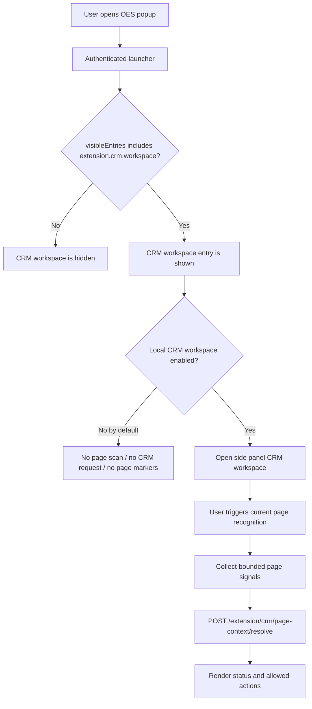
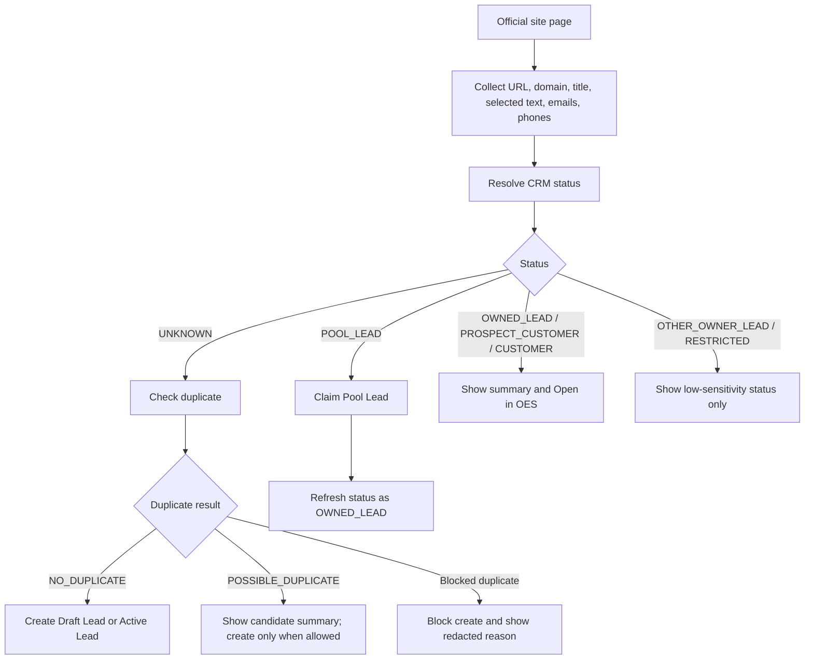
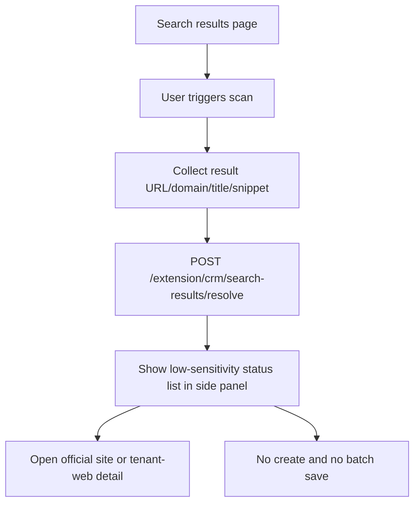

# Browser Extension CRM Workspace P1

## 1. Feature Status

Current status: `contract frozen / implementation ready`

本文是浏览器插件 CRM Sales Workspace P1 的 feature packet。它承接以下稳定设计与契约：

- [browser-workspace-extension-design.md](/Users/acehood/Documents/GitHub/oes/docs/plans/designs/browser-workspace-extension-design.md)
- [extension-crm-workspace.md](/Users/acehood/Documents/GitHub/oes/docs/contracts/api-gateway/extension-crm-workspace.md)
- [extension-auth-bff-login.md](/Users/acehood/Documents/GitHub/oes/docs/contracts/api-gateway/extension-auth-bff-login.md)
- [crm-service.md](/Users/acehood/Documents/GitHub/oes/docs/architecture/services/crm-service.md)
- [navigation-summary.md](/Users/acehood/Documents/GitHub/oes/docs/contracts/api-gateway/navigation-summary.md)
- [access-summary.md](/Users/acehood/Documents/GitHub/oes/docs/contracts/api-gateway/access-summary.md)
- [2026-06-23-browser-extension-crm-workspace-p1.md](/Users/acehood/Documents/GitHub/oes/docs/superpowers/plans/2026-06-23-browser-extension-crm-workspace-p1.md)

本文只冻结 P1 交付范围、实现边界、切片顺序、验收方式与测试矩阵，不重新定义 CRM 服务真相、permission-service 真相或 auth-service 真相。

若本文与 `crm-service.md` 冲突，以 `crm-service.md` 为准。若本文与 `extension-crm-workspace.md` 的 HTTP 黑盒契约冲突，以 contract 为准。

## 2. Goal

交付浏览器插件 CRM Sales Workspace P1：

- 用户在插件中登录后，看到后端允许的 `extension.crm.workspace`。
- CRM workspace 默认不主动运行，用户手动启用后才进行页面识别、content script 注入和 `/extension/crm/*` 请求。
- 用户在客户官网页可以通过 side panel 完成 CRM 状态识别、查重、创建 Draft Lead、创建 Active Lead、Claim 公海 Lead 和打开 tenant-web CRM 详情。
- 用户在搜索结果页可以触发只读状态回显，避免重复开发。
- 插件不拥有 CRM 业务真相，不创建第二套 prospecting/timeline/source 模型，不绕过 BFF 或 `crm-service`。

## 3. Current Implementation Baseline

当前仓库已有：

- `app/browser-extension` 独立 Vue / Vite Chrome extension app。
- popup 登录、账号选择、MFA、session restore / refresh、logout、基础 authenticated launcher。
- `ExtensionAuthApi` 调用 `/extension/auth/*` 登录相关 endpoint。
- API Gateway terminal auth controller 已暴露 extension auth surface，包括 login、account selection、MFA、refresh、logout、session context、access summary、session contexts、switch context。
- CRM P1 runtime 已存在 `CreateDraftLead`、`CreateLead`、`CheckLeadDuplicate`、`ClaimCrmAccount`、list/detail 等核心能力。
- tenant-web 已有 `/crm/accounts`、`/crm/pool` 与 `/crm/accounts/:crmAccountId` 路由。

当前缺口：

- permission navigation seed 尚未提供 `extension.crm.workspace`。
- popup launcher 尚未映射 `extension.crm.workspace`。
- 插件前端尚未消费独立 `/extension/auth/session/access-summary`。
- 插件尚未实现 workspace local enablement。
- manifest 尚未提供 side panel、active tab、scripting、context menu 或 commands 能力。
- 插件尚未实现 background / content script / side panel runtime。
- API Gateway 尚未提供 `/extension/crm/*` BFF facade。
- 插件尚未实现 CRM Sales Workspace UI 和页面识别 / 查重 / 创建 / Claim 流程。

## 4. Confirmed Product Decisions

- 插件定位为统一 Browser Workspace Extension，不是旧 sales prospecting 单点插件。
- 旧 `browser-prospecting-workspace` feature packet 已删除。
- 旧 `/browser-prospecting/*` endpoint prefix 废弃。
- CRM 插件 workspace entry 是 `extension.crm.workspace`。
- Web terminal 的 `crm.accounts / crm.pool` 不复用于插件 launcher。
- 插件 CRM P1 通过 `/extension/crm/*` BFF facade 调用 CRM P1 用例。
- CRM workspace 前端形态采用 `Popup Launcher + Side Panel Workspace`。
- 所有插件 workspace 支持用户个人启用 / 停用。
- CRM workspace P1 默认关闭，用户启用后才主动运行。
- 搜索结果页只做只读状态回显。
- 客户官网页是 P1 主要双向页面类型。
- 插件 P1 不消费 `ReleaseCrmAccount`。
- 插件来源类型默认 `BROWSER_EXTENSION`。

## 5. P1 Scope

### 5.1 Included

P1 includes:

- `extension.crm.workspace` navigation entry and visibility for CRM sales roles.
- Extension launcher mapping for CRM workspace.
- Local workspace enablement preference stored per account / tenant / workspace key.
- Side panel CRM Sales Workspace shell.
- Background runtime for opening side panel and coordinating current tab context.
- User-triggered content script / scripting flow for page signals.
- Context menu and command entry points for CRM workspace only after user enablement.
- `/extension/crm/page-context/resolve`.
- `/extension/crm/search-results/resolve`.
- `/extension/crm/leads/check-duplicate`.
- `/extension/crm/draft-leads`.
- `/extension/crm/leads`.
- `/extension/crm/accounts/:crmAccountId/claim`.
- `/extension/crm/accounts/:crmAccountId`.
- Customer official-site flow: identify, check duplicate, create Draft Lead, create Active Lead, Claim Pool Lead, open tenant-web detail.
- Search results flow: resolve candidates and show low-sensitivity CRM statuses.

### 5.2 Excluded

P1 excludes:

- tenant-level plugin capability enablement.
- old `/browser-prospecting/*` endpoints.
- standalone prospecting service.
- release to Pool.
- convert to Prospect Customer inside plugin.
- contact creation.
- activity append.
- source append to existing CRM account.
- screenshot evidence.
- AI summary or AI decision.
- automatic crawling.
- search-result batch import.
- replacing tenant-web CRM detail pages.

## 6. Architecture

```text
browser-extension popup
  -> /extension/auth/session/context
  -> /extension/auth/session/access-summary
  -> launcher visible workspace entries

browser-extension side panel
  -> background current-tab broker
  -> user-triggered page signal collection
  -> /extension/crm/* BFF facade
  -> crm-service via existing Gateway CRM adapters / gRPC
  -> tenant-web deep link for full detail
```

Boundary rules:

- Browser extension is a terminal-specific front end.
- API Gateway BFF owns HTTP presentation, terminal normalization, downstream context mapping and view model redaction.
- `crm-service` owns CRM business rules and persistence.
- `permission-service` owns role/action/navigation and resource authorization truth.
- `auth-service` owns sessions and tokens.
- Extension storage owns only local user preference and session material already managed by extension auth.

## 7. UX Flow

### 7.1 Main Flow



### 7.2 Official Site Flow



### 7.3 Search Results Flow



## 8. Status And Action Matrix

| Status | Display | P1 actions |
| --- | --- | --- |
| `UNKNOWN` | No visible CRM record | Check duplicate, create Draft Lead, create Active Lead |
| `POSSIBLE_DUPLICATE` | Possible duplicate | Show candidate summary, create only when CRM allows |
| `OWNED_LEAD` | Current user's Lead | Open OES detail |
| `POOL_LEAD` | Ownerless Pool Lead | Claim, then Open OES detail |
| `OTHER_OWNER_LEAD` | Another account owns the Lead | Low-sensitivity status only |
| `PROSPECT_CUSTOMER` | Prospect Customer | Open OES detail |
| `CUSTOMER` | Customer | Open OES detail |
| `RESTRICTED` | Restricted object | Low-sensitivity status only |

## 9. Implementation Slices

### Slice 1: Navigation And Workspace Preference

Deliver:

- Add `extension.crm.workspace` navigation seed.
- Allow CRM sales roles to see it for `BROWSER_EXTENSION`.
- Add extension launcher mapping.
- Add local enable / disable preference for workspace runtime.
- Ensure CRM workspace defaults disabled.

Validation:

- permission-service navigation seed tests.
- browser-extension unit tests for launcher workspace mapping.
- browser-extension unit tests for workspace preference isolation by account / tenant / workspace key.

### Slice 2: Extension Runtime Shell

Deliver:

- Manifest permissions for P1 runtime only.
- Background runtime for side panel open and current tab coordination.
- Side panel app shell.
- Content signal collection triggered only by user action.
- Context menu / command entries gated by local CRM workspace enablement.

Validation:

- browser-extension unit tests for runtime message contracts.
- manifest tests ensuring no broad `<all_urls>` persistent injection.
- manual extension load test.

### Slice 3: Extension CRM BFF

Deliver:

- `/extension/crm/*` controllers / services in API Gateway.
- Terminal-authenticated request source mapping.
- Permission checks and redaction.
- CRM downstream adapter reuse where possible.
- Stable error code mapping.

Validation:

- API Gateway unit tests for each endpoint.
- API Gateway authorization/redaction tests.
- CRM duplicate/create/claim mapping tests.

### Slice 4: CRM Workspace UI

Deliver:

- Side panel states: off, enabled empty, resolving, unknown, duplicate, owned, pool, restricted, error, mutation success.
- Official site identify/check/create/claim flows.
- Search results read-only status flow.
- Tenant-web deep link behavior.

Validation:

- browser-extension component/unit tests for states.
- browser-extension API tests with mocked BFF.
- manual side panel flow test with local BFF.

### Slice 5: Integrated Smoke

Deliver:

- Seed / fixture or scripted smoke for extension CRM scenario.
- End-to-end manual checklist covering extension auth, enablement, official-site create, Pool claim and search-result resolve.

Validation:

- focused service tests.
- browser-extension build/typecheck/unit tests.
- API Gateway tests.
- CRM focused tests.
- manual Chrome extension load and live BFF smoke where available.

## 10. Verification Matrix

Commands expected during implementation:

```bash
pnpm --filter @oes/browser-extension test:unit
pnpm --filter @oes/browser-extension typecheck
pnpm --filter @oes/browser-extension build
pnpm --filter api-gateway test
pnpm --filter crm-service test:l1
pnpm --filter crm-service test:l3
pnpm --filter permission-service test:l1
pnpm proto:lint
```

Focused manual verification:

- Extension login uses existing popup flow.
- CRM workspace appears only when `extension.crm.workspace` is visible.
- CRM workspace is off by default.
- Enabling CRM allows side panel page recognition.
- Disabling CRM stops page recognition and CRM BFF calls.
- Official site unknown -> duplicate check -> create Draft Lead.
- Official site unknown -> duplicate check -> create Active Lead with owner = current operator.
- Pool Lead -> claim -> status refreshes to owned lead.
- Search results -> status list only, no create or batch save.
- Restricted/other-owner results remain low-sensitivity.

## 11. Risks And Controls

| Risk | Control |
| --- | --- |
| Plugin accidentally scans all pages by default | CRM workspace defaults off; content script runs only after user enablement and action. |
| Front end infers CRM ownership or permission | BFF returns statuses and allowed actions; front end only renders. |
| BFF becomes CRM business owner | Mutations call CRM P1 use cases; BFF only maps terminal-specific HTTP view models. |
| Duplicate data leaks | Redact restricted duplicates; use `crm.duplicate.viewRestricted` only where intended. |
| Old prospecting model returns | Old feature packet deleted; `/browser-prospecting/*` explicitly non-goal. |
| Web and extension navigation drift | Use `extension.crm.workspace` for extension terminal instead of reusing Web entries. |
| Release / convert slips into P1 | Explicit non-goals; implementation tests should assert absence of release/convert plugin actions. |

## 12. Handoff To Implementation Plan

Implementation plan should be created after this packet and the BFF contract are reviewed in repo context.

The implementation plan should not ask product questions about internal code structure. It should choose the cleanest approach consistent with:

- existing `app/browser-extension` Vue / Vite structure.
- existing `src/services/api-gateway/src/modules/auth-bff` terminal patterns.
- existing `src/services/api-gateway/src/modules/crm-service` CRM adapters and DTO mapping.
- existing `src/services/system/permission-service` navigation seed patterns.
- existing CRM P1 service contract and tests.

## 13. Deferred Debug Reminder

下次继续浏览器插件开发时，优先恢复以下未决问题，不要把它当作已解决：

- Swiss Madison official site 上 CRM floating panel 仍未在用户真机中出现；Google Search 结果页可以正确标注 Swiss Madison / PC，因此当前证据更像 official-site FP 渲染链路问题，而不是 CRM 后端识别问题。
- 已验证过的后端证据：`/extension/crm/page-context/resolve` 对 `https://swissmadison.com/collections/psc-console-sinks` 能返回 Swiss Madison 相关匹配结果。
- 已尝试过的修复方向：FP close/minimized 状态清理、panel preference 独立于 search-tags runtime、offscreen position clamp、popup 增加“显示当前页”入口、draft hard-delete guard 修复。
- 下次恢复时应先完成真实浏览器加载 unpacked extension 的 E2E 复现，观察 background runtime 返回的失败阶段：`COLLECT_SIGNALS`、`RESOLVE_PAGE_CONTEXT`、`RENDER_PANEL` 或页面内 host 已存在但不可见。不要继续靠猜测修改多个无关文件。
