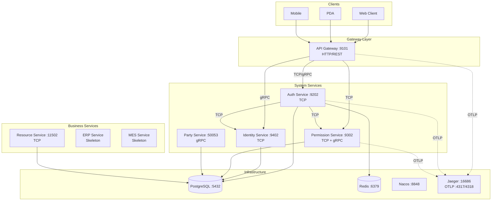
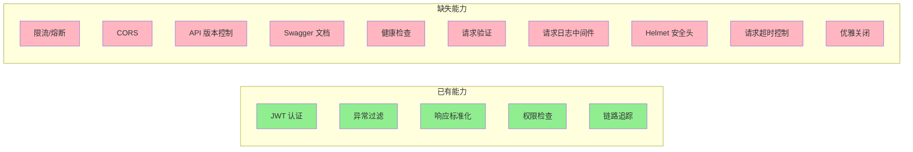
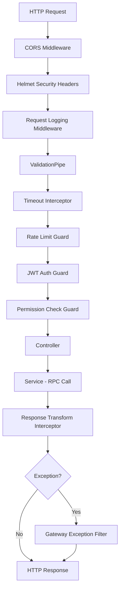
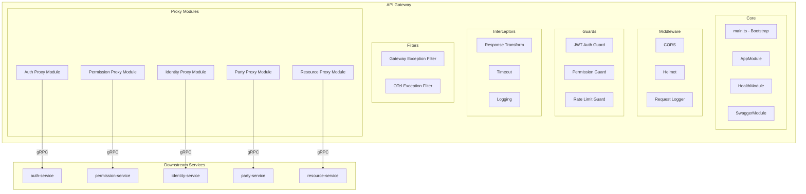
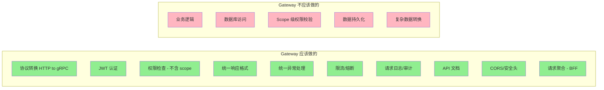
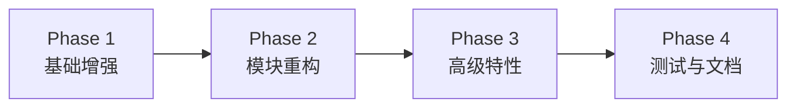

# OES 项目架构分析 & API Gateway 详细设计方案

> **文档版本**: v1.0  
> **创建日期**: 2026-02-24  
> **作者**: Senior Architect  
> **状态**: Draft

---

## 目录

1. [OES 整体架构分析](#1-oes-整体架构分析)
2. [API Gateway 现状评估](#2-api-gateway-现状评估)
3. [API Gateway 目标架构设计](#3-api-gateway-目标架构设计)
4. [详细模块设计](#4-详细模块设计)
5. [目录结构设计](#5-目录结构设计)
6. [实施计划](#6-实施计划)

---

## 1. OES 整体架构分析

### 1.1 项目概览

OES 是一个基于 **NestJS 11 + TypeScript + Prisma + PostgreSQL** 的微服务 monorepo 项目，采用 **DDD 设计思想**，面向制造业的多租户 SaaS 企业管理平台。

### 1.2 Monorepo 结构

```
oes/
├── src/
│   ├── common/                    # 共享库 - @oes/common
│   └── services/
│       ├── system/                # 系统服务层
│       │   ├── api-gateway        # API 网关 (HTTP → RPC)
│       │   ├── auth-service       # 认证服务 (TCP)
│       │   ├── identity-service   # 身份服务 (TCP)
│       │   ├── permission-service # 权限服务 (TCP + gRPC)
│       │   └── party-service      # 主体服务 (gRPC)
│       ├── business/              # 业务服务层
│       │   ├── erp-service        # ERP 服务 (骨架)
│       │   ├── mes-service        # MES 服务 (骨架)
│       │   ├── asset-service      # 资产服务 (骨架)
│       │   └── resource-service   # 资源服务 (TCP, 域名管理)
│       └── auxiliary/             # 辅助服务层
│           ├── im-service         # 即时通讯 (骨架)
│           └── mailbox-service    # 邮件服务 (骨架)
├── docker-compose.yml
├── pnpm-workspace.yaml
└── package.json
```

### 1.3 整体架构图



### 1.4 技术栈总结

| 层面     | 技术选型                     | 说明                |
| -------- | ---------------------------- | ------------------- |
| 框架     | NestJS 11                    | 企业级 Node.js 框架 |
| 语言     | TypeScript 5.8               | 类型安全            |
| ORM      | Prisma 6                     | 类型安全 ORM        |
| 数据库   | PostgreSQL                   | 主数据库            |
| 缓存     | Redis 7                      | Session、缓存       |
| 同步通信 | TCP (NestJS) + gRPC (迁移中) | 服务间通信          |
| 链路追踪 | OpenTelemetry + Jaeger v2    | 可观测性            |
| 日志     | Pino + OpenTelemetry         | 结构化日志          |
| 服务发现 | Nacos (规划中)               | 动态发现            |
| 包管理   | pnpm workspace               | Monorepo 管理       |
| API 文档 | Swagger/OpenAPI              | 已引入依赖          |
| 构建     | SWC                          | 快速编译            |

### 1.5 架构优势

1. **清晰的服务分层**: system / business / auxiliary 三层划分合理
2. **DDD 实践**: 各服务内部采用 domain / application / infrastructure / interface 分层
3. **共享库设计**: `@oes/common` 统一了 transport、auth、logging、tracing 等横切关注点
4. **可观测性基础**: OpenTelemetry + Jaeger 已集成
5. **统一异常体系**: [`OESExceptionBase`](src/common/src/core/exceptions/oes.exception.ts) + [`ExceptionFactory`](src/common/src/core/exceptions/exception.factory.ts) 提供了三层异常分类

### 1.6 架构待改进点

| 问题                       | 影响                       | 建议                                 |
| -------------------------- | -------------------------- | ------------------------------------ |
| TCP 与 gRPC 混用           | 通信协议不统一，维护成本高 | 统一迁移到 gRPC                      |
| Gateway 缺少 API 版本控制  | 后续 API 演进困难          | 引入 `/api/v1/` 前缀                 |
| Gateway 缺少限流/熔断      | 无法保护下游服务           | 引入 rate limiting + circuit breaker |
| Gateway 缺少健康检查端点   | 容器编排无法探测           | 添加 `/health` 端点                  |
| Gateway 缺少 CORS 配置     | 前端跨域问题               | 添加 CORS 中间件                     |
| Gateway 缺少请求验证管道   | 入参未校验                 | 添加全局 ValidationPipe              |
| Swagger 依赖已引入但未配置 | API 文档缺失               | 完成 Swagger 集成                    |

---

## 2. API Gateway 现状评估

### 2.1 当前实现

当前 api-gateway 完成度约 **40%**，已实现：

| 功能                 | 状态 | 实现位置                                                                                                                                     |
| -------------------- | ---- | -------------------------------------------------------------------------------------------------------------------------------------------- |
| JWT 认证守卫         | ✅   | [`GatewayJwtAuthGuard`](src/common/src/auth/guards/gateway-jwt-auth.guard.ts)                                                                |
| 公开路由装饰器       | ✅   | [`@Public()`](src/common/src/auth/decorators/is-public.decorator.ts)                                                                         |
| 统一异常过滤器       | ✅   | [`GatewayExceptionFilter`](src/services/system/api-gateway/src/common/filters/gateway-exception.filter.ts)                                   |
| 统一响应拦截器       | ✅   | [`ResponseTransformInterceptor`](src/services/system/api-gateway/src/common/interceptors/response.interceptor.ts)                            |
| gRPC → HTTP 异常映射 | ✅   | [`grpcStatusToHttpStatus()`](src/services/system/api-gateway/src/common/filters/gateway-exception.filter.ts:81)                              |
| 权限检查守卫         | ✅   | [`GatewayPermissionGuard`](src/common/src/authorization/guards/gateway-permission.guard.ts)                                                   |
| Auth BFF 编排        | ✅   | [`AuthController`](src/services/api-gateway/src/modules/auth-bff/interfaces/http/controllers/auth.controller.ts)                              |
| Permission 路由代理  | ✅   | [`PermissionController`](src/services/system/api-gateway/src/modules/permission-service/interface/http/controllers/permission.controller.ts) |
| Identity 路由代理    | ❌   | 历史占位代理已清理；后续如需对外暴露身份能力，应以新的场景型 BFF 重新设计                                                                   |
| OpenTelemetry 集成   | ✅   | [`initOtelSdk()`](src/services/system/api-gateway/src/main.ts:13)                                                                            |
| 结构化日志           | ✅   | [`AppLogger`](src/services/system/api-gateway/src/main.ts:16)                                                                                |

### 2.2 当前问题分析



### 2.3 代码质量问题

1. **[`GatewayExceptionFilter`](src/services/system/api-gateway/src/common/filters/gateway-exception.filter.ts:49)** 中 `OESExceptionBase` 和 unknown 分支的 `payload` 变量被 `const` 重新声明遮蔽了外层变量，导致最终 `res.status(payload.code).json(payload)` 使用的是未初始化的外层 `payload`，会抛出运行时错误
2. 历史 `modules/auth-service` 与 `modules/identity-service` 占位代理曾长期留在代码仓库中，容易误导线程继续在死代码上扩写；现已清理
3. 历史设计文档中仍存在部分旧路径与旧模块名引用，需要持续收口，避免把已删除代理视为活跃集成路径
4. 缺少全局 `ValidationPipe`，入参未校验

---

## 3. API Gateway 目标架构设计

### 3.1 设计原则

| 原则            | 说明                                               |
| --------------- | -------------------------------------------------- |
| **单一职责**    | Gateway 只负责协议转换、认证、路由，不包含业务逻辑 |
| **BFF 模式**    | 作为 Backend-for-Frontend，聚合多个下游服务的响应  |
| **Fail-Fast**   | 认证/权限失败立即返回，不转发到下游                |
| **Fail-Closed** | 权限检查异常时拒绝访问                             |
| **可观测**      | 每个请求都有 traceId、spanId、请求日志             |
| **防御性编程**  | 限流、熔断、超时保护下游服务                       |
| **向前兼容**    | 预留 APISIX 迁移路径，职责可平滑转移               |

### 3.2 请求处理流水线



### 3.3 模块架构图



### 3.4 Gateway 职责边界



---

## 4. 详细模块设计

### 4.1 Bootstrap (main.ts) 增强

当前 [`main.ts`](src/services/system/api-gateway/src/main.ts) 需要增强以下能力：

```typescript
// 目标 main.ts 伪代码
async function bootstrap() {
  // 1. 初始化 OpenTelemetry
  initOtelSdk('api-gateway')

  // 2. 创建应用
  const app = await NestFactory.create(AppModule, { bufferLogs: true })

  // 3. 自定义日志
  app.useLogger(app.get(AppLogger))

  // 4. 全局前缀 + API 版本
  app.setGlobalPrefix('api/v1')

  // 5. CORS
  app.enableCors({ origin: configService.get('CORS_ORIGINS'), ... })

  // 6. 安全头 (Helmet)
  app.use(helmet())

  // 7. 全局管道 (ValidationPipe)
  app.useGlobalPipes(new ValidationPipe({ transform: true, whitelist: true }))

  // 8. 全局守卫 (JWT → Permission → RateLimit)
  app.useGlobalGuards(
    app.get(GatewayJwtAuthGuard),
    app.get(GatewayPermissionGuard),
  )

  // 9. 全局拦截器
  app.useGlobalInterceptors(
    new TimeoutInterceptor(),
    new ResponseTransformInterceptor(),
  )

  // 10. 全局过滤器
  // GatewayExceptionFilter 内部先记录 tracing，再完成 HTTP 异常映射
  app.useGlobalFilters(
    new GatewayExceptionFilter(app.get(AppLogger)),
  )

  // 11. Swagger 文档
  setupSwagger(app)

  // 12. 优雅关闭
  app.enableShutdownHooks()

  // 13. 启动
  await app.listen(process.env.SERVICE_PORT ?? 9101)
}
```

### 4.2 AppModule 设计

```typescript
// 目标 app.module.ts 结构
@Module({
  imports: [
    // ─── 基础设施模块 ───
    ConfigModule.forRoot({ isGlobal: true }),
    LoggingModule,
    CommonJwtModule,
    GrpcTransportModule.forRoot({ services: { ... } }),

    // ─── 核心模块 ───
    HealthModule,          // 健康检查
    ThrottlerModule,       // 限流

    // ─── 系统服务代理模块 ───
    AuthProxyModule,
    PermissionProxyModule,
    IdentityProxyModule,
    EntityProxyModule,

    // ─── 业务服务代理模块 ───
    ResourceProxyModule,
    // ErpProxyModule,     // 后续添加
    // MesProxyModule,     // 后续添加
  ],
  providers: [
    { provide: APP_GUARD, useClass: GatewayJwtAuthGuard },
    { provide: APP_GUARD, useClass: GatewayPermissionGuard },
  ],
})
export class AppModule implements NestModule {
  configure(consumer: MiddlewareConsumer) {
    consumer
      .apply(RequestLoggerMiddleware)
      .forRoutes('*')
  }
}
```

### 4.3 健康检查模块

提供 Kubernetes/Docker 探针端点：

| 端点                | 用途            | 检查内容       |
| ------------------- | --------------- | -------------- |
| `GET /health`       | Liveness probe  | 进程存活       |
| `GET /health/ready` | Readiness probe | 下游服务连通性 |

```typescript
// health.controller.ts
@Public()
@Controller('health')
export class HealthController {
  @Get()
  liveness() {
    return { status: 'ok', timestamp: new Date().toISOString() }
  }

  @Get('ready')
  async readiness() {
    // 检查下游服务连通性
    const checks = await Promise.allSettled([
      this.checkAuthService(),
      this.checkPermissionService()
    ])
    // ...
  }
}
```

### 4.4 Swagger/OpenAPI 集成

利用已引入的 `@nestjs/swagger` 依赖：

```typescript
// swagger.setup.ts
function setupSwagger(app: INestApplication) {
  const config = new DocumentBuilder()
    .setTitle('OES API Gateway')
    .setDescription('Open Enterprise System API Documentation')
    .setVersion('1.0')
    .addBearerAuth()
    .addTag('auth', '认证相关接口')
    .addTag('permission', '权限管理接口')
    .addTag('identity', '身份管理接口')
    .build()

  const document = SwaggerModule.createDocument(app, config)
  SwaggerModule.setup('docs', app, document)
}
```

### 4.5 限流模块

使用 `@nestjs/throttler` 实现基础限流：

| 策略     | 配置              | 说明       |
| -------- | ----------------- | ---------- |
| 全局默认 | 100 req/min       | 防止滥用   |
| 登录接口 | 5 req/min per IP  | 防暴力破解 |
| 公开接口 | 30 req/min per IP | 防爬虫     |

### 4.6 超时控制拦截器

```typescript
// timeout.interceptor.ts
@Injectable()
export class TimeoutInterceptor implements NestInterceptor {
  intercept(context: ExecutionContext, next: CallHandler) {
    return next.handle().pipe(
      timeout(10000), // 10s 全局超时
      catchError((err) => {
        if (err instanceof TimeoutError) {
          throw new GatewayTimeoutException('Request timeout')
        }
        throw err
      })
    )
  }
}
```

### 4.7 请求日志中间件

```typescript
// request-logger.middleware.ts
@Injectable()
export class RequestLoggerMiddleware implements NestMiddleware {
  use(req: Request, res: Response, next: NextFunction) {
    const start = Date.now()
    const { method, originalUrl, ip } = req

    res.on('finish', () => {
      const duration = Date.now() - start
      this.logger.log({
        method,
        path: originalUrl,
        statusCode: res.statusCode,
        duration,
        ip,
        userAgent: req.get('user-agent'),
        traceId: getTraceId()
      })
    })

    next()
  }
}
```

### 4.8 代理模块设计模式

每个下游服务在 Gateway 中对应一个 **Proxy Module**，遵循统一模式：

```
modules/
  auth-proxy/
    auth-proxy.module.ts       # 模块定义，注册 gRPC client
    auth-proxy.service.ts      # 封装 gRPC 调用，处理错误映射
    controllers/
      auth.controller.ts       # HTTP 路由定义，DTO 验证
      session.controller.ts    # Session 相关路由
    dtos/
      login.dto.ts             # 请求/响应 DTO (可复用 @oes/common)
```

**Controller 职责**:

- 定义 HTTP 路由和方法
- 使用 Swagger 装饰器标注 API 文档
- 使用 `@Public()` / `@PermissionCheck()` 装饰器控制访问
- 调用 Proxy Service，不包含业务逻辑

**Proxy Service 职责**:

- 获取 gRPC service stub
- 调用下游服务
- 使用 `safeGrpcCall()` 处理超时和错误
- 返回标准化结果

### 4.9 GatewayExceptionFilter 修复

当前 [`GatewayExceptionFilter`](src/services/system/api-gateway/src/common/filters/gateway-exception.filter.ts) 需要同时承担两项职责：

- 在写出 HTTP 响应前调用 tracing helper 记录异常
- 统一将 `RpcException` / `HttpException` / `OESExceptionBase` 映射为 JSON 响应

注意：

- tracing helper 归属 `@oes/common/tracing`
- 不再通过 `OtelExceptionFilter -> GatewayExceptionFilter` 的 filter 串联方式实现
- 原因是 Nest exception filter 不是稳定的链式传递模型，重新 `throw` 可能直接落回底层 adapter

修复后的关键点如下：

```typescript
catch(exception: unknown, host: ArgumentsHost) {
  recordExceptionToActiveSpan(exception)

  let payload: HttpExceptionPayload
  let httpStatus = HttpStatus.INTERNAL_SERVER_ERROR

  if (exception instanceof RpcException) {
    payload = { /* ... */ }
    httpStatus = this.grpcStatusToHttpStatus(...)
  } else if (exception instanceof OESExceptionBase) {
    payload = exception.toHttpPayload()
    httpStatus = exception.getHttpStatus()
  } else {
    const unknownExp = ExceptionFactory.infrastructure(UNKNOWN_EXCEPTION, { ... })
    payload = unknownExp.toHttpPayload()
    httpStatus = unknownExp.getHttpStatus()
  }

  res.status(httpStatus).json(payload)
}
```

### 4.10 统一通信协议

当前 Gateway 中存在 TCP 和 gRPC 混用的情况：

| 模块                                                                                                                     | 当前协议                                          | 目标协议 |
| ------------------------------------------------------------------------------------------------------------------------ | ------------------------------------------------- | -------- |
| [`AuthBffModule`](src/services/api-gateway/src/modules/auth-bff/auth-bff.module.ts)                                     | HTTP BFF controller + gRPC adapter                | gRPC     |
| [`PermissionServiceProxyModule`](src/services/api-gateway/src/modules/permission-service/permission-service.module.ts)   | HTTP 管理薄代理 + gRPC adapter                    | gRPC     |

**目标**: 统一使用 `GrpcTransportModule.forFeature()` + `@InjectGrpcClient()` 模式。

---

## 5. 目录结构设计

### 5.1 目标目录结构

```
src/services/system/api-gateway/
├── package.json
├── tsconfig.json
├── nest-cli.json
├── keys/
│   └── public.key                          # JWT 公钥
├── src/
│   ├── main.ts                             # 应用入口
│   ├── app.module.ts                       # 根模块
│   │
│   ├── common/                             # Gateway 内部公共层
│   │   ├── filters/
│   │   │   └── gateway-exception.filter.ts # 统一异常过滤器
│   │   ├── interceptors/
│   │   │   ├── response.interceptor.ts     # 统一响应拦截器
│   │   │   ├── timeout.interceptor.ts      # 超时拦截器 [NEW]
│   │   │   └── logging.interceptor.ts      # 日志拦截器
│   │   ├── middleware/
│   │   │   └── request-logger.middleware.ts # 请求日志中间件 [NEW]
│   │   ├── decorators/
│   │   │   └── api-version.decorator.ts    # API 版本装饰器 [NEW]
│   │   └── constants/
│   │       └── gateway.constants.ts        # 网关常量 [NEW]
│   │
│   ├── config/                             # 配置模块 [NEW]
│   │   ├── gateway.config.ts               # 网关配置
│   │   ├── cors.config.ts                  # CORS 配置
│   │   └── swagger.config.ts               # Swagger 配置
│   │
│   ├── health/                             # 健康检查模块 [NEW]
│   │   ├── health.module.ts
│   │   └── health.controller.ts
│   │
│   ├── swagger/                            # Swagger 设置 [NEW]
│   │   └── swagger.setup.ts
│   │
│   └── modules/                            # 下游服务代理模块
│       ├── auth-proxy/                     # 认证服务代理 [REFACTOR]
│       │   ├── auth-proxy.module.ts
│       │   ├── auth-proxy.service.ts
│       │   └── controllers/
│       │       ├── auth.controller.ts      # 登录/注册/Token
│       │       └── session.controller.ts   # Session 管理
│       │
│       ├── permission-proxy/               # 权限服务代理 [REFACTOR]
│       │   ├── permission-proxy.module.ts
│       │   ├── permission-proxy.service.ts
│       │   └── controllers/
│       │       ├── permission.controller.ts
│       │       └── role.controller.ts
│       │
│       ├── identity-proxy/                 # 身份服务代理 [REFACTOR]
│       │   ├── identity-proxy.module.ts
│       │   ├── identity-proxy.service.ts
│       │   └── controllers/
│       │       ├── account.controller.ts
│       │       └── admin.controller.ts
│       │
│       ├── party-proxy/                    # 主体服务代理 [NEW]
│       │   ├── party-proxy.module.ts
│       │   ├── party-proxy.service.ts
│       │   └── controllers/
│       │       └── party.controller.ts
│       │
│       └── resource-proxy/                 # 资源服务代理 [NEW]
│           ├── resource-proxy.module.ts
│           ├── resource-proxy.service.ts
│           └── controllers/
│               └── domain.controller.ts
```

### 5.2 命名规范

| 类型     | 命名规则                           | 示例                           |
| -------- | ---------------------------------- | ------------------------------ |
| 代理模块 | `{service}-proxy.module.ts`        | `auth-proxy.module.ts`         |
| 代理服务 | `{service}-proxy.service.ts`       | `auth-proxy.service.ts`        |
| 控制器   | `{resource}.controller.ts`         | `auth.controller.ts`           |
| DTO      | 复用 `@oes/common/dtos/{service}/` | `all.dto.ts`                   |
| 中间件   | `{name}.middleware.ts`             | `request-logger.middleware.ts` |
| 拦截器   | `{name}.interceptor.ts`            | `timeout.interceptor.ts`       |
| 守卫     | 复用 `@oes/common/auth/guards/`    | `gateway-jwt-auth.guard.ts`    |

---

## 6. 实施计划

### 6.1 实施阶段



### 6.2 Phase 1: 基础增强

| 任务                                     | 说明                        | 优先级 |
| ---------------------------------------- | --------------------------- | ------ |
| 修复 GatewayExceptionFilter 变量遮蔽 bug | 修复 payload 变量作用域问题 | P0     |
| 添加全局 ValidationPipe                  | 入参校验                    | P0     |
| 添加 CORS 配置                           | 跨域支持                    | P0     |
| 添加 Helmet 安全头                       | HTTP 安全                   | P0     |
| 添加全局前缀 `api/v1`                    | API 版本控制                | P0     |
| 添加健康检查端点                         | `/health` + `/health/ready` | P0     |
| 添加优雅关闭                             | `enableShutdownHooks()`     | P1     |
| 添加 TimeoutInterceptor                  | 全局超时控制                | P1     |
| 添加 RequestLoggerMiddleware             | 请求日志                    | P1     |

### 6.3 Phase 2: 模块重构

| 任务                                            | 说明                            | 优先级 |
| ----------------------------------------------- | ------------------------------- | ------ |
| 重构 auth-service 模块为 auth-proxy             | 统一命名，切换到 gRPC           | P0     |
| 重构 permission-service 模块为 permission-proxy | TCP → gRPC                      | P0     |
| 重构 identity-service 模块为 identity-proxy     | 完善控制器                      | P0     |
| 新增 party-proxy 模块                           | 主体服务代理                    | P1     |
| 新增 resource-proxy 模块                        | 资源服务代理                    | P1     |
| 统一 AppModule 中的 gRPC 配置                   | `GrpcTransportModule.forRoot()` | P0     |
| 移除 TCP ClientModule 依赖                      | 清理旧代码                      | P1     |

### 6.4 Phase 3: 高级特性

| 任务                       | 说明                     | 优先级 |
| -------------------------- | ------------------------ | ------ |
| 集成 Swagger/OpenAPI       | API 文档自动生成         | P0     |
| 添加限流 (ThrottlerModule) | 全局 + 按路由限流        | P1     |
| 添加熔断器                 | 下游服务不可用时快速失败 | P2     |
| 添加请求 ID 传播           | X-Request-ID header      | P1     |
| 添加审计日志               | 关键操作记录             | P2     |

### 6.5 Phase 4: 测试与文档

| 任务              | 说明                            | 优先级 |
| ----------------- | ------------------------------- | ------ |
| 编写 e2e 测试     | 端到端测试                      | P1     |
| 编写单元测试      | Guard、Interceptor、Filter 测试 | P1     |
| 完善 Swagger 注解 | 所有 Controller 添加 API 文档   | P1     |
| 编写 README       | 服务说明文档                    | P2     |

### 6.6 新增依赖

```json
{
  "dependencies": {
    "@nestjs/throttler": "^6.x", // 限流
    "@nestjs/terminus": "^11.x", // 健康检查
    "helmet": "^8.x" // 安全头
  }
}
```

### 6.7 环境变量设计

| 变量名                        | 默认值                  | 说明                |
| ----------------------------- | ----------------------- | ------------------- |
| `SERVICE_PORT`                | `9101`                  | 网关端口            |
| `MODULE_NAME`                 | `api-gateway`           | 模块名称            |
| `CORS_ORIGINS`                | `*`                     | CORS 允许的源       |
| `GLOBAL_PREFIX`               | `api/v1`                | API 全局前缀        |
| `THROTTLE_TTL`                | `60000`                 | 限流时间窗口 (ms)   |
| `THROTTLE_LIMIT`              | `200`                   | 限流请求数          |
| `REQUEST_TIMEOUT_MS`          | `10000`                 | 请求超时 (ms)       |
| `SWAGGER_ENABLED`             | `true`                  | 是否启用 Swagger    |
| `AUTH_SERVICE_HOST`           | `localhost`             | Auth 服务地址       |
| `AUTH_SERVICE_PORT`           | `9202`                  | Auth 服务端口       |
| `IDENTITY_SERVICE_HOST`       | `localhost`             | Identity 服务地址   |
| `IDENTITY_SERVICE_PORT`       | `9402`                  | Identity 服务端口   |
| `PERMISSION_SERVICE_HOST`     | `localhost`             | Permission 服务地址 |
| `PERMISSION_SERVICE_PORT`     | `9302`                  | Permission 服务端口 |
| `OTEL_EXPORTER_OTLP_ENDPOINT` | `http://localhost:4318` | OTLP 端点           |
| `OTEL_SERVICE_NAME`           | `api-gateway`           | OTEL 服务名         |

---

## 附录 A: 统一响应格式

### 成功响应

```json
{
  "code": "SYS_000000",
  "message": "Success",
  "messageKey": "common.success",
  "data": { ... },
  "meta": {
    "traceId": "abc123...",
    "spanId": "def456...",
    "timestamp": "2026-02-24T08:00:00.000Z",
    "path": "/api/v1/auth/login",
    "module": "api-gateway",
    "callTrace": [],
    "warnings": {}
  }
}
```

### 错误响应

```json
{
  "code": 401,
  "message": "JWT token is invalid",
  "messageKey": "security.jwt.invalid",
  "traceId": "abc123...",
  "details": {
    "code": "SEC_JWT_001",
    "layer": "application"
  }
}
```

## 附录 B: 与 APISIX 的迁移路径

当前 NestJS Gateway 承担了所有网关职责。未来引入 APISIX 后，职责将逐步转移：

| 阶段 | NestJS Gateway           | APISIX             |
| ---- | ------------------------ | ------------------ |
| 当前 | 认证 + 限流 + 路由 + BFF | 不存在             |
| 中期 | BFF + 业务聚合           | 认证 + 限流 + 路由 |
| 后期 | 纯 BFF                   | 全部基础设施       |

**关键设计决策**: 当前在 NestJS Gateway 中实现的认证、限流等功能，应设计为可插拔的模块，便于后续迁移到 APISIX 时平滑移除。
